# WebRTC SFrame Integration Architecture

This document describes the architectural design for integrating SFrame (Secure Frame) encryption into WebRTC's native C++ API. SFrame provides end-to-end media security as defined by [RFC 9605](https://www.rfc-editor.org/rfc/rfc9605.html) and [draft-ietf-avtcore-rtp-sframe](https://github.com/ietf-wg-avtcore/draft-ietf-avtcore-rtp-sframe).

## Overview

SFrame encryption can be applied at two levels:
- **Per-frame** (`SframeMode::kPerFrame`): Encrypts complete video/audio frames before packetization
- **Per-packet** (`SframeMode::kPerPacket`): Encrypts individual RTP packets after packetization

Both modes are activated through the same public API on `RtpSenderInterface` and `RtpReceiverInterface`. The application creates an SFrame encrypter or decrypter by calling a method on the sender or receiver, receives a key management handle, and the internal pipeline handles transformer installation and SDP negotiation automatically.

## Architecture Overview

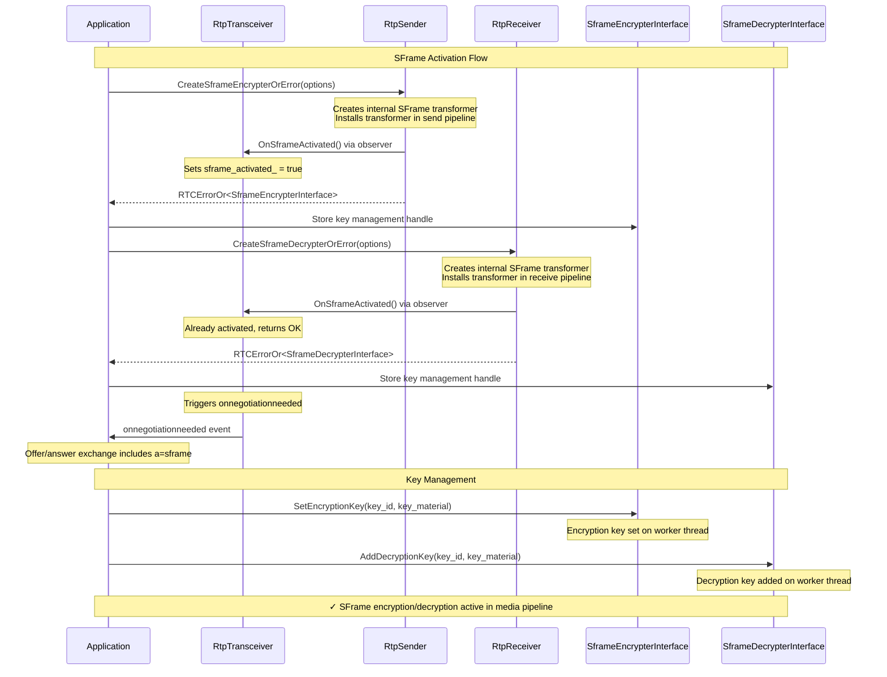
```mermaid
sequenceDiagram
    participant App as Application
    participant T as RtpTransceiver
    participant S as RtpSender
    participant R as RtpReceiver
    participant EncHandle as SframeEncrypterInterface
    participant DecHandle as SframeDecrypterInterface

    Note over App,DecHandle: SFrame Activation Flow

    App->>S: CreateSframeEncrypterOrError(options)
    Note over S: Creates internal SFrame transformer<br/>Installs transformer in send pipeline
    S->>T: OnSframeActivated() via observer
    Note over T: Sets sframe_activated_ = true
    S-->>App: RTCErrorOr<SframeEncrypterInterface>
    App->>EncHandle: Store key management handle

    App->>R: CreateSframeDecrypterOrError(options)
    Note over R: Creates internal SFrame transformer<br/>Installs transformer in receive pipeline
    R->>T: OnSframeActivated() via observer
    Note over T: Already activated, returns OK
    R-->>App: RTCErrorOr<SframeDecrypterInterface>
    App->>DecHandle: Store key management handle

    Note over T: Triggers onnegotiationneeded
    T->>App: onnegotiationneeded event

    Note over App: Offer/answer exchange includes a=sframe

    Note over App,DecHandle: Key Management

    App->>EncHandle: SetEncryptionKey(key_id, key_material)
    Note over EncHandle: Encryption key set on worker thread

    App->>DecHandle: AddDecryptionKey(key_id, key_material)
    Note over DecHandle: Decryption key added on worker thread

    Note over App,DecHandle: ✓ SFrame encryption/decryption active in media pipeline
```

## Public API

### SFrame Types (`api/sframe/sframe_types.h`)

```cpp
enum class SframeMode {
  kPerFrame,
  kPerPacket,
};

enum class SframeCipherSuite {
  kAesCtr128HmacSha256_80,
  kAesCtr128HmacSha256_64,
  kAesCtr128HmacSha256_32,
  kAesGcm128,
  kAesGcm256,
};
```

### SFrame Encrypter Configuration and Interface (`api/sframe/sframe_encrypter_interface.h`)

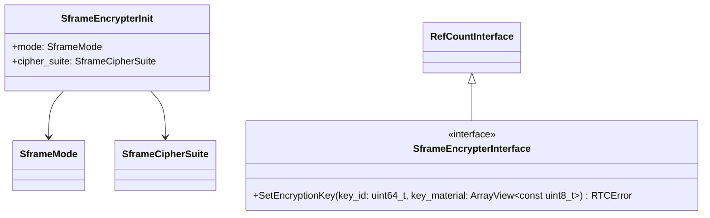
```mermaid
classDiagram
    class SframeEncrypterInit {
        +mode: SframeMode
        +cipher_suite: SframeCipherSuite
    }

    class SframeEncrypterInterface {
        <<interface>>
        +SetEncryptionKey(key_id: uint64_t, key_material: ArrayView~const uint8_t~) RTCError
    }

    SframeEncrypterInit --> SframeMode
    SframeEncrypterInit --> SframeCipherSuite
    RefCountInterface <|-- SframeEncrypterInterface
```

The encrypter init carries both `mode` (per-frame or per-packet) and `cipher_suite`. The mode determines which internal transformer is created and how the send pipeline processes frames.

The `key_material` parameter is the SFrame `base_key` — raw key bytes that the SFrame library uses as input to HKDF for deriving the actual encryption keys (per RFC 9605 §4.4).

### SFrame Decrypter Configuration and Interface (`api/sframe/sframe_decrypter_interface.h`)

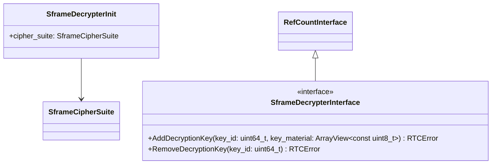
```mermaid
classDiagram
    class SframeDecrypterInit {
        +cipher_suite: SframeCipherSuite
    }

    class SframeDecrypterInterface {
        <<interface>>
        +AddDecryptionKey(key_id: uint64_t, key_material: ArrayView~const uint8_t~) RTCError
        +RemoveDecryptionKey(key_id: uint64_t) RTCError
    }

    SframeDecrypterInit --> SframeCipherSuite
    RefCountInterface <|-- SframeDecrypterInterface
```

The decrypter init carries only `cipher_suite` — the mode (per-frame or per-packet) is inferred from the received SFrame payload descriptor's T bit. The decrypter supports multiple simultaneous keys to handle key rotation scenarios, where new keys are added before old keys are removed.

### API on RtpSenderInterface (`api/rtp_sender_interface.h`)

```cpp
virtual RTCErrorOr<scoped_refptr<SframeEncrypterInterface>>
CreateSframeEncrypterOrError(const SframeEncrypterInit& options) {
  RTC_DCHECK_NOTREACHED();
  return RTCError();
}
```

Creates an internal SFrame encrypter, installs the appropriate transformer in the send pipeline, notifies the transceiver of SFrame activation, and returns a key management handle. The returned `SframeEncrypterInterface` is used solely for key management (`SetEncryptionKey`). Can only be called once per sender — subsequent calls return an error.

**Errors:**
- `UNSUPPORTED_OPERATION`: SFrame not yet implemented (stub)
- `INVALID_MODIFICATION`: SFrame already activated on this transceiver

### API on RtpReceiverInterface (`api/rtp_receiver_interface.h`)

```cpp
virtual RTCErrorOr<scoped_refptr<SframeDecrypterInterface>>
CreateSframeDecrypterOrError(const SframeDecrypterInit& options) {
  RTC_DCHECK_NOTREACHED();
  return RTCError();
}
```

Creates an internal SFrame decrypter, installs the appropriate transformer in the receive pipeline, notifies the transceiver of SFrame activation, and returns a key management handle. The returned `SframeDecrypterInterface` is used for key management (`AddDecryptionKey`, `RemoveDecryptionKey`). Can only be called once per receiver — subsequent calls return an error.

**Errors:**
- `UNSUPPORTED_OPERATION`: SFrame not yet implemented (stub)
- `INVALID_MODIFICATION`: SFrame already activated on this transceiver

## Internal Architecture

### SframeActivationObserver

When `CreateSframeEncrypterOrError` or `CreateSframeDecrypterOrError` is called, the sender/receiver notifies its transceiver via the `SframeActivationObserver` callback. This follows the `SetStreamsObserver` pattern used throughout libwebrtc — a raw pointer to an observer interface, injected via constructor and stored as a `const` member.

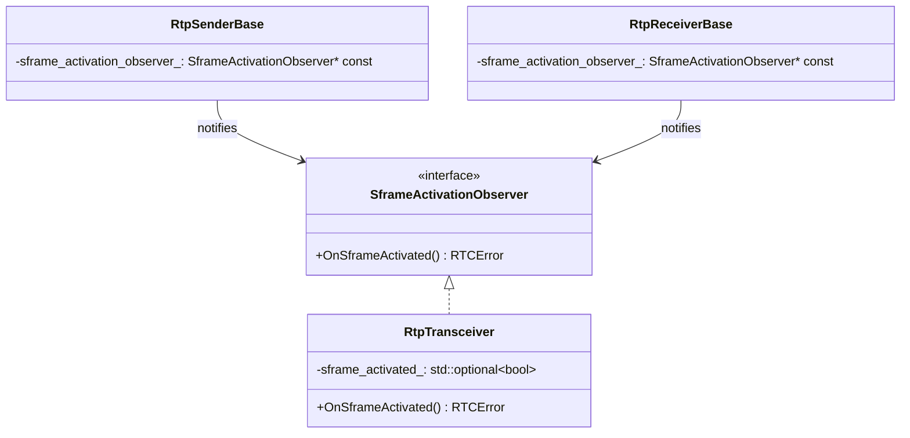
```mermaid
classDiagram
    class SframeActivationObserver {
        <<interface>>
        +OnSframeActivated() RTCError
    }

    class RtpTransceiver {
        -sframe_activated_: std::optional~bool~
        +OnSframeActivated() RTCError
    }

    class RtpSenderBase {
        -sframe_activation_observer_: SframeActivationObserver* const
    }

    class RtpReceiverBase {
        -sframe_activation_observer_: SframeActivationObserver* const
    }

    SframeActivationObserver <|.. RtpTransceiver
    RtpSenderBase --> SframeActivationObserver : notifies
    RtpReceiverBase --> SframeActivationObserver : notifies
```

**Transceiver state machine:**

| `sframe_activated_` | Meaning | `OnSframeActivated()` result |
|---|---|---|
| `std::nullopt` | Not yet decided | Sets to `true`, returns OK |
| `true` | Already activated | Returns OK (idempotent) |

The transceiver's `sframe_activated_` field is used during SDP generation to determine whether `a=sframe` should be included in the corresponding media section. Once set to `true`, it cannot be reverted.

**Constructor injection:** The observer pointer is passed via constructor to `RtpSenderBase` and `RtpReceiverBase`. The transceiver passes `this` when creating sender/receiver instances through the `CreateSender()` and `CreateReceiver()` helper functions.

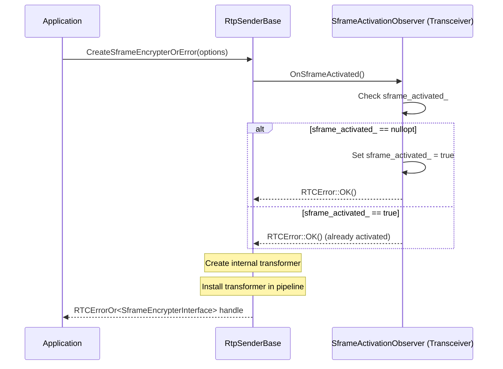
```mermaid
sequenceDiagram
    participant App as Application
    participant Sender as RtpSenderBase
    participant Observer as SframeActivationObserver (Transceiver)

    App->>Sender: CreateSframeEncrypterOrError(options)
    Sender->>Observer: OnSframeActivated()
    Observer->>Observer: Check sframe_activated_

    alt sframe_activated_ == nullopt
        Observer->>Observer: Set sframe_activated_ = true
        Observer-->>Sender: RTCError::OK()
    else sframe_activated_ == true
        Observer-->>Sender: RTCError::OK() (already activated)
    end

    Note over Sender: Create internal transformer
    Note over Sender: Install transformer in pipeline
    Sender-->>App: RTCErrorOr<SframeEncrypterInterface> handle
```

### Transformation Features Hierarchy

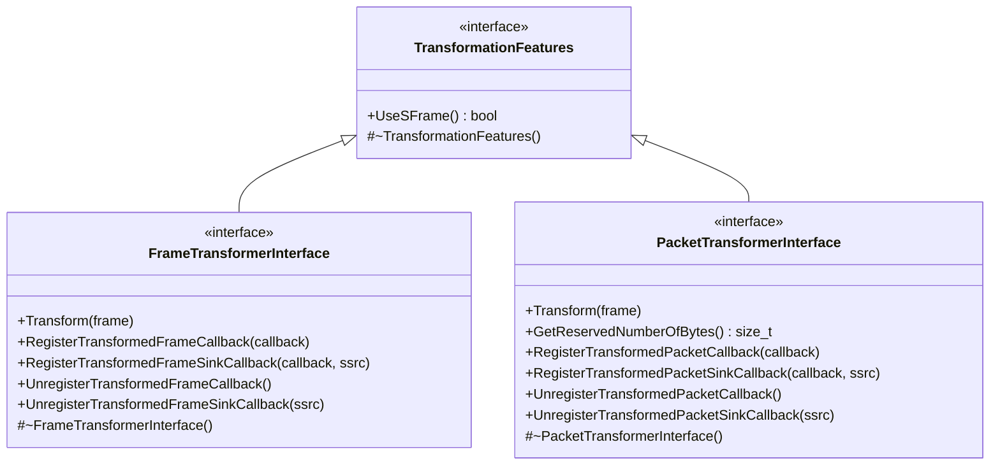
```mermaid
classDiagram
    class TransformationFeatures {
        <<interface>>
        +UseSFrame() bool
        #~TransformationFeatures()
    }
    
    class FrameTransformerInterface {
        <<interface>>
        +Transform(frame)
        +RegisterTransformedFrameCallback(callback)
        +RegisterTransformedFrameSinkCallback(callback, ssrc)
        +UnregisterTransformedFrameCallback()
        +UnregisterTransformedFrameSinkCallback(ssrc)
        #~FrameTransformerInterface()
    }
    
    class PacketTransformerInterface {
        <<interface>>
        +Transform(frame)
        +GetReservedNumberOfBytes() size_t
        +RegisterTransformedPacketCallback(callback)
        +RegisterTransformedPacketSinkCallback(callback, ssrc)
        +UnregisterTransformedPacketCallback()
        +UnregisterTransformedPacketSinkCallback(ssrc)
        #~PacketTransformerInterface()
    }
    
    TransformationFeatures <|-- FrameTransformerInterface
    TransformationFeatures <|-- PacketTransformerInterface
```

> **Note**: The `GetReservedNumberOfBytes()` method in `PacketTransformerInterface` ensures that the packetizer reserves enough space for SFrame encryption overhead to avoid MTU overflow.

### SFrameSenderTransformer (Internal)

The `SFrameSenderTransformer` is an internal implementation class created by `RtpSenderBase::CreateSframeEncrypterOrError`. It provides SFrame encryption and exposes both the key management interface (returned to the app via proxy) and transformer interfaces (installed in the pipeline).

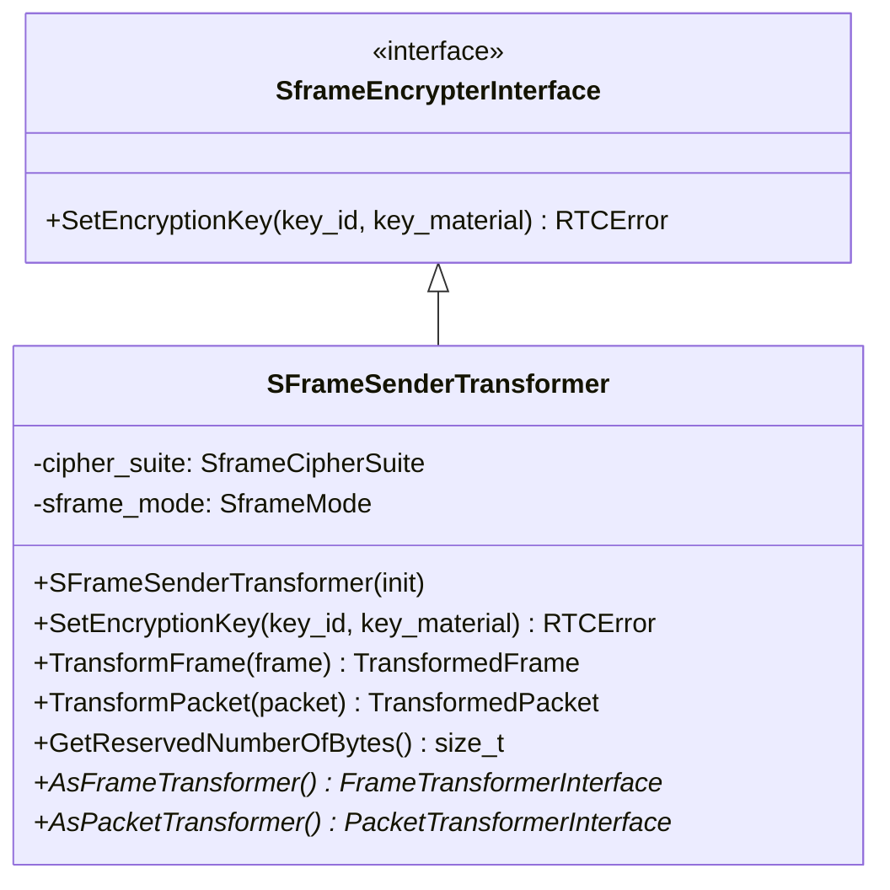
```mermaid
classDiagram
    class SframeEncrypterInterface {
        <<interface>>
        +SetEncryptionKey(key_id, key_material) RTCError
    }
    
    class SFrameSenderTransformer {
        -cipher_suite: SframeCipherSuite
        -sframe_mode: SframeMode
        +SFrameSenderTransformer(init)
        +SetEncryptionKey(key_id, key_material) RTCError
        +TransformFrame(frame) TransformedFrame
        +TransformPacket(packet) TransformedPacket
        +GetReservedNumberOfBytes() size_t
        +AsFrameTransformer() FrameTransformerInterface*
        +AsPacketTransformer() PacketTransformerInterface*
    }
    
    SframeEncrypterInterface <|-- SFrameSenderTransformer
```

> **Diamond Inheritance**: `SFrameSenderTransformer` cannot directly implement both `FrameTransformerInterface` and `PacketTransformerInterface` due to diamond inheritance from the common `TransformationFeatures` base. The factory methods `AsFrameTransformer()` and `AsPacketTransformer()` return separate wrapper objects that implement the respective interfaces and delegate to the transformer.

### SFrameReceiverTransformer (Internal)

The `SFrameReceiverTransformer` is created by `RtpReceiverBase::CreateSframeDecrypterOrError`. It provides SFrame decryption with the same factory pattern for transformer interfaces.

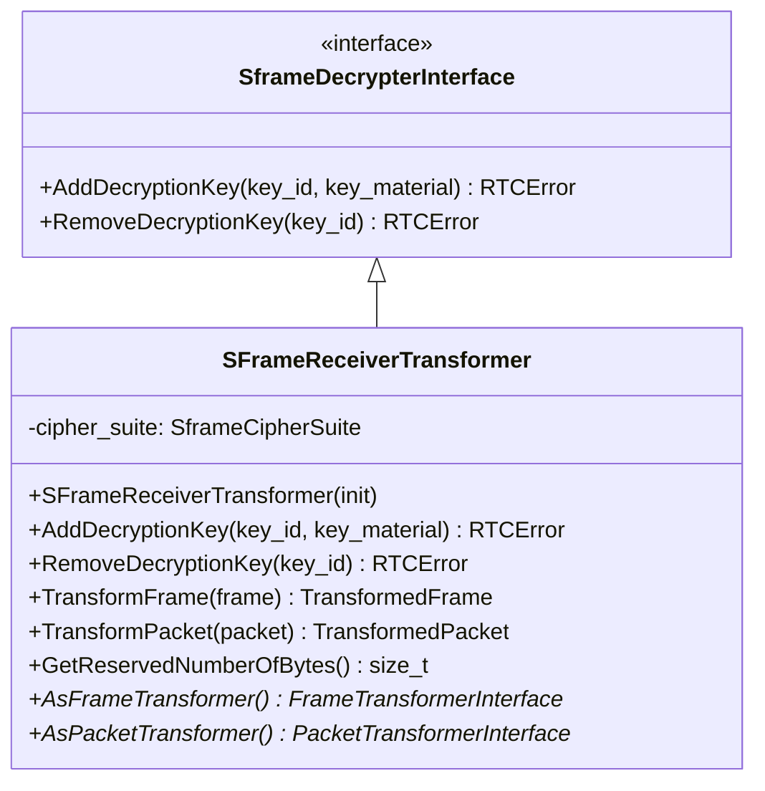
```mermaid
classDiagram
    class SframeDecrypterInterface {
        <<interface>>
        +AddDecryptionKey(key_id, key_material) RTCError
        +RemoveDecryptionKey(key_id) RTCError
    }
    
    class SFrameReceiverTransformer {
        -cipher_suite: SframeCipherSuite
        +SFrameReceiverTransformer(init)
        +AddDecryptionKey(key_id, key_material) RTCError
        +RemoveDecryptionKey(key_id) RTCError
        +TransformFrame(frame) TransformedFrame
        +TransformPacket(packet) TransformedPacket
        +GetReservedNumberOfBytes() size_t
        +AsFrameTransformer() FrameTransformerInterface*
        +AsPacketTransformer() PacketTransformerInterface*
    }
    
    SframeDecrypterInterface <|-- SFrameReceiverTransformer
```

### CreateSframeEncrypterOrError Internal Flow

When the application calls `CreateSframeEncrypterOrError`, the sender:
1. Notifies the transceiver via the observer
2. Creates the internal `SFrameSenderTransformer`
3. Based on mode, gets the appropriate transformer wrapper and installs it in the pipeline
4. Wraps the transformer in a thread-safe proxy
5. Returns the proxy as the key management handle

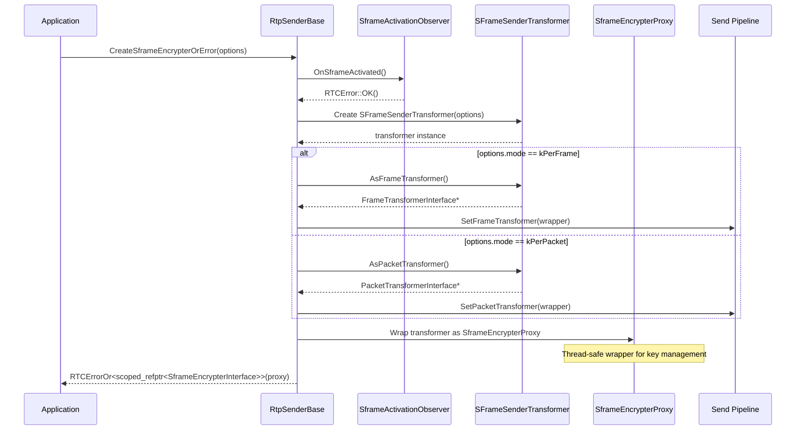
```mermaid
sequenceDiagram
    participant App as Application
    participant Sender as RtpSenderBase
    participant Observer as SframeActivationObserver
    participant Transformer as SFrameSenderTransformer
    participant Proxy as SframeEncrypterProxy
    participant Pipeline as Send Pipeline

    App->>Sender: CreateSframeEncrypterOrError(options)

    Sender->>Observer: OnSframeActivated()
    Observer-->>Sender: RTCError::OK()

    Sender->>Transformer: Create SFrameSenderTransformer(options)
    Transformer-->>Sender: transformer instance

    alt options.mode == kPerFrame
        Sender->>Transformer: AsFrameTransformer()
        Transformer-->>Sender: FrameTransformerInterface*
        Sender->>Pipeline: SetFrameTransformer(wrapper)
    else options.mode == kPerPacket
        Sender->>Transformer: AsPacketTransformer()
        Transformer-->>Sender: PacketTransformerInterface*
        Sender->>Pipeline: SetPacketTransformer(wrapper)
    end

    Sender->>Proxy: Wrap transformer as SframeEncrypterProxy
    Note over Proxy: Thread-safe wrapper for key management

    Sender-->>App: RTCErrorOr<scoped_refptr<SframeEncrypterInterface>>(proxy)
```

### CreateSframeDecrypterOrError Internal Flow

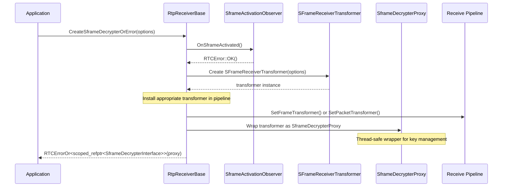
```mermaid
sequenceDiagram
    participant App as Application
    participant Receiver as RtpReceiverBase
    participant Observer as SframeActivationObserver
    participant Transformer as SFrameReceiverTransformer
    participant Proxy as SframeDecrypterProxy
    participant Pipeline as Receive Pipeline

    App->>Receiver: CreateSframeDecrypterOrError(options)

    Receiver->>Observer: OnSframeActivated()
    Observer-->>Receiver: RTCError::OK()

    Receiver->>Transformer: Create SFrameReceiverTransformer(options)
    Transformer-->>Receiver: transformer instance

    Note over Receiver: Install appropriate transformer in pipeline
    Receiver->>Pipeline: SetFrameTransformer() or SetPacketTransformer()

    Receiver->>Proxy: Wrap transformer as SframeDecrypterProxy
    Note over Proxy: Thread-safe wrapper for key management

    Receiver-->>App: RTCErrorOr<scoped_refptr<SframeDecrypterInterface>>(proxy)
```

## Key Management

### Thread Safety

Key management calls on the returned `SframeEncrypterInterface` and `SframeDecrypterInterface` handles are thread-safe. The proxy pattern ensures all calls are marshaled to the worker thread:

- **SframeEncrypterProxy**: Wraps `SFrameSenderTransformer`, marshals `SetEncryptionKey` to worker thread
- **SframeDecrypterProxy**: Wraps `SFrameReceiverTransformer`, marshals `AddDecryptionKey`/`RemoveDecryptionKey` to worker thread

The transformer itself always runs on the worker thread, ensuring single-threaded access to encryption/decryption state.

### Sender Key Management Flow

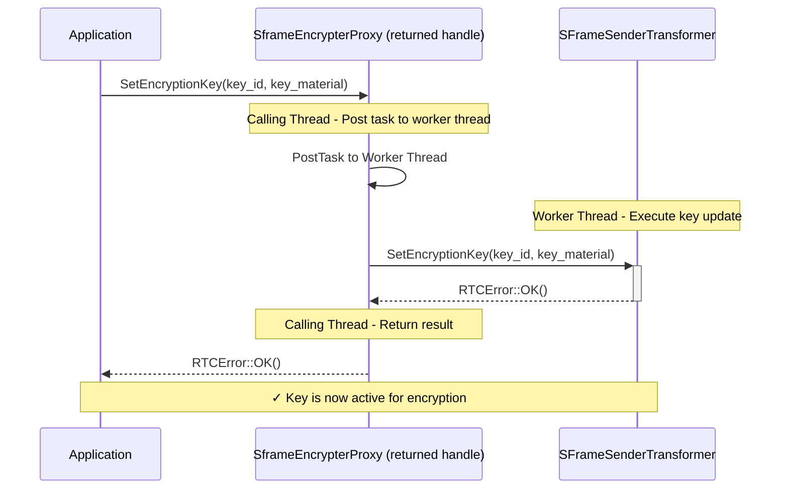
```mermaid
sequenceDiagram
    participant App as Application
    participant Proxy as SframeEncrypterProxy (returned handle)
    participant Transformer as SFrameSenderTransformer

    App->>Proxy: SetEncryptionKey(key_id, key_material)
    
    Note over Proxy: Calling Thread - Post task to worker thread
    Proxy->>Proxy: PostTask to Worker Thread
    
    Note over Transformer: Worker Thread - Execute key update
    Proxy->>+Transformer: SetEncryptionKey(key_id, key_material)
    Transformer-->>-Proxy: RTCError::OK()
    
    Note over Proxy: Calling Thread - Return result
    Proxy-->>App: RTCError::OK()
    
    Note over App,Transformer: ✓ Key is now active for encryption
```

### Receiver Key Management Flow

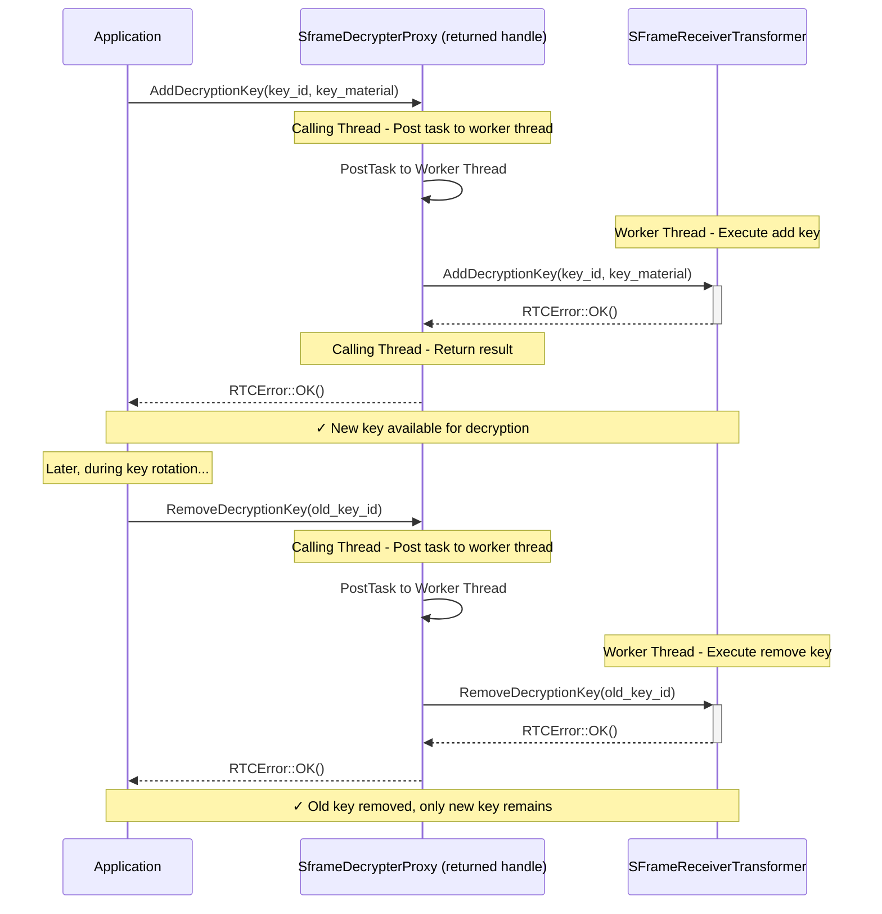
```mermaid
sequenceDiagram
    participant App as Application
    participant Proxy as SframeDecrypterProxy (returned handle)
    participant Transformer as SFrameReceiverTransformer

    App->>Proxy: AddDecryptionKey(key_id, key_material)
    
    Note over Proxy: Calling Thread - Post task to worker thread
    Proxy->>Proxy: PostTask to Worker Thread
    
    Note over Transformer: Worker Thread - Execute add key
    Proxy->>+Transformer: AddDecryptionKey(key_id, key_material)
    Transformer-->>-Proxy: RTCError::OK()
    
    Note over Proxy: Calling Thread - Return result
    Proxy-->>App: RTCError::OK()
    
    Note over App,Transformer: ✓ New key available for decryption
    
    Note over App: Later, during key rotation...
    
    App->>Proxy: RemoveDecryptionKey(old_key_id)
    
    Note over Proxy: Calling Thread - Post task to worker thread
    Proxy->>Proxy: PostTask to Worker Thread
    
    Note over Transformer: Worker Thread - Execute remove key
    Proxy->>+Transformer: RemoveDecryptionKey(old_key_id)
    Transformer-->>-Proxy: RTCError::OK()
    
    Proxy-->>App: RTCError::OK()
    
    Note over App,Transformer: ✓ Old key removed, only new key remains
```

## Transformer Installation Flows

These flows show how transformers propagate through the internal layers. In the new API, the sender/receiver calls these internally during `CreateSframeEncrypterOrError` / `CreateSframeDecrypterOrError` — the application does not call `SetFrameTransformer` / `SetPacketTransformer` directly for SFrame.

### RtpSender FrameTransformer Installation Flow

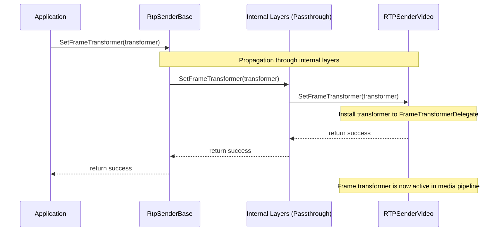
```mermaid
sequenceDiagram
    participant App as Application
    participant Sender as RtpSenderBase
    participant Passthrough as Internal Layers (Passthrough)
    participant VideoSender as RTPSenderVideo

    App->>Sender: SetFrameTransformer(transformer)
    
    Note over Sender,VideoSender: Propagation through internal layers
    
    Sender->>Passthrough: SetFrameTransformer(transformer)
    Passthrough->>VideoSender: SetFrameTransformer(transformer)
    
    Note over VideoSender: Install transformer to FrameTransformerDelegate

    VideoSender-->>Passthrough: return success
    Passthrough-->>Sender: return success
    Sender-->>App: return success
    
    Note over VideoSender : Frame transformer is now active in media pipeline
```

### RtpSender PacketTransformer Installation Flow

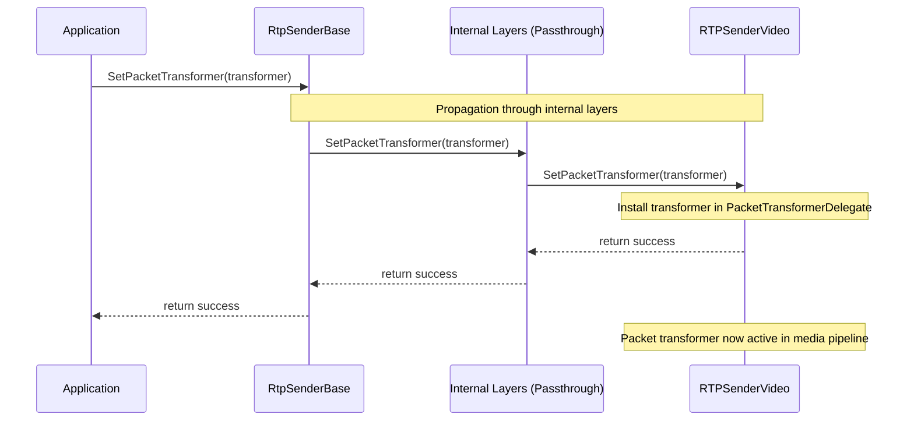
```mermaid
sequenceDiagram
    participant App as Application
    participant Sender as RtpSenderBase
    participant Passthrough as Internal Layers (Passthrough)
    participant VideoSender as RTPSenderVideo

    App->>Sender: SetPacketTransformer(transformer)
    
    Note over Sender,VideoSender: Propagation through internal layers
    
    Sender->>Passthrough: SetPacketTransformer(transformer)
    Passthrough->>VideoSender: SetPacketTransformer(transformer)
    
    Note over VideoSender: Install transformer in PacketTransformerDelegate
    
    VideoSender-->>Passthrough: return success
    Passthrough-->>Sender: return success
    Sender-->>App: return success
    
    Note over VideoSender: Packet transformer now active in media pipeline
```

### RtpReceiver(Video) FrameTransformer Installation Flow

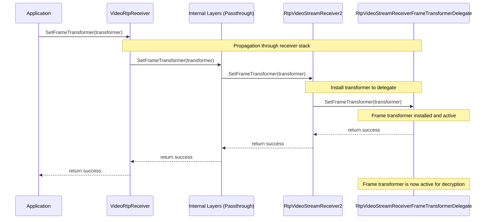
```mermaid
sequenceDiagram
    participant App as Application
    participant Receiver as VideoRtpReceiver
    participant Passthrough as Internal Layers (Passthrough)
    participant StreamReceiver as RtpVideoStreamReceiver2
    participant Delegate as RtpVideoStreamReceiverFrameTransformerDelegate

    App->>Receiver: SetFrameTransformer(transformer)
    
    Note over Receiver,Delegate: Propagation through receiver stack
    
    Receiver->>Passthrough: SetFrameTransformer(transformer)
    Passthrough->>StreamReceiver: SetFrameTransformer(transformer)
    
    Note over StreamReceiver,Delegate: Install transformer to delegate
    
    StreamReceiver->>Delegate: SetFrameTransformer(transformer)
    
    Note over Delegate: Frame transformer installed and active
    
    Delegate-->>StreamReceiver: return success
    StreamReceiver-->>Passthrough: return success
    Passthrough-->>Receiver: return success
    Receiver-->>App: return success
    
    Note over Delegate : Frame transformer is now active for decryption
```

### RtpReceiver(Video) PacketTransformer Installation Flow

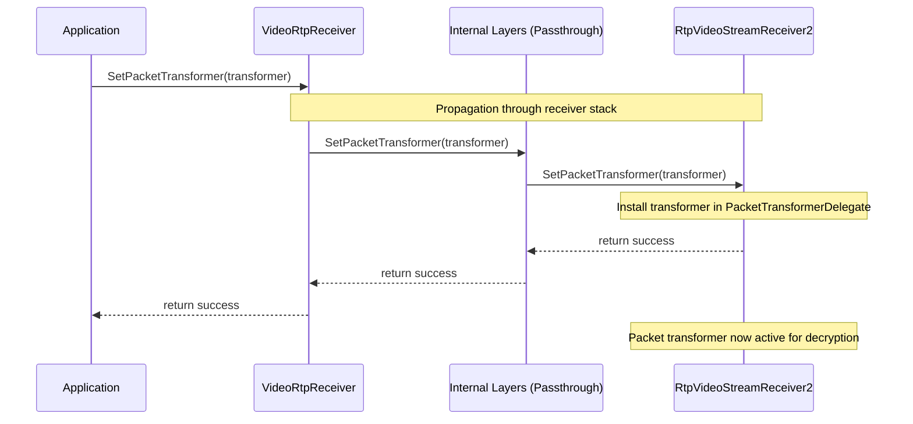
```mermaid
sequenceDiagram
    participant App as Application
    participant Receiver as VideoRtpReceiver
    participant Passthrough as Internal Layers (Passthrough)
    participant StreamReceiver as RtpVideoStreamReceiver2

    App->>Receiver: SetPacketTransformer(transformer)
    
    Note over Receiver,StreamReceiver: Propagation through receiver stack
    
    Receiver->>Passthrough: SetPacketTransformer(transformer)
    Passthrough->>StreamReceiver: SetPacketTransformer(transformer)
    
    Note over StreamReceiver: Install transformer in PacketTransformerDelegate
    
    StreamReceiver-->>Passthrough: return success
    Passthrough-->>Receiver: return success
    Receiver-->>App: return success
    
    Note over StreamReceiver: Packet transformer now active for decryption
```

### RtpReceiver(Audio) FrameTransformer Installation Flow

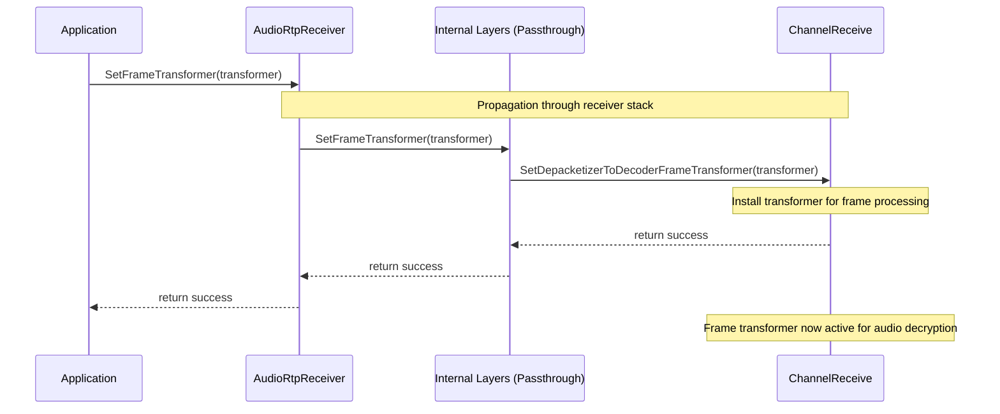
```mermaid
sequenceDiagram
    participant App as Application
    participant Receiver as AudioRtpReceiver
    participant Passthrough as Internal Layers (Passthrough)
    participant ChannelReceive as ChannelReceive

    App->>Receiver: SetFrameTransformer(transformer)
    
    Note over Receiver,ChannelReceive: Propagation through receiver stack
    
    Receiver->>Passthrough: SetFrameTransformer(transformer)
    Passthrough->>ChannelReceive: SetDepacketizerToDecoderFrameTransformer(transformer)
    
    Note over ChannelReceive: Install transformer for frame processing
    
    ChannelReceive-->>Passthrough: return success
    Passthrough-->>Receiver: return success
    Receiver-->>App: return success
    
    Note over ChannelReceive: Frame transformer now active for audio decryption
```

### RtpReceiver(Audio) PacketTransformer Installation Flow

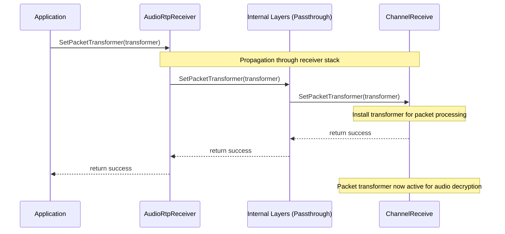
```mermaid
sequenceDiagram
    participant App as Application
    participant Receiver as AudioRtpReceiver
    participant Passthrough as Internal Layers (Passthrough)
    participant ChannelReceive as ChannelReceive

    App->>Receiver: SetPacketTransformer(transformer)
    
    Note over Receiver,ChannelReceive: Propagation through receiver stack
    
    Receiver->>Passthrough: SetPacketTransformer(transformer)
    Passthrough->>ChannelReceive: SetPacketTransformer(transformer)
    
    Note over ChannelReceive: Install transformer for packet processing
    
    ChannelReceive-->>Passthrough: return success
    Passthrough-->>Receiver: return success
    Receiver-->>App: return success
    
    Note over ChannelReceive: Packet transformer now active for audio decryption
```

## Media Processing Flows

### RtpSender Frame Processing Flow - Video

This flow describes how encoded video frames are processed through the RTP sender pipeline with SFrame encryption support. The pipeline handles both frame-level and packet-level encryption modes, with appropriate transformers applied at each stage.

**Flow Overview:**

1. **Frame Reception**: The video encoder produces an encoded frame and forwards it to the RTP sender for transmission.

2. **SFrame Configuration Validation**: The sender validates the SFrame configuration:
   - If SFrame is enabled, it checks whether the appropriate transformer (frame or packet) is available
   - If SFrame is enabled but no sframe transformer is available, the frame is dropped
   - If SFrame is not enabled, processing continues normally without SFrame encryption

3. **Frame Transformation**: When a frame transformer exists, the encoded frame is forwarded to it:
   - The frame transformer applies transformation to the frame payload
   - This occurs before packetization, transforming the complete frame
   - If no frame transformer exists, this step is skipped

4. **Packetization**: The sender determines the appropriate packetizer based on the frame transformer's `UseSFrame()` method:
   - If `UseSFrame()` returns true, an SFrame-aware packetizer is used that adds SFrame-specific headers to RTP packets
   - If `UseSFrame()` returns false (or no frame transformer), a codec-specific packetizer is used for standard RTP packet creation

5. **Packet Transformation**: When a packet transformer exists, each RTP packet is individually processed:
   - Each packet is forwarded to the packet transformer
   - The transformer applies packet-level transformations
   - This occurs after packetization, transforming individual packets
   - If no packet transformer exists, this step is skipped

6. **Repacketization** (when packet transformer with SFrame is used): Additional SFrame-specific headers may be inserted into packets.

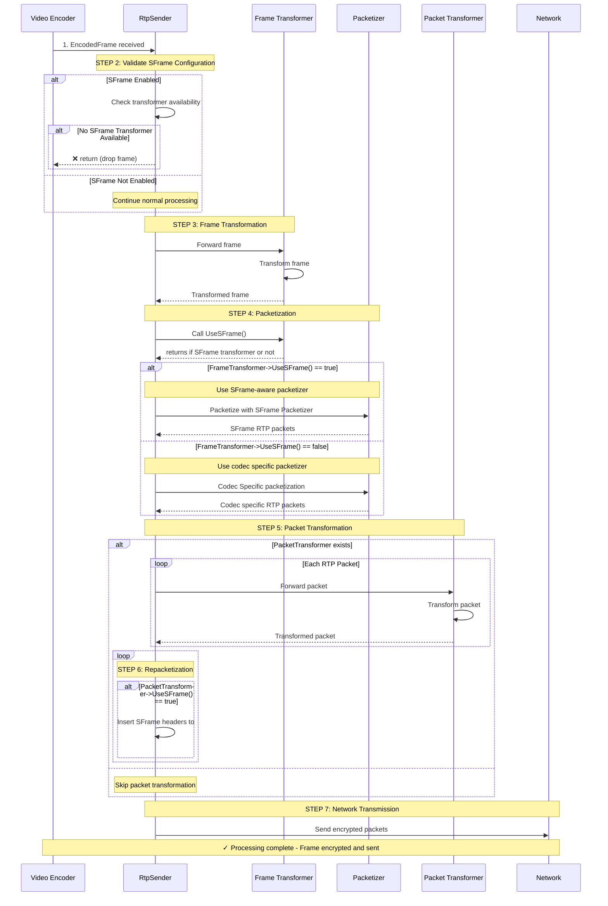
```mermaid
sequenceDiagram
    participant Encoder as Video Encoder
    participant Sender as RtpSender
    participant FrameTransformer as Frame Transformer
    participant Packetizer as Packetizer
    participant PacketTransformer as Packet Transformer
    participant Network as Network

    Encoder->>Sender: 1. EncodedFrame received
    
    Note over Sender: STEP 2: Validate SFrame Configuration

    alt SFrame Enabled
        Sender->>Sender: Check transformer availability
        alt No SFrame Transformer Available
            Sender-->>Encoder: ❌ return (drop frame)
        end
    else SFrame Not Enabled
        Note over Sender: Continue normal processing
    end
    
    Note over Sender,FrameTransformer: STEP 3: Frame Transformation
    
    Sender->>FrameTransformer: Forward frame
    FrameTransformer->>FrameTransformer: Transform frame
    FrameTransformer-->>Sender: Transformed frame
    
    Note over Sender,Packetizer: STEP 4: Packetization
    
    Sender->>FrameTransformer: Call UseSFrame()
    FrameTransformer-->>Sender: returns if SFrame transformer or not
    
    alt FrameTransformer->UseSFrame() == true
        Note over Sender,Packetizer: Use SFrame-aware packetizer
        
        Sender->>Packetizer: Packetize with SFrame Packetizer
        Packetizer-->>Sender: SFrame RTP packets
    else FrameTransformer->UseSFrame() == false
        Note over Sender,Packetizer: Use codec specific packetizer
        
        Sender->>Packetizer: Codec Specific packetization
        Packetizer-->>Sender: Codec specific RTP packets
    end
    
    Note over Sender,PacketTransformer: STEP 5: Packet Transformation
    
    alt PacketTransformer exists
        loop Each RTP Packet
            Sender->>PacketTransformer: Forward packet
            PacketTransformer->>PacketTransformer: Transform packet
            PacketTransformer-->>Sender: Transformed packet
        end

        loop
            Note over Sender: STEP 6: Repacketization
            alt PacketTransformer->UseSFrame() == true
                Sender->>Sender: Insert SFrame headers to 
            end
        end
        
    else
        Note over Sender: Skip packet transformation
    end
    
    Note over Sender,Network: STEP 7: Network Transmission
    Sender->>Network: Send encrypted packets
    
    Note over Encoder,Network: ✓ Processing complete - Frame encrypted and sent
```

### RtpReceiver Frame Processing Flow - Video

This flow describes how received RTP packets are processed through the video receiver pipeline with SFrame decryption support. The pipeline handles both packet-level and frame-level decryption modes, reconstructing and decrypting video frames before forwarding them to the decoder.

**Flow Overview:**

1. **Packet Reception**: RTP packets arrive from the network transport and are received by the VideoRtpReceiver.

2. **SFrame Configuration Validation**: The receiver validates the SFrame configuration:
   - If SFrame is enabled, it checks whether the appropriate sframe transformer (packet or frame) is available
   - If SFrame is enabled but no sframe transformer is available, the packets are dropped
   - If SFrame is not enabled, processing continues normally without decryption

3. **Pre-repacketization**: When a packet transformer exists, and it implements SFrame (packet_transformer->UseSFrame() return true), it should remove SFrame headers from packets before pushing it to the packet transformer

4. **Packet Transformation**: When a packet transformer exists, each received RTP packet is individually processed:
   - Each packet is forwarded to the packet transformer for transformation
   - The transformer removes SFrame headers and decrypts the packet payload
   - This occurs before depacketization, working on individual encrypted packets
   - If no packet transformer exists, this step is skipped

5. **Depacketization**: The receiver determines the appropriate depacketizer based on the packet transformer's `UseSFrame()` method:
   - If `UseSFrame()` returns true, an SFrame depacketizer is used to reconstruct the encrypted frame from SFrame-formatted packets
   - If `UseSFrame()` returns false (or no packet transformer), a codec-specific depacketizer reconstructs the frame using standard media depacketization
   - The depacketizer assembles RTP packets into complete video frames

6. **Frame Transformation**: When a frame transformer exists, the assembled frame is processed:
   - The frame is forwarded to the frame transformer for decryption
   - The transformer decrypts the complete frame payload
   - This occurs after depacketization, working on the reassembled encrypted frame
   - If no frame transformer exists, this step is skipped

7. **Decoding**: The processed (and potentially decrypted) frame is forwarded to the video decoder for final decoding into displayable video.

The flow supports three operational modes:
- **Frame Mode**: SFrame depacketizer reconstructs encrypted frame, frame transformer decrypts the complete frame
- **Packet Mode**: Packet transformer decrypts individual packets, standard depacketizer reconstructs the frame
- **No SFrame**: Standard RTP packet reception, depacketization, and decoding without decryption

This receiver flow is the inverse of the sender flow, ensuring that encrypted frames can be properly reconstructed and decrypted regardless of whether frame-level or packet-level encryption was used.

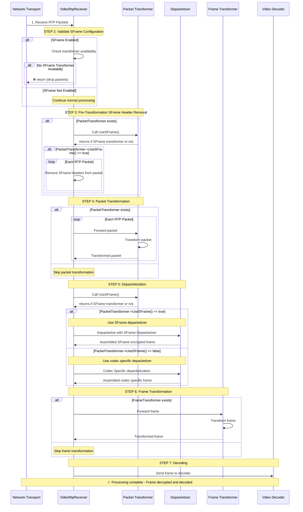
```mermaid
sequenceDiagram
    participant Network as Network Transport
    participant Receiver as VideoRtpReceiver
    participant PacketTransformer as Packet Transformer
    participant Depacketizer as Depacketizer
    participant FrameTransformer as Frame Transformer
    participant Decoder as Video Decoder

    Network->>Receiver: 1. Receive RTP Packets
    
    Note over Receiver: STEP 2: Validate SFrame Configuration

    alt SFrame Enabled
        Receiver->>Receiver: Check transformer availability
        alt No SFrame Transformer Available
            Receiver-->>Network: ❌ return (drop packets)
        end
    else SFrame Not Enabled
        Note over Receiver: Continue normal processing
    end
    
    Note over Receiver,PacketTransformer: STEP 3: Pre-Transformation SFrame Header Removal
    
    alt PacketTransformer exists
        Receiver->>PacketTransformer: Call UseSFrame()
        PacketTransformer-->>Receiver: returns if SFrame transformer or not
        
        alt PacketTransformer->UseSFrame() == true
            loop Each RTP Packet
                Receiver->>Receiver: Remove SFrame headers from packet
            end
        end
    end
    
    Note over Receiver,PacketTransformer: STEP 4: Packet Transformation
    
    alt PacketTransformer exists
        loop Each RTP Packet
            Receiver->>PacketTransformer: Forward packet
            PacketTransformer->>PacketTransformer: Transform packet
            PacketTransformer-->>Receiver: Transformed packet
        end
    else
        Note over Receiver: Skip packet transformation
    end
    
    Note over Receiver,Depacketizer: STEP 5: Depacketization
    
    Receiver->>PacketTransformer: Call UseSFrame()
    PacketTransformer-->>Receiver: returns if SFrame transformer or not
    
    alt PacketTransformer->UseSFrame() == true
        Note over Receiver,Depacketizer: Use SFrame depacketizer
        
        Receiver->>Depacketizer: Depacketize with SFrame Depacketizer
        Depacketizer-->>Receiver: Assembled SFrame encrypted frame
    else PacketTransformer->UseSFrame() == false
        Note over Receiver,Depacketizer: Use codec specific depacketizer
        
        Receiver->>Depacketizer: Codec Specific depacketization
        Depacketizer-->>Receiver: Assembled codec specific frame
    end
    
    Note over Receiver,FrameTransformer: STEP 6: Frame Transformation
    
    alt FrameTransformer exists
        Receiver->>FrameTransformer: Forward frame
        FrameTransformer->>FrameTransformer: Transform frame
        FrameTransformer-->>Receiver: Transformed frame
    else
        Note over Receiver: Skip frame transformation
    end
    
    Note over Receiver,Decoder: STEP 7: Decoding
    Receiver->>Decoder: Send frame to decoder
    
    Note over Network,Decoder: ✓ Processing complete - Frame decrypted and decoded
```

