# WebRTC SFrame Integration Architecture

This document describes the architectural design for integrating SFrame (Secure Frame) encryption into WebRTC's native C++ API. SFrame provides end-to-end media security as defined by [RFC 9605](https://www.rfc-editor.org/rfc/rfc9605.html) and [draft-ietf-avtcore-rtp-sframe](https://github.com/ietf-wg-avtcore/draft-ietf-avtcore-rtp-sframe).

## Overview

SFrame encryption can be applied at two levels:
- **Per-frame** (`SframeMode::kPerFrame`): Encrypts complete video/audio frames before packetization
- **Per-packet** (`SframeMode::kPerPacket`): Encrypts individual RTP packets after packetization

Both modes are enabled through the same public API on `RtpSenderInterface` and `RtpReceiverInterface`. The application creates an SFrame encrypter or decrypter by calling a method on the sender or receiver, receives a key management handle, and the internal pipeline handles encrypter/decrypter installation and SDP negotiation automatically.

## Architecture Overview

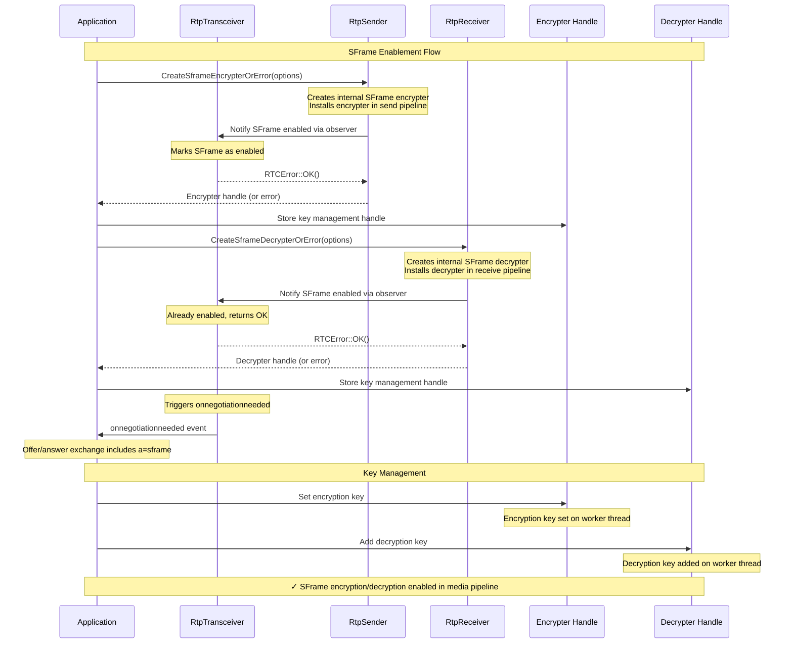

## Public API

### SFrame Types (`api/sframe/sframe_types.h`)

```cpp
enum class SframeMode {
  kPerFrame,
  kPerPacket,
};

enum class SframeCipherSuite {
  kAesCtr128HmacSha256_80,
  kAesCtr128HmacSha256_64,
  kAesCtr128HmacSha256_32,
  kAesGcm128,
  kAesGcm256,
};
```

### SFrame Encrypter Configuration and Interface (`api/sframe/sframe_encrypter_interface.h`)

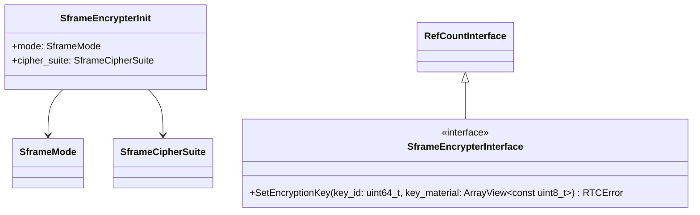

The encrypter init carries both `mode` (per-frame or per-packet) and `cipher_suite`. The mode determines how the send pipeline processes frames — either encrypting complete frames before packetization or encrypting individual packets after packetization. The `cipher_suite` selects the cryptographic algorithm used for encryption.

### SFrame Decrypter Configuration and Interface (`api/sframe/sframe_decrypter_interface.h`)

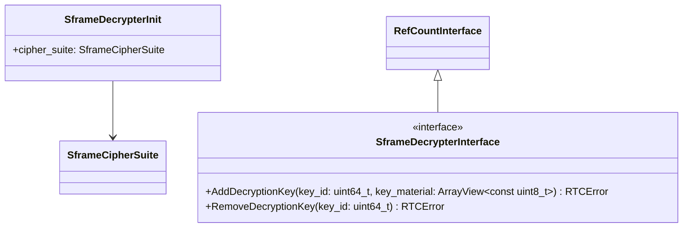

The decrypter init carries only `cipher_suite` — the mode (per-frame or per-packet) is automatically determined from the received encrypted data. The decrypter supports multiple simultaneous keys to handle key rotation scenarios, where new keys are added before old keys are removed.

> **Note:** The SFrame header contains a `T` bit that indicates whether the payload is an encrypted full frame (`T=1`) or an encrypted packet (`T=0`). The decrypter uses this bit to automatically select the correct decryption path without requiring the application to specify the mode.

### API on RtpSenderInterface (`api/rtp_sender_interface.h`)

```cpp
virtual RTCErrorOr<scoped_refptr<SframeEncrypterInterface>>
CreateSframeEncrypterOrError(const SframeEncrypterInit& options) {
  RTC_DCHECK_NOTREACHED();
  return RTCError();
}
```

Creates an internal SFrame encrypter, installs it in the send pipeline, notifies the transceiver of SFrame enablement, and returns a key management handle. The returned `SframeEncrypterInterface` is used solely for key management (`SetEncryptionKey`). Can only be called once per sender — subsequent calls return an error.

**Errors:**
- `INVALID_MODIFICATION`: SFrame negotiation has already been disabled on this transceiver (SFrame can only be enabled during the initial offer/answer exchange)

### API on RtpReceiverInterface (`api/rtp_receiver_interface.h`)

```cpp
virtual RTCErrorOr<scoped_refptr<SframeDecrypterInterface>>
CreateSframeDecrypterOrError(const SframeDecrypterInit& options) {
  RTC_DCHECK_NOTREACHED();
  return RTCError();
}
```

Creates an internal SFrame decrypter, installs it in the receive pipeline, notifies the transceiver of SFrame enablement, and returns a key management handle. The returned `SframeDecrypterInterface` is used for key management (`AddDecryptionKey`, `RemoveDecryptionKey`). Can only be called once per receiver — subsequent calls return an error.

**Errors:**
- `INVALID_MODIFICATION`: SFrame negotiation has already been disabled on this transceiver (SFrame can only be enabled during the initial offer/answer exchange)

## Internal Architecture

### SframeStateObserver

When `CreateSframeEncrypterOrError` or `CreateSframeDecrypterOrError` is called, the sender/receiver notifies its transceiver via the `SframeStateObserver` callback. This follows the `SetStreamsObserver` pattern used throughout libwebrtc — a raw pointer to an observer interface, injected via constructor and stored as a `const` member.

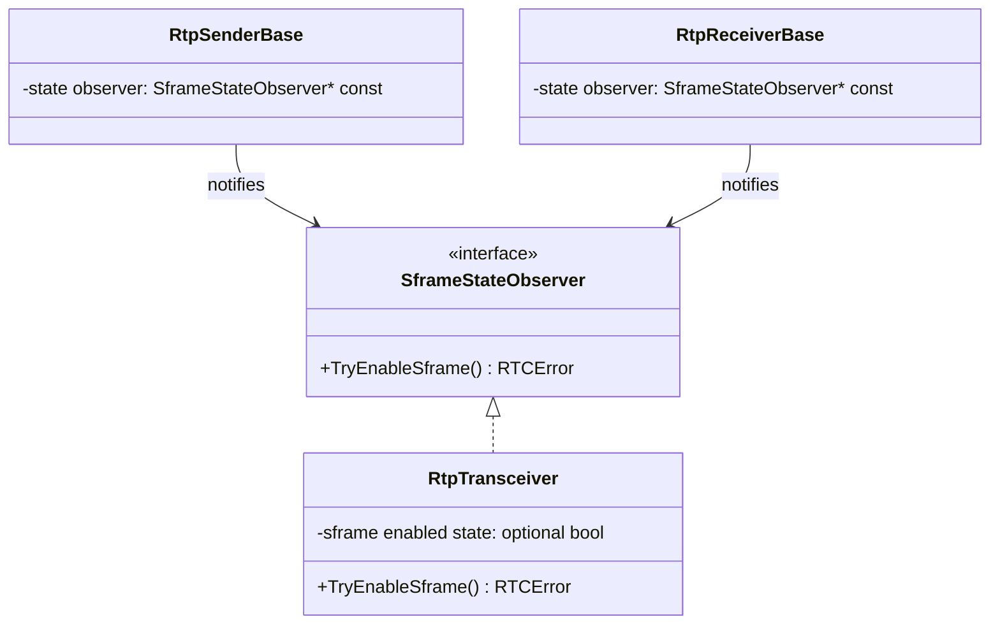

**Transceiver state machine:**

| SFrame enabled state | Meaning | `TryEnableSframe()` result |
|---|---|---|
| Not yet decided | SFrame has not been enabled or disabled | Sets to enabled, returns OK |
| Enabled | SFrame is enabled on this transceiver | Returns OK (idempotent) |
| Disabled | SFrame was explicitly turned off | Returns `INVALID_MODIFICATION` error |

The transceiver's SFrame enabled state is used during SDP generation to determine whether `a=sframe` should be included in the corresponding media section. Once enabled, it cannot be reverted. The disabled state is set when an offer/answer exchange completes without SFrame — at that point, SFrame can no longer be enabled on this transceiver.

**Constructor injection:** The observer pointer is passed via constructor to `RtpSenderBase` and `RtpReceiverBase`. The transceiver passes `this` when creating sender/receiver instances through the `CreateSender()` and `CreateReceiver()` helper functions.

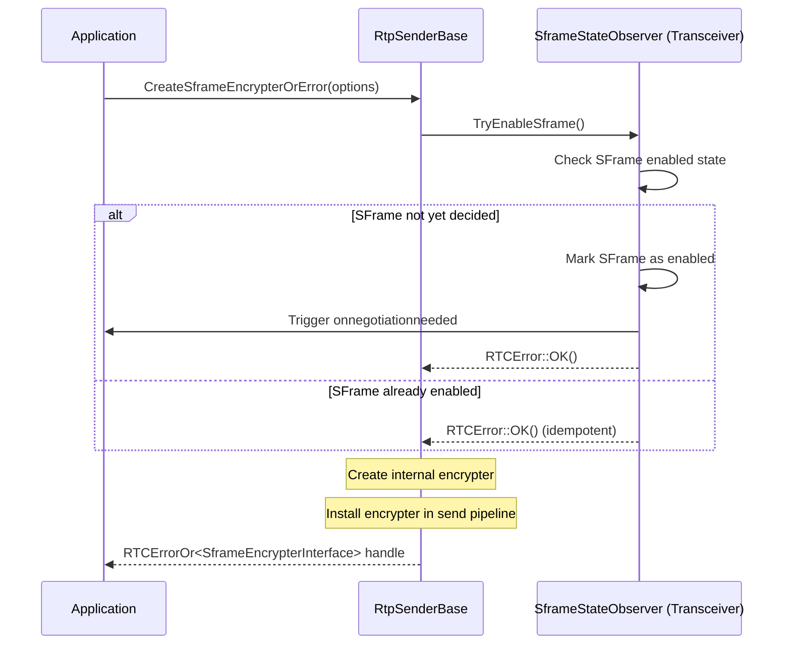

### SframeEncrypterImpl (Internal)

The `SframeEncrypterImpl` is the internal implementation of `SframeEncrypterInterface`, created by `RtpSenderBase::CreateSframeEncrypterOrError`. It provides SFrame encryption and exposes the key management interface (returned to the app via proxy). Internally, it is installed in the send pipeline to encrypt frames or packets depending on the configured mode.

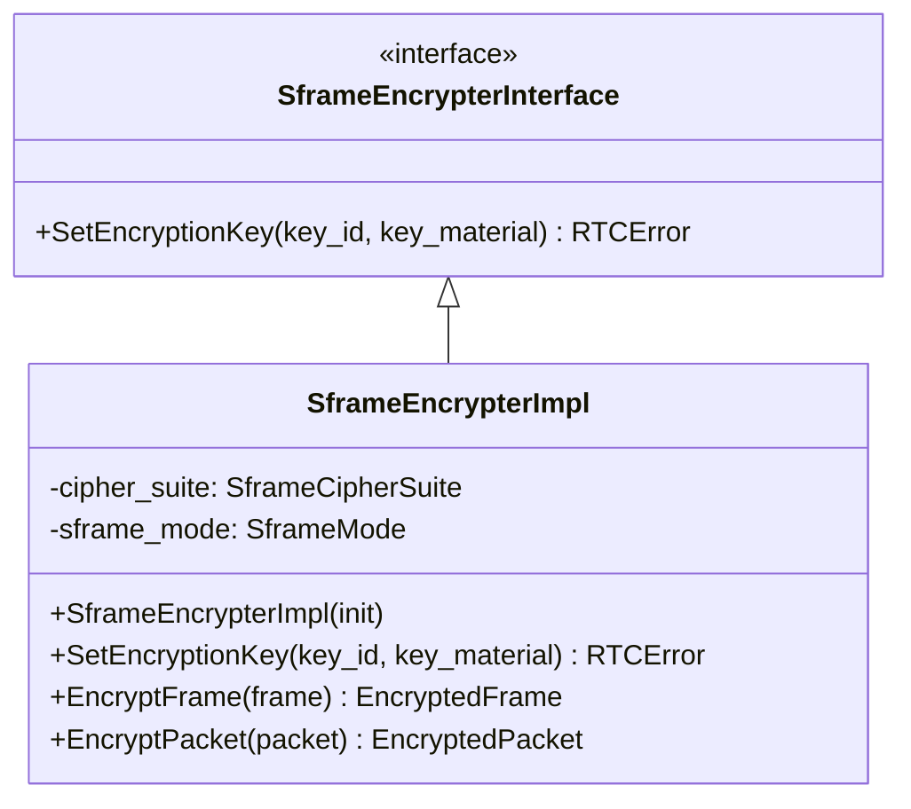

### SframeDecrypterImpl (Internal)

The `SframeDecrypterImpl` is the internal implementation of `SframeDecrypterInterface`, created by `RtpReceiverBase::CreateSframeDecrypterOrError`. It provides SFrame decryption and exposes the key management interface (returned to the app via proxy). Internally, it is installed in the receive pipeline to decrypt frames or packets.

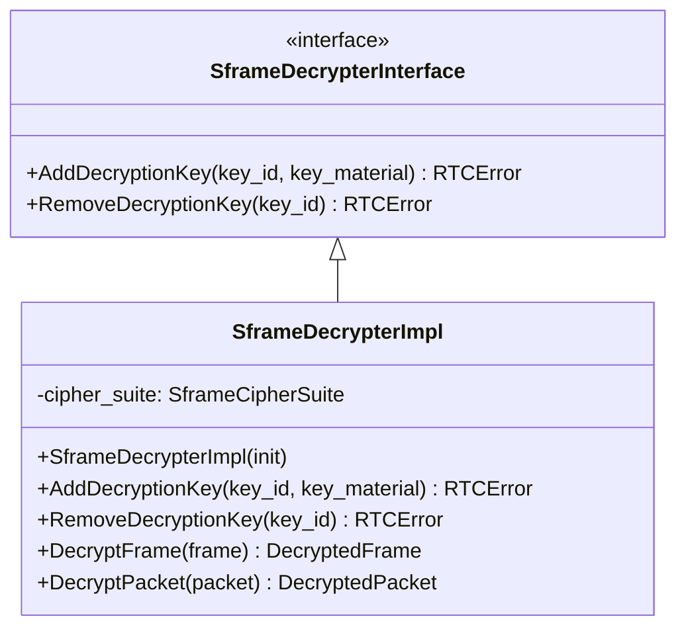

### CreateSframeEncrypterOrError Internal Flow

When the application calls `CreateSframeEncrypterOrError`, the sender:
1. Notifies the transceiver via the observer
2. Creates the internal `SframeEncrypterImpl`
3. Installs the encrypter in the send pipeline
4. Wraps the encrypter in a thread-safe proxy
5. Returns the proxy as the key management handle


### CreateSframeDecrypterOrError Internal Flow

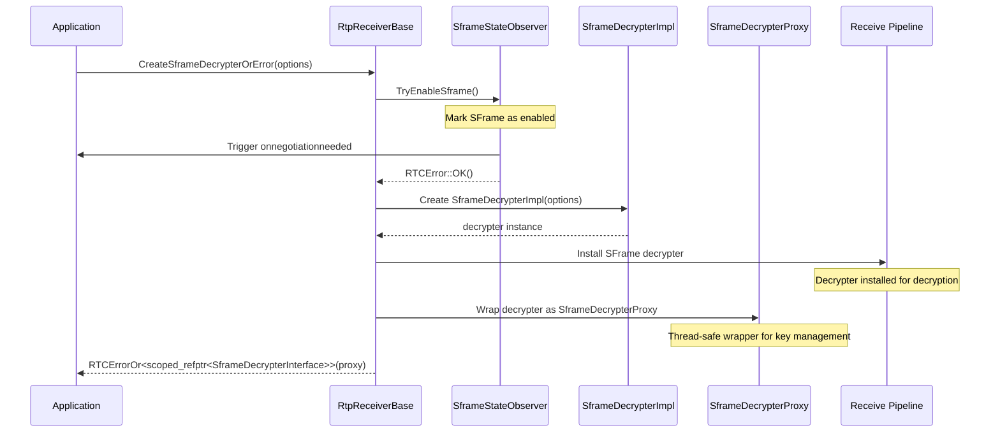

## Key Management

### Thread Safety

Key management calls on the returned `SframeEncrypterInterface` and `SframeDecrypterInterface` handles are thread-safe. The proxy pattern ensures all calls are marshaled to the worker thread:

- **SframeEncrypterProxy**: Wraps `SframeEncrypterImpl`, marshals `SetEncryptionKey` to worker thread
- **SframeDecrypterProxy**: Wraps `SframeDecrypterImpl`, marshals `AddDecryptionKey`/`RemoveDecryptionKey` to worker thread

The encrypter/decrypter itself always runs on the worker thread, ensuring single-threaded access to encryption/decryption state.

### Sender Key Management Flow

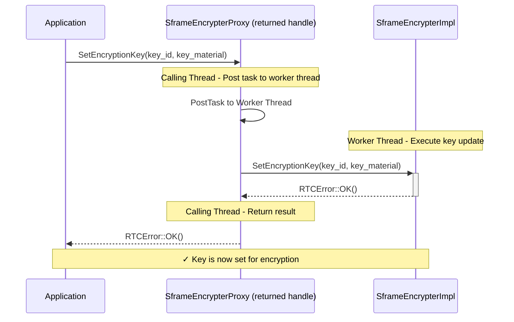

### Receiver Key Management Flow

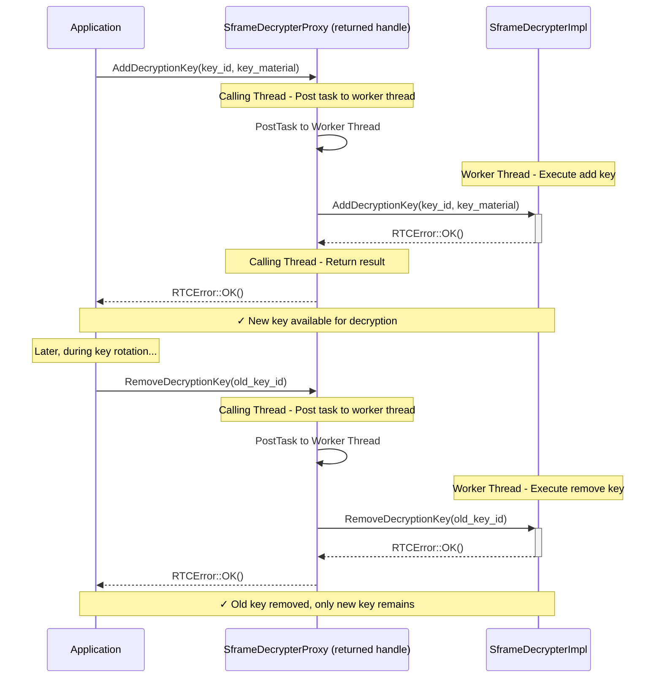

## Media Processing Flows

### RtpSender Frame Processing Flow - Video

This flow describes how encoded video frames are processed through the RTP sender pipeline with SFrame encryption support. The pipeline handles both frame-level and packet-level encryption modes, with the `SframeEncrypterImpl` invoked directly at the appropriate stage.

**Flow Overview:**

1. **Frame Reception**: The video encoder produces an encoded frame and forwards it to the RTP sender for transmission.

2. **SFrame Configuration Validation**: The sender validates the SFrame configuration:
   - If SFrame is enabled, it checks whether the `SframeEncrypterImpl` has been installed and has a key set
   - If SFrame is enabled but the encrypter is not ready, the frame is dropped
   - If SFrame is not enabled, processing continues normally without encryption

3. **Frame Encryption** (per-frame mode only): When SFrame per-frame mode is enabled, the `SframeEncrypterImpl` encrypts the complete encoded frame before packetization:
   - The frame payload is encrypted and the SFrame header is prepended
   - If SFrame is not enabled or per-packet mode is enabled, this step is skipped

4. **Packetization**: The sender determines the appropriate packetizer based on the enabled SFrame mode:
   - If SFrame per-frame mode is enabled, an SFrame-aware packetizer is used that creates RTP packets with SFrame-specific headers (the frame payload is already encrypted at this point)
   - If SFrame per-packet mode is enabled or SFrame is not enabled, a codec-specific packetizer is used for standard RTP packet creation

5. **Packet Encryption** (per-packet mode only): When SFrame per-packet mode is enabled, the `SframeEncrypterImpl` encrypts each RTP packet individually:
   - Each packet payload is encrypted and the SFrame header is prepended
   - This occurs after packetization, encrypting individual packets
   - If SFrame is not enabled or per-frame mode is enabled, this step is skipped

6. **Repacketization** (per-packet mode only): SFrame-specific RTP headers are inserted into the encrypted packets.

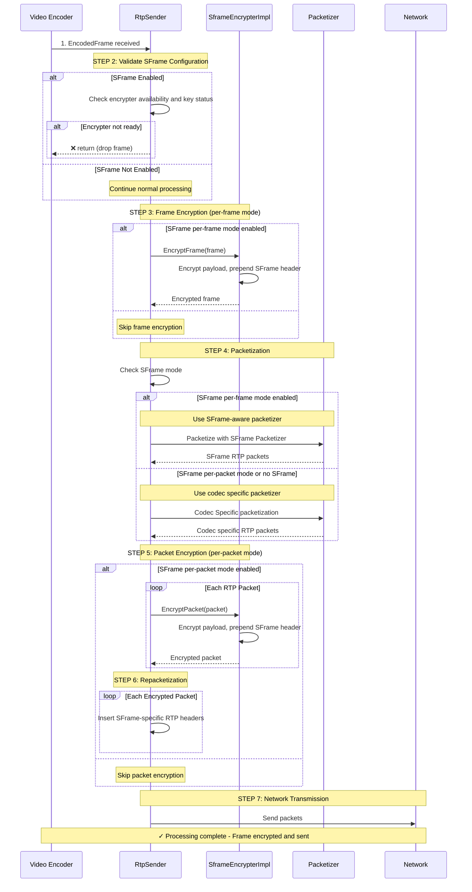

### RtpReceiver Frame Processing Flow - Video

This flow describes how received RTP packets are processed through the video receiver pipeline with SFrame decryption support. The pipeline handles both packet-level and frame-level decryption modes, with the `SframeDecrypterImpl` invoked directly at the appropriate stage.

**Flow Overview:**

1. **Packet Reception**: RTP packets arrive from the network transport and are received by the VideoRtpReceiver.

2. **SFrame Configuration Validation**: The receiver validates the SFrame configuration:
   - If SFrame is enabled, it checks whether the `SframeDecrypterImpl` has been installed and has keys available
   - If SFrame is enabled but the decrypter is not ready, the packets are dropped
   - If SFrame is not enabled, processing continues normally without decryption

3. **SFrame Header Removal** (per-packet mode only): When SFrame per-packet mode is enabled, SFrame-specific RTP headers are stripped from each packet before decryption.

4. **Packet Decryption** (per-packet mode only): When SFrame per-packet mode is enabled, the `SframeDecrypterImpl` decrypts each RTP packet individually:
   - The SFrame header is parsed and the packet payload is decrypted
   - This occurs before depacketization, working on individual encrypted packets
   - If SFrame is not enabled or per-frame mode is enabled, this step is skipped

5. **Depacketization**: The receiver determines the appropriate depacketizer based on the enabled SFrame mode:
   - If SFrame per-frame mode is enabled, an SFrame depacketizer is used to reconstruct the encrypted frame from SFrame-formatted packets
   - If SFrame per-packet mode is enabled or SFrame is not enabled, a codec-specific depacketizer reconstructs the frame using standard media depacketization
   - The depacketizer assembles RTP packets into complete video frames

6. **Frame Decryption** (per-frame mode only): When SFrame per-frame mode is enabled, the `SframeDecrypterImpl` decrypts the complete assembled frame:
   - The SFrame header is parsed and the frame payload is decrypted
   - This occurs after depacketization, working on the reassembled encrypted frame
   - If SFrame is not enabled or per-packet mode is enabled, this step is skipped

7. **Decoding**: The processed (and potentially decrypted) frame is forwarded to the video decoder for final decoding into displayable video.

The flow supports three operational modes:
- **Per-frame mode**: SFrame depacketizer reconstructs encrypted frame, `SframeDecrypterImpl` decrypts the complete frame
- **Per-packet mode**: `SframeDecrypterImpl` decrypts individual packets, standard depacketizer reconstructs the frame
- **No SFrame**: Standard RTP packet reception, depacketization, and decoding without decryption

This receiver flow is the inverse of the sender flow, ensuring that encrypted frames can be properly reconstructed and decrypted regardless of whether frame-level or packet-level encryption was used.

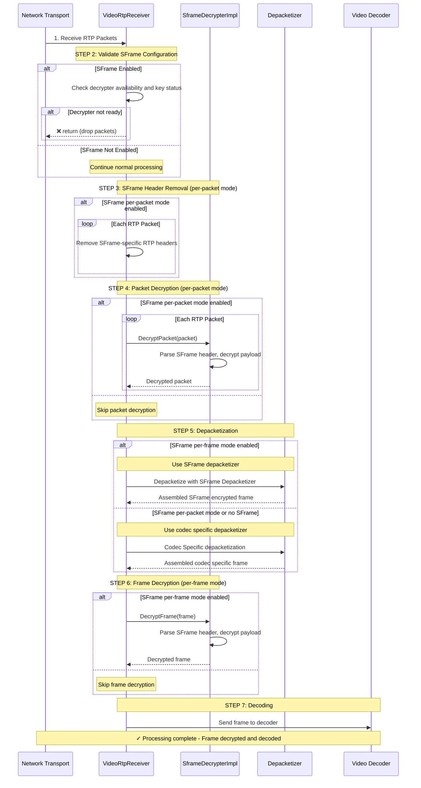

