# WebRTC SFrame Integration Architecture

This document describes the architectural design for integrating SFrame (Secure Frame) encryption into WebRTC applications. SFrame provides end-to-end media security that works even when media flows through untrusted servers or intermediaries.

## Overview

SFrame encryption can be applied at two different levels:
- **Per-frame**: Encrypts complete video/audio frames before packetization
- **Per-packet**: Encrypts individual RTP packets after packetization

Both approaches offer strong security guarantees, with per-packet providing finer granularity and per-frame offering better performance characteristics.

## Architecture Overview

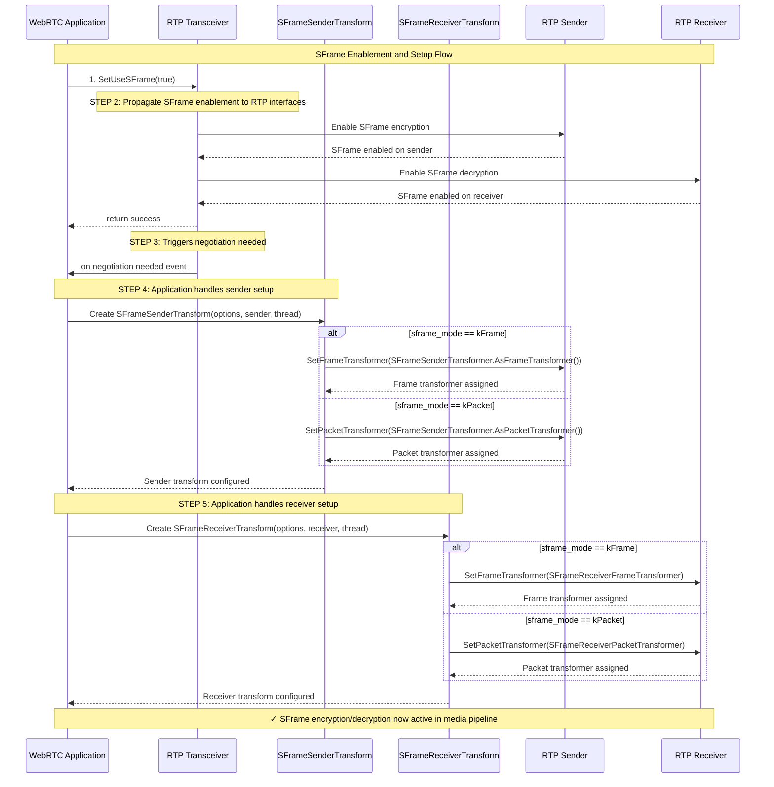
```mermaid
sequenceDiagram
    participant App as WebRTC Application
    participant T as RTP Transceiver
    participant SenderTransform as SFrameSenderTransform
    participant ReceiverTransform as SFrameReceiverTransform
    participant S as RTP Sender
    participant R as RTP Receiver

    Note over App,R: SFrame Enablement and Setup Flow

    App->>T: 1. SetUseSFrame(true)
    
    Note over T: STEP 2: Propagate SFrame enablement to RTP interfaces
    T->>S: Enable SFrame encryption
    S-->>T: SFrame enabled on sender
    T->>R: Enable SFrame decryption
    R-->>T: SFrame enabled on receiver
    T-->>App: return success
    
    Note over T: STEP 3: Triggers negotiation needed
    T->>App: on negotiation needed event
    
    Note over App,SenderTransform: STEP 4: Application handles sender setup
    App->>SenderTransform: Create SFrameSenderTransform(options, sender, thread)
    
    alt sframe_mode == kFrame
        SenderTransform->>S: SetFrameTransformer(SFrameSenderTransformer.AsFrameTransformer())
        S-->>SenderTransform: Frame transformer assigned
    else sframe_mode == kPacket
        SenderTransform->>S: SetPacketTransformer(SFrameSenderTransformer.AsPacketTransformer())
        S-->>SenderTransform: Packet transformer assigned
    end
    
    SenderTransform-->>App: Sender transform configured
    
    Note over App,ReceiverTransform: STEP 5: Application handles receiver setup
    App->>ReceiverTransform: Create SFrameReceiverTransform(options, receiver, thread)
    
    alt sframe_mode == kFrame
        ReceiverTransform->>R: SetFrameTransformer(SFrameReceiverFrameTransformer)
        R-->>ReceiverTransform: Frame transformer assigned
    else sframe_mode == kPacket
        ReceiverTransform->>R: SetPacketTransformer(SFrameReceiverPacketTransformer)
        R-->>ReceiverTransform: Packet transformer assigned
    end
    
    ReceiverTransform-->>App: Receiver transform configured
    
    Note over App,R: ✓ SFrame encryption/decryption now active in media pipeline
```

## Core Interface Architecture

### RtpTransceiverInterface

Extend `RtpTransceiverInterface` to enable setting `SFrame` configuration which will trigger `on negotiation needed` event.

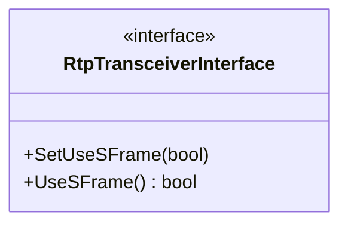
```mermaid
classDiagram
  class RtpTransceiverInterface {
    <<interface>>
    +SetUseSFrame(bool)
    +UseSFrame() bool
  }
```

### Transformation Features Hierarchy

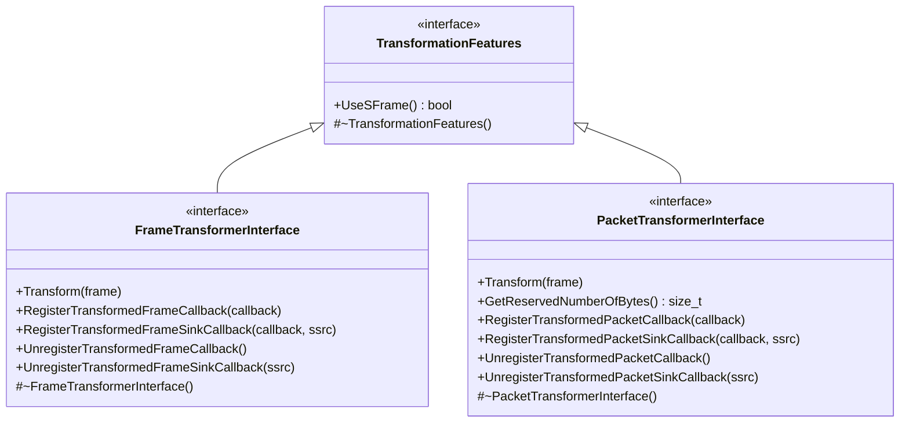
```mermaid
classDiagram
    class TransformationFeatures {
        <<interface>>
        +UseSFrame() bool
        #~TransformationFeatures()
    }
    
    class FrameTransformerInterface {
        <<interface>>
        +Transform(frame)
        +RegisterTransformedFrameCallback(callback)
        +RegisterTransformedFrameSinkCallback(callback, ssrc)
        +UnregisterTransformedFrameCallback()
        +UnregisterTransformedFrameSinkCallback(ssrc)
        #~FrameTransformerInterface()
    }
    
    class PacketTransformerInterface {
        <<interface>>
        +Transform(frame)
        +GetReservedNumberOfBytes() size_t
        +RegisterTransformedPacketCallback(callback)
        +RegisterTransformedPacketSinkCallback(callback, ssrc)
        +UnregisterTransformedPacketCallback()
        +UnregisterTransformedPacketSinkCallback(ssrc)
        #~PacketTransformerInterface()
    }
    
    TransformationFeatures <|-- FrameTransformerInterface
    TransformationFeatures <|-- PacketTransformerInterface
```

> **Note**: The `GetReservedNumberOfBytes()` method in `PacketTransformerInterface` ensures that the packetizer reserves enough space for transformer data to avoid MTU overflow. This is critical for packet-level transformations where additional encryption overhead needs to be accommodated within network packet size constraints.

### RTP Interface Integration

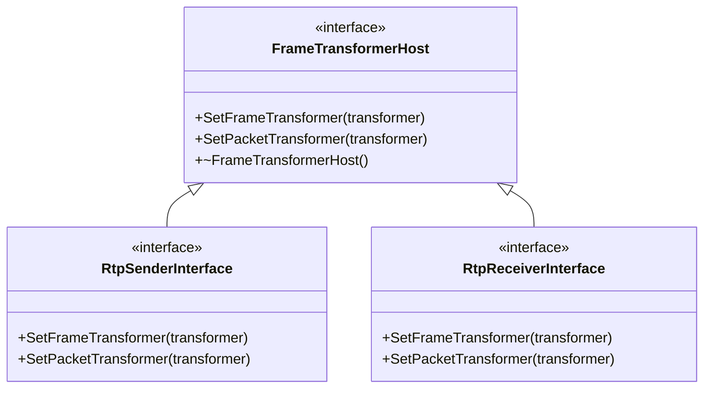
```mermaid
classDiagram
    class FrameTransformerHost {
        <<interface>>
        +SetFrameTransformer(transformer)
        +SetPacketTransformer(transformer)
        +~FrameTransformerHost()
    }
    
    class RtpSenderInterface {
        <<interface>>
        +SetFrameTransformer(transformer)
        +SetPacketTransformer(transformer)
    }
    
    class RtpReceiverInterface {
        <<interface>>
        +SetFrameTransformer(transformer)
        +SetPacketTransformer(transformer)
    }
    
    FrameTransformerHost <|-- RtpSenderInterface
    FrameTransformerHost <|-- RtpReceiverInterface
```

### SFrame Management Interfaces

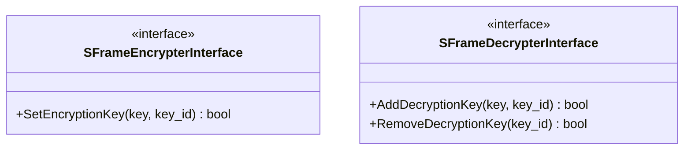
```mermaid
classDiagram
    class SFrameEncrypterInterface {
        <<interface>>
        +SetEncryptionKey(key, key_id) bool
    }
    
    class SFrameDecrypterInterface {
        <<interface>>
        +AddDecryptionKey(key, key_id) bool
        +RemoveDecryptionKey(key_id) bool
    }
```

> **Note**: These interfaces provide key management capabilities for SFrame transformers. The encrypter interface manages a single encryption key, while the decrypter interface can manage multiple decryption keys simultaneously to handle key rotation scenarios.

For each of `SFrameEncrypterInterface` and `SFrameDecrypterInterface` proxy will be defined.
To ensure that calls of `SetEncryptionKey` and `AddDecryptionKey`/`RemoveDecryptionKey` will be delegated to valid thread.

## Configuration and Options

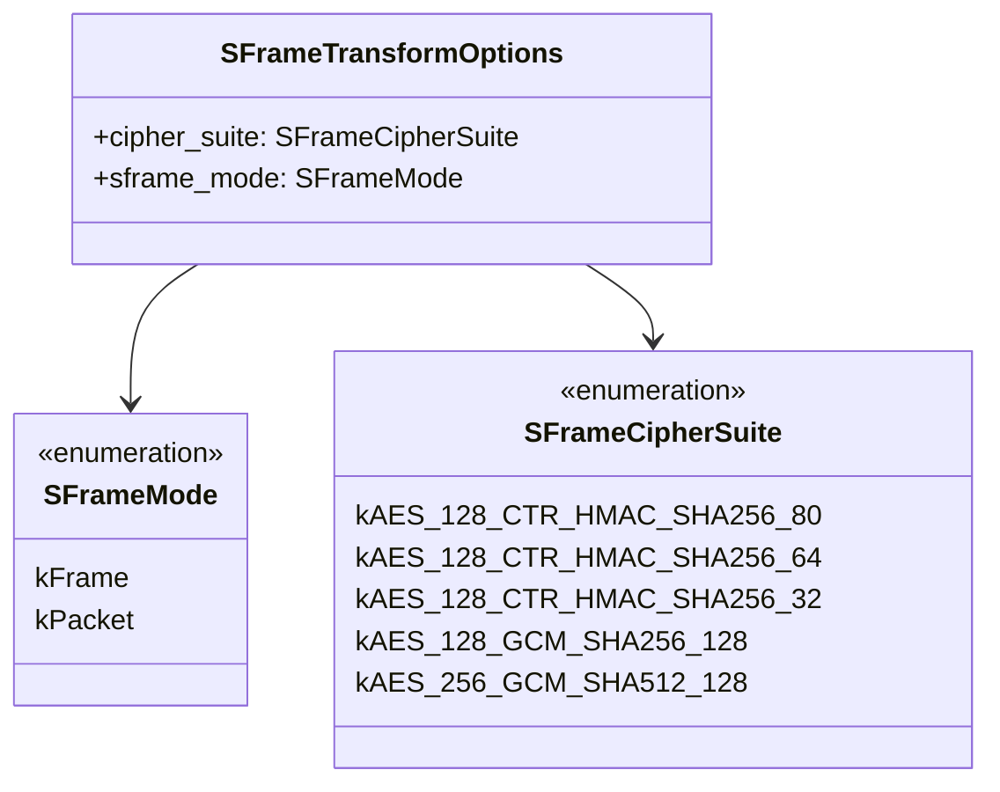
```mermaid
classDiagram
    class SFrameMode {
        <<enumeration>>
        kFrame
        kPacket
    }
    
    class SFrameCipherSuite {
        <<enumeration>>
        kAES_128_CTR_HMAC_SHA256_80
        kAES_128_CTR_HMAC_SHA256_64
        kAES_128_CTR_HMAC_SHA256_32
        kAES_128_GCM_SHA256_128
        kAES_256_GCM_SHA512_128
    }
    
    class SFrameTransformOptions {
        +cipher_suite: SFrameCipherSuite
        +sframe_mode: SFrameMode
    }
    
    SFrameTransformOptions --> SFrameMode
    SFrameTransformOptions --> SFrameCipherSuite
```

## Core objects

### SFrameSenderTransformer

The `SFrameSenderTransformer` provides SFrame encryption with factory methods to create appropriate transformer delegate.

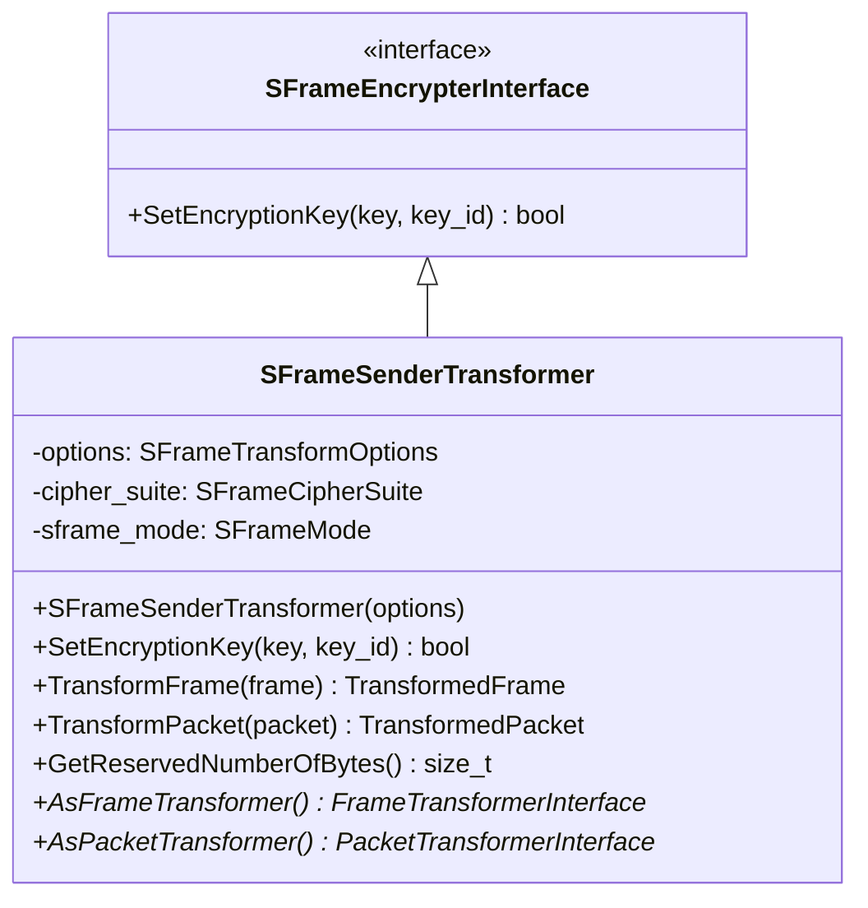
```mermaid
classDiagram
    class SFrameEncrypterInterface {
        <<interface>>
        +SetEncryptionKey(key, key_id) bool
    }
    
    class SFrameSenderTransformer {
        -options: SFrameTransformOptions
        -cipher_suite: SFrameCipherSuite
        -sframe_mode: SFrameMode
        +SFrameSenderTransformer(options)
        +SetEncryptionKey(key, key_id) bool
        +TransformFrame(frame) TransformedFrame
        +TransformPacket(packet) TransformedPacket
        +GetReservedNumberOfBytes() size_t
        +AsFrameTransformer() FrameTransformerInterface*
        +AsPacketTransformer() PacketTransformerInterface*
    }
    
    SFrameEncrypterInterface <|-- SFrameSenderTransformer
```

> **Diamond Inheritance Issue**: `SFrameSenderTransformer` cannot directly implement both `FrameTransformerInterface` and `PacketTransformerInterface` due to diamond inheritance from the common `TransformationFeatures` base interface. This would create ambiguity in method resolution and violate C++ inheritance rules. Therefore, the factory pattern with `AsFrameTransformer()` and `AsPacketTransformer()` methods is used to return separate wrapper objects that implement the respective interfaces.

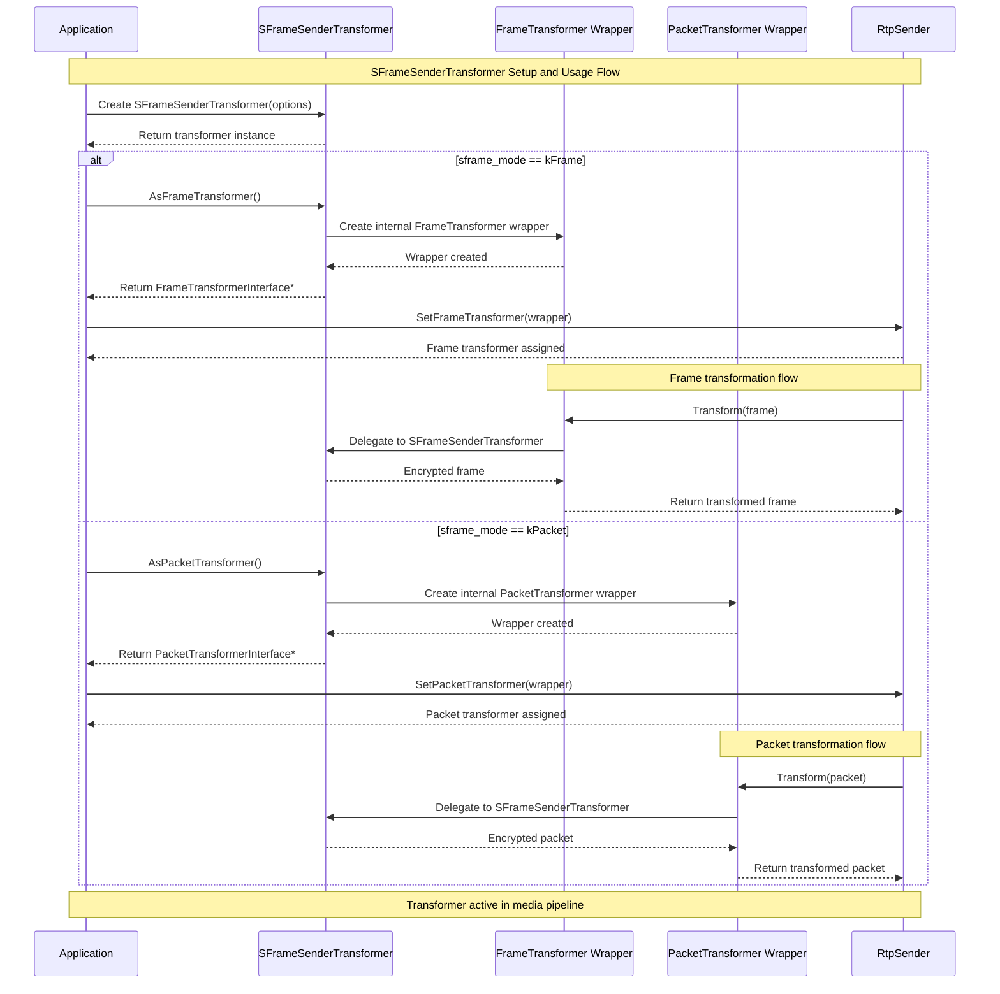
```mermaid
sequenceDiagram
    participant App as Application
    participant ST as SFrameSenderTransformer
    participant FW as FrameTransformer Wrapper
    participant PW as PacketTransformer Wrapper
    participant Sender as RtpSender

    Note over App,Sender: SFrameSenderTransformer Setup and Usage Flow

    App->>ST: Create SFrameSenderTransformer(options)
    ST-->>App: Return transformer instance

    alt sframe_mode == kFrame
        App->>ST: AsFrameTransformer()
        ST->>FW: Create internal FrameTransformer wrapper
        FW-->>ST: Wrapper created
        ST-->>App: Return FrameTransformerInterface*
        
        App->>Sender: SetFrameTransformer(wrapper)
        Sender-->>App: Frame transformer assigned
        
        Note over FW,Sender: Frame transformation flow
        Sender->>FW: Transform(frame)
        FW->>ST: Delegate to SFrameSenderTransformer
        ST-->>FW: Encrypted frame
        FW-->>Sender: Return transformed frame
        
    else sframe_mode == kPacket
        App->>ST: AsPacketTransformer()
        ST->>PW: Create internal PacketTransformer wrapper
        PW-->>ST: Wrapper created
        ST-->>App: Return PacketTransformerInterface*
        
        App->>Sender: SetPacketTransformer(wrapper)
        Sender-->>App: Packet transformer assigned
        
        Note over PW,Sender: Packet transformation flow
        Sender->>PW: Transform(packet)
        PW->>ST: Delegate to SFrameSenderTransformer
        ST-->>PW: Encrypted packet
        PW-->>Sender: Return transformed packet
    end

    Note over App,Sender: Transformer active in media pipeline
```

> **Architecture Benefits**: The unified `SFrameSenderTransformer` design provides a single encryption implementation that can be used for both frame and packet transformation through factory methods. This reduces code duplication while maintaining interface compatibility.

> **Factory Methods**: `AsFrameTransformer()` and `AsPacketTransformer()` return wrapper objects that implement the respective interfaces and delegate transformation calls to the appropriate internal methods.

> **MTU Consideration**: The `GetReservedNumberOfBytes()` method provides the encryption overhead size needed for packet transformation to prevent MTU overflow.

### SFrameSenderTransform

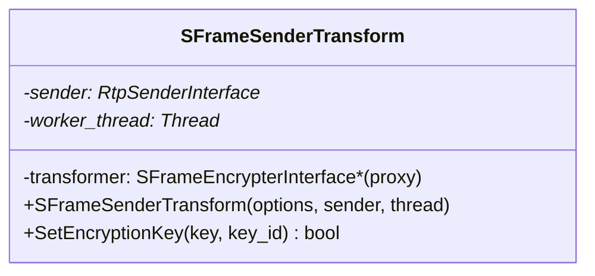
```mermaid
classDiagram
    class SFrameSenderTransform {
        -sender: RtpSenderInterface*
        -worker_thread: Thread*
        -transformer: SFrameEncrypterInterface* (proxy)
        +SFrameSenderTransform(options, sender, thread)
        +SetEncryptionKey(key, key_id) bool
    }
```

The `SFrameSenderTransform` class serves as the main orchestrator for sender-side SFrame encryption. 
The key architectural pattern is that the proxy wraps the transformer for thread safety:

**Architecture Responsibilities:**

- **SFrameSenderTransformer**: The unified encryption implementation with internal wrapper classes
- **SFrameEncrypterProxy**: Thread-safe wrapper that marshals calls to the worker thread
- **SFrameSenderTransform**: High-level orchestrator that manages the proxy-wrapped transformer

**Key Design Elements:**

- **Unified Implementation**: Single `SFrameSenderTransformer` handles both frame and packet encryption
- **Internal Wrappers**: `AsFrameTransformer()` and `AsPacketTransformer()` return interface-specific wrappers
- **Proxy Wrapping**: The proxy wraps the `SFrameSenderTransformer` instance for thread safety
- **Thread Marshaling**: All `SetEncryptionKey()` calls are automatically routed to the worker thread

**Initialization Flow:**
1. `SFrameSenderTransform` constructor receives options, sender, and worker thread
2. Creates `SFrameSenderTransformer` instance with encryption configuration
3. Based on sframe mode, calls `AsFrameTransformer()` or `AsPacketTransformer()` to get interface wrapper
4. Sets wrapper to corresponding transformation slot (`SetFrameTransformer`/`SetPacketTransformer`)
5. Wraps transformer in `SFrameEncrypterProxy` for thread safety
6. Stores the proxy as `transformer_`

> **Thread Safety**: The proxy pattern ensures all key management operations are thread-safe by automatically marshaling calls from any thread to the designated worker thread, while maintaining the same interface as the underlying transformer.
Transformer itself will always work on the worker thread, which will ensure that tranformer will get modified only from that one thread.

### SFrameReceiverTransformer

The `SFrameReceiverTransformer` provides SFrame decryption with factory methods to create appropriate transformer interfaces.

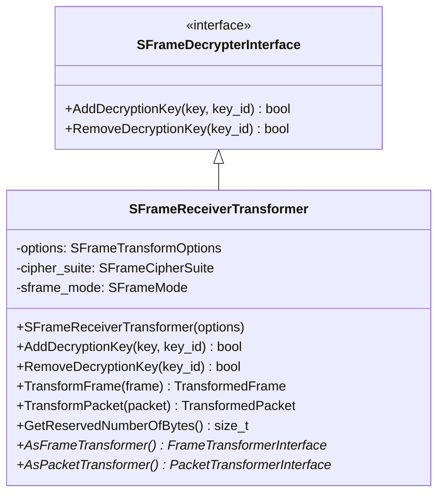
```mermaid
classDiagram
    class SFrameDecrypterInterface {
        <<interface>>
        +AddDecryptionKey(key, key_id) bool
        +RemoveDecryptionKey(key_id) bool
    }
    
    class SFrameReceiverTransformer {
        -options: SFrameTransformOptions
        -cipher_suite: SFrameCipherSuite
        -sframe_mode: SFrameMode
        +SFrameReceiverTransformer(options)
        +AddDecryptionKey(key, key_id) bool
        +RemoveDecryptionKey(key_id) bool
        +TransformFrame(frame) TransformedFrame
        +TransformPacket(packet) TransformedPacket
        +GetReservedNumberOfBytes() size_t
        +AsFrameTransformer() FrameTransformerInterface*
        +AsPacketTransformer() PacketTransformerInterface*
    }
    
    SFrameDecrypterInterface <|-- SFrameReceiverTransformer
```

> **Diamond Inheritance Issue**: `SFrameReceiverTransformer` cannot directly implement both `FrameTransformerInterface` and `PacketTransformerInterface` due to diamond inheritance from the common `TransformationFeatures` base interface. This would create ambiguity in method resolution and violate C++ inheritance rules. Therefore, the factory pattern with `AsFrameTransformer()` and `AsPacketTransformer()` methods is used to return separate wrapper objects that implement the respective interfaces.

```mermaid
sequenceDiagram
    participant App as Application
    participant RT as SFrameReceiverTransformer
    participant FW as FrameTransformer Wrapper
    participant PW as PacketTransformer Wrapper
    participant Receiver as RtpReceiver

    Note over App,Receiver: SFrameReceiverTransformer Setup and Usage Flow

    App->>RT: Create SFrameReceiverTransformer(options)
    RT-->>App: Return transformer instance

    alt sframe_mode == kFrame
        App->>RT: AsFrameTransformer()
        RT->>FW: Create internal FrameTransformer wrapper
        FW-->>RT: Wrapper created
        RT-->>App: Return FrameTransformerInterface*
        
        App->>Receiver: SetFrameTransformer(wrapper)
        Receiver-->>App: Frame transformer assigned
        
        Note over FW,Receiver: Frame transformation flow
        Receiver->>FW: Transform(frame)
        FW->>RT: Delegate to SFrameReceiverTransformer
        RT-->>FW: Decrypted frame
        FW-->>Receiver: Return transformed frame
        
    else sframe_mode == kPacket
        App->>RT: AsPacketTransformer()
        RT->>PW: Create internal PacketTransformer wrapper
        PW-->>RT: Wrapper created
        RT-->>App: Return PacketTransformerInterface*
        
        App->>Receiver: SetPacketTransformer(wrapper)
        Receiver-->>App: Packet transformer assigned
        
        Note over PW,Receiver: Packet transformation flow
        Receiver->>PW: Transform(packet)
        PW->>RT: Delegate to SFrameReceiverTransformer
        RT-->>PW: Decrypted packet
        PW-->>Receiver: Return transformed packet
    end

    Note over App,Receiver: Transformer active in media pipeline
```

> **Architecture Benefits**: The unified `SFrameReceiverTransformer` design provides a single decryption implementation that can be used for both frame and packet transformation through factory methods. This reduces code duplication while maintaining interface compatibility.

> **Factory Methods**: `AsFrameTransformer()` and `AsPacketTransformer()` return wrapper objects that implement the respective interfaces and delegate transformation calls to the appropriate internal methods.

> **Key Management**: The receiver transformer can manage multiple decryption keys simultaneously to handle key rotation scenarios, where new keys are added before old keys are removed to ensure seamless decryption during key transitions.

### SFrameReceiverTransform

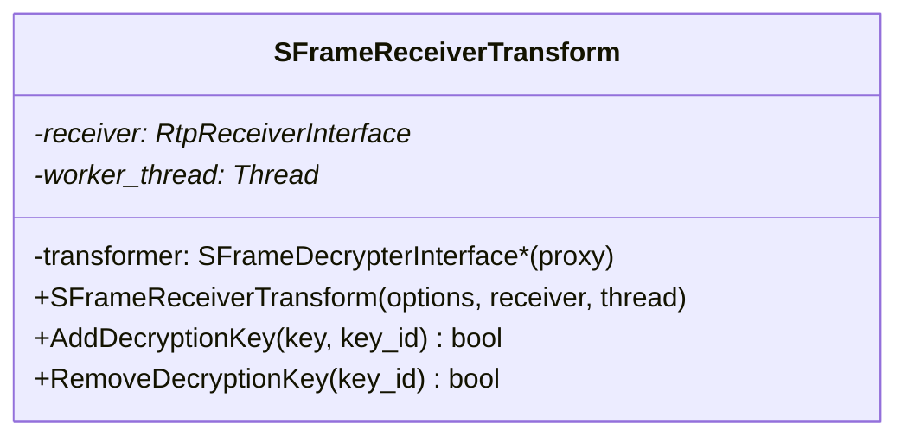
```mermaid
classDiagram
    class SFrameReceiverTransform {
        -receiver: RtpReceiverInterface*
        -worker_thread: Thread*
        -transformer: SFrameDecrypterInterface* (proxy)
        +SFrameReceiverTransform(options, receiver, thread)
        +AddDecryptionKey(key, key_id) bool
        +RemoveDecryptionKey(key_id) bool
    }
```

The `SFrameReceiverTransform` class serves as the main orchestrator for receiver-side SFrame decryption. The key architectural pattern is that the proxy wraps the transformer for thread safety:

**Architecture Responsibilities:**

- **SFrameReceiverTransformer**: The unified decryption implementation with internal wrapper classes
- **SFrameDecrypterProxy**: Thread-safe wrapper that marshals calls to the worker thread
- **SFrameReceiverTransform**: High-level orchestrator that manages the proxy-wrapped transformer

**Key Design Elements:**

- **Unified Implementation**: Single `SFrameReceiverTransformer` handles both frame and packet decryption
- **Internal Wrappers**: `AsFrameTransformer()` and `AsPacketTransformer()` return interface-specific wrappers
- **Proxy Wrapping**: The proxy wraps the `SFrameReceiverTransformer` instance for thread safety
- **Thread Marshaling**: All `AddDecryptionKey()`/`RemoveDecryptionKey()` calls are automatically routed to the worker thread

**Initialization Flow:**
1. `SFrameReceiverTransform` constructor receives options, receiver, and worker thread
2. Creates `SFrameReceiverTransformer` instance with decryption configuration
3. Based on sframe mode, calls `AsFrameTransformer()` or `AsPacketTransformer()` to get interface wrapper
4. Sets wrapper to corresponding transformation slot (`SetFrameTransformer`/`SetPacketTransformer`)
5. Wraps transformer in `SFrameDecrypterProxy` for thread safety
6. Stores the proxy as `transformer_`

> **Thread Safety**: The proxy pattern ensures all key management operations are thread-safe by automatically marshaling calls from any thread to the designated worker thread. The transformer itself always works on the worker thread, ensuring single-threaded access to decryption state.

## Media Pipeline Integration

### Key Management Architecture

### Sender Key Management Flow

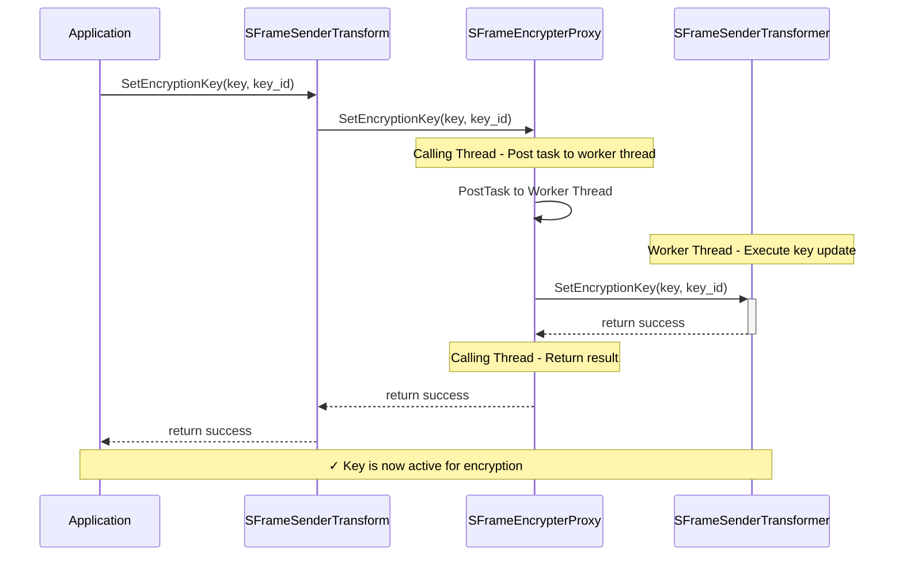
```mermaid
sequenceDiagram
    participant App as Application
    participant SenderTransform as SFrameSenderTransform
    participant Proxy as SFrameEncrypterProxy
    participant Transformer as SFrameSenderTransformer

    App->>SenderTransform: SetEncryptionKey(key, key_id)
    SenderTransform->>Proxy: SetEncryptionKey(key, key_id)
    
    Note over Proxy: Calling Thread - Post task to worker thread
    Proxy->>Proxy: PostTask to Worker Thread
    
    Note over Transformer: Worker Thread - Execute key update
    Proxy->>+Transformer: SetEncryptionKey(key, key_id)
    Transformer-->>-Proxy: return success
    
    Note over Proxy: Calling Thread - Return result
    Proxy-->>SenderTransform: return success
    SenderTransform-->>App: return success
    
    Note over App,Transformer: ✓ Key is now active for encryption
```

### Receiver Key Management Flow

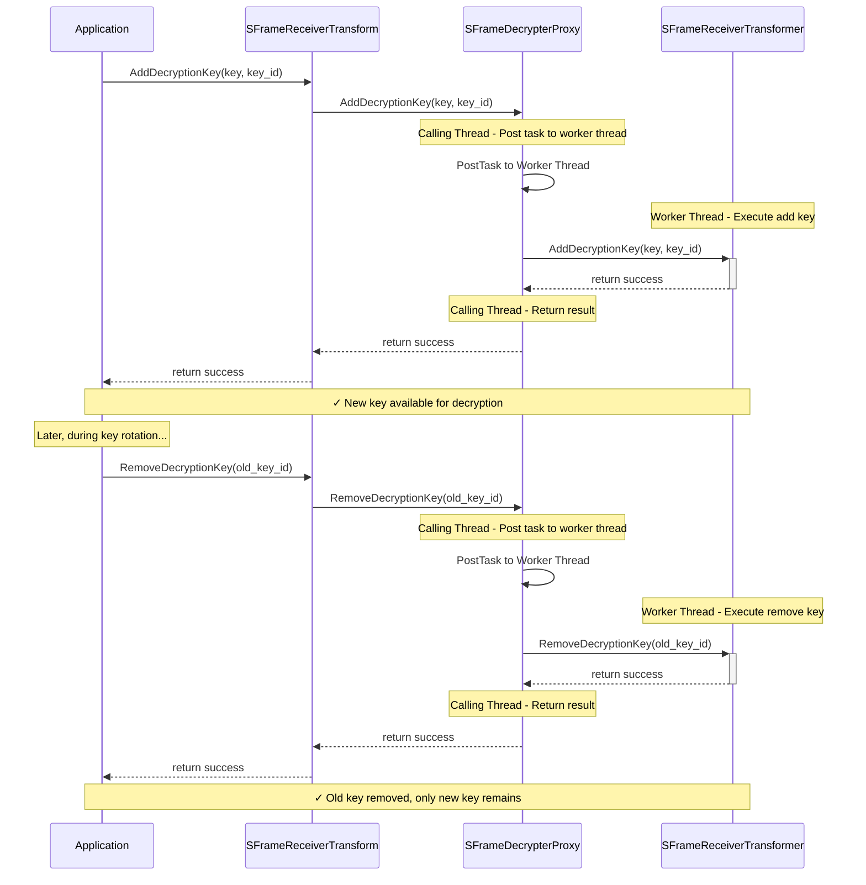
```mermaid
sequenceDiagram
    participant App as Application
    participant ReceiverTransform as SFrameReceiverTransform
    participant Proxy as SFrameDecrypterProxy
    participant Transformer as SFrameReceiverTransformer

    App->>ReceiverTransform: AddDecryptionKey(key, key_id)
    ReceiverTransform->>Proxy: AddDecryptionKey(key, key_id)
    
    Note over Proxy: Calling Thread - Post task to worker thread
    Proxy->>Proxy: PostTask to Worker Thread
    
    Note over Transformer: Worker Thread - Execute add key
    Proxy->>+Transformer: AddDecryptionKey(key, key_id)
    Transformer-->>-Proxy: return success
    
    Note over Proxy: Calling Thread - Return result
    Proxy-->>ReceiverTransform: return success
    ReceiverTransform-->>App: return success
    
    Note over App,Transformer: ✓ New key available for decryption
    
    Note over App: Later, during key rotation...
    
    App->>ReceiverTransform: RemoveDecryptionKey(old_key_id)
    ReceiverTransform->>Proxy: RemoveDecryptionKey(old_key_id)
    
    Note over Proxy: Calling Thread - Post task to worker thread
    Proxy->>Proxy: PostTask to Worker Thread
    
    Note over Transformer: Worker Thread - Execute remove key
    Proxy->>+Transformer: RemoveDecryptionKey(old_key_id)
    Transformer-->>-Proxy: return success
    
    Note over Proxy: Calling Thread - Return result
    Proxy-->>ReceiverTransform: return success
    ReceiverTransform-->>App: return success
    
    Note over App,Transformer: ✓ Old key removed, only new key remains
```

### RtpSender FrameTransformer Installation Flow

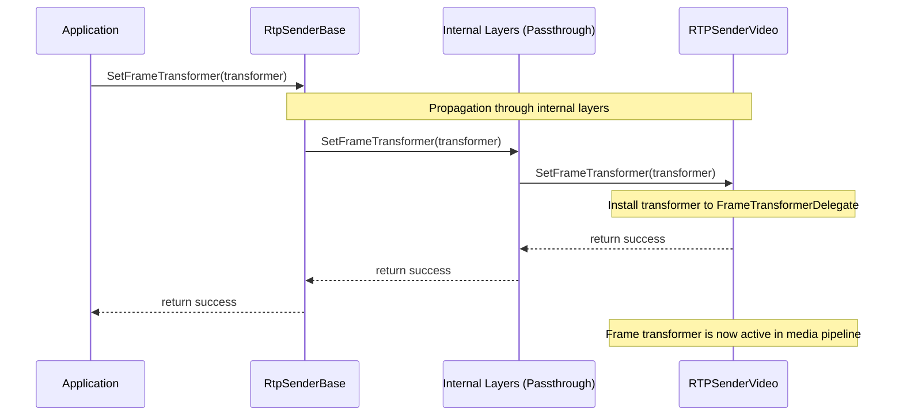
```mermaid
sequenceDiagram
    participant App as Application
    participant Sender as RtpSenderBase
    participant Passthrough as Internal Layers (Passthrough)
    participant VideoSender as RTPSenderVideo

    App->>Sender: SetFrameTransformer(transformer)
    
    Note over Sender,VideoSender: Propagation through internal layers
    
    Sender->>Passthrough: SetFrameTransformer(transformer)
    Passthrough->>VideoSender: SetFrameTransformer(transformer)
    
    Note over VideoSender: Install transformer to FrameTransformerDelegate

    VideoSender-->>Passthrough: return success
    Passthrough-->>Sender: return success
    Sender-->>App: return success
    
    Note over VideoSender : Frame transformer is now active in media pipeline
```

### RtpSender PacketTransformer Installation Flow

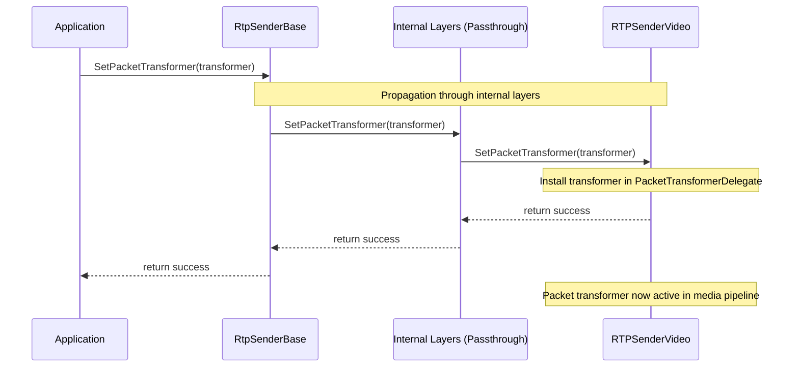
```mermaid
sequenceDiagram
    participant App as Application
    participant Sender as RtpSenderBase
    participant Passthrough as Internal Layers (Passthrough)
    participant VideoSender as RTPSenderVideo

    App->>Sender: SetPacketTransformer(transformer)
    
    Note over Sender,VideoSender: Propagation through internal layers
    
    Sender->>Passthrough: SetPacketTransformer(transformer)
    Passthrough->>VideoSender: SetPacketTransformer(transformer)
    
    Note over VideoSender: Install transformer in PacketTransformerDelegate
    
    VideoSender-->>Passthrough: return success
    Passthrough-->>Sender: return success
    Sender-->>App: return success
    
    Note over VideoSender: Packet transformer now active in media pipeline
```

### RtpReceiver(Video) FrameTransformer Installation Flow

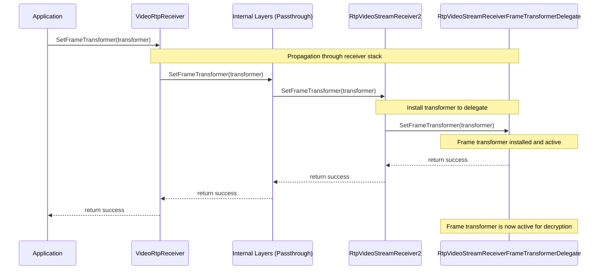
```mermaid
sequenceDiagram
    participant App as Application
    participant Receiver as VideoRtpReceiver
    participant Passthrough as Internal Layers (Passthrough)
    participant StreamReceiver as RtpVideoStreamReceiver2
    participant Delegate as RtpVideoStreamReceiverFrameTransformerDelegate

    App->>Receiver: SetFrameTransformer(transformer)
    
    Note over Receiver,Delegate: Propagation through receiver stack
    
    Receiver->>Passthrough: SetFrameTransformer(transformer)
    Passthrough->>StreamReceiver: SetFrameTransformer(transformer)
    
    Note over StreamReceiver,Delegate: Install transformer to delegate
    
    StreamReceiver->>Delegate: SetFrameTransformer(transformer)
    
    Note over Delegate: Frame transformer installed and active
    
    Delegate-->>StreamReceiver: return success
    StreamReceiver-->>Passthrough: return success
    Passthrough-->>Receiver: return success
    Receiver-->>App: return success
    
    Note over Delegate : Frame transformer is now active for decryption
```

### RtpReceiver(Video) PacketTransformer Installation Flow

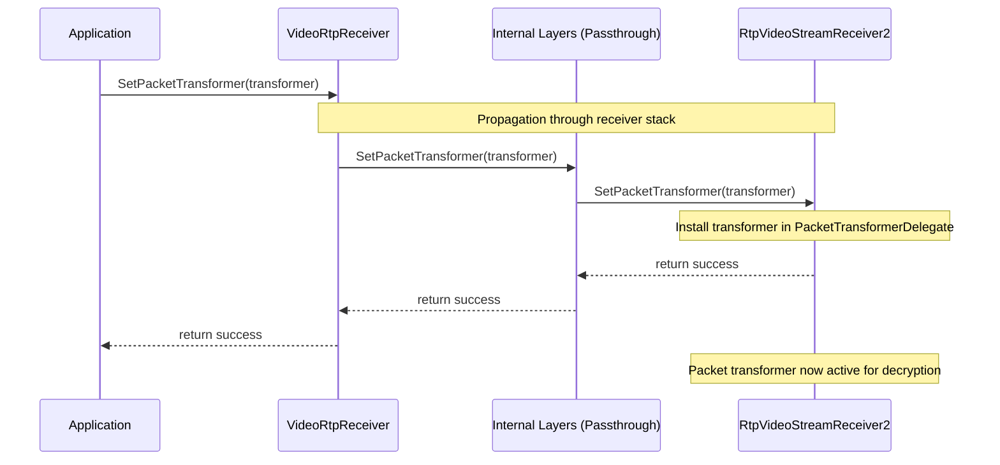
```mermaid
sequenceDiagram
    participant App as Application
    participant Receiver as VideoRtpReceiver
    participant Passthrough as Internal Layers (Passthrough)
    participant StreamReceiver as RtpVideoStreamReceiver2

    App->>Receiver: SetPacketTransformer(transformer)
    
    Note over Receiver,StreamReceiver: Propagation through receiver stack
    
    Receiver->>Passthrough: SetPacketTransformer(transformer)
    Passthrough->>StreamReceiver: SetPacketTransformer(transformer)
    
    Note over StreamReceiver: Install transformer in PacketTransformerDelegate
    
    StreamReceiver-->>Passthrough: return success
    Passthrough-->>Receiver: return success
    Receiver-->>App: return success
    
    Note over StreamReceiver: Packet transformer now active for decryption
```

### RtpReceiver(Audio) FrameTransformer Installation Flow

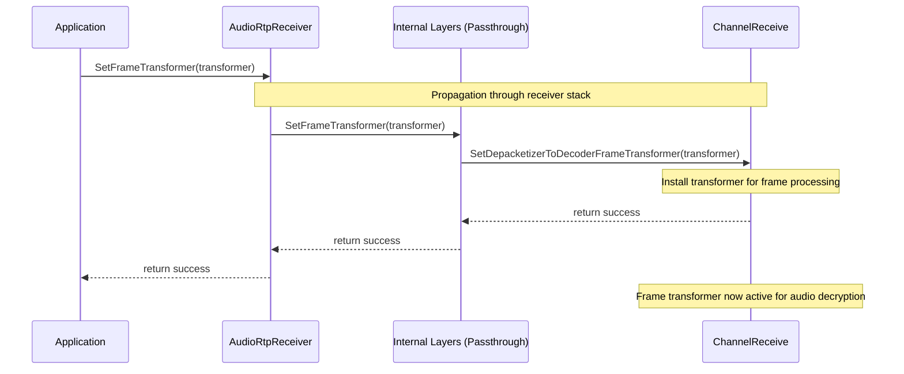
```mermaid
sequenceDiagram
    participant App as Application
    participant Receiver as AudioRtpReceiver
    participant Passthrough as Internal Layers (Passthrough)
    participant ChannelReceive as ChannelReceive

    App->>Receiver: SetFrameTransformer(transformer)
    
    Note over Receiver,ChannelReceive: Propagation through receiver stack
    
    Receiver->>Passthrough: SetFrameTransformer(transformer)
    Passthrough->>ChannelReceive: SetDepacketizerToDecoderFrameTransformer(transformer)
    
    Note over ChannelReceive: Install transformer for frame processing
    
    ChannelReceive-->>Passthrough: return success
    Passthrough-->>Receiver: return success
    Receiver-->>App: return success
    
    Note over ChannelReceive: Frame transformer now active for audio decryption
```

### RtpReceiver(Audio) PacketTransformer Installation Flow

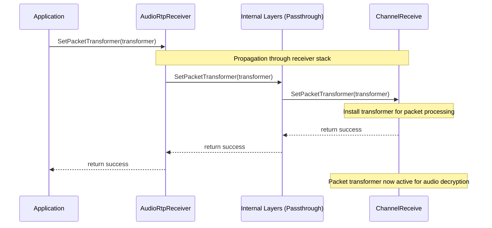
```mermaid
sequenceDiagram
    participant App as Application
    participant Receiver as AudioRtpReceiver
    participant Passthrough as Internal Layers (Passthrough)
    participant ChannelReceive as ChannelReceive

    App->>Receiver: SetPacketTransformer(transformer)
    
    Note over Receiver,ChannelReceive: Propagation through receiver stack
    
    Receiver->>Passthrough: SetPacketTransformer(transformer)
    Passthrough->>ChannelReceive: SetPacketTransformer(transformer)
    
    Note over ChannelReceive: Install transformer for packet processing
    
    ChannelReceive-->>Passthrough: return success
    Passthrough-->>Receiver: return success
    Receiver-->>App: return success
    
    Note over ChannelReceive: Packet transformer now active for audio decryption
```

### RtpSender Frame Processing Flow - Video

This flow describes how encoded video frames are processed through the RTP sender pipeline with SFrame encryption support. The pipeline handles both frame-level and packet-level encryption modes, with appropriate transformers applied at each stage.

**Flow Overview:**

1. **Frame Reception**: The video encoder produces an encoded frame and forwards it to the RTP sender for transmission.

2. **SFrame Configuration Validation**: The sender validates the SFrame configuration:
   - If SFrame is enabled, it checks whether the appropriate transformer (frame or packet) is available
   - If SFrame is enabled but no sframe transformer is available, the frame is dropped
   - If SFrame is not enabled, processing continues normally without SFrame encryption

3. **Frame Transformation**: When a frame transformer exists, the encoded frame is forwarded to it:
   - The frame transformer applies transformation to the frame payload
   - This occurs before packetization, transforming the complete frame
   - If no frame transformer exists, this step is skipped

4. **Packetization**: The sender determines the appropriate packetizer based on the frame transformer's `UseSFrame()` method:
   - If `UseSFrame()` returns true, an SFrame-aware packetizer is used that adds SFrame-specific headers to RTP packets
   - If `UseSFrame()` returns false (or no frame transformer), a codec-specific packetizer is used for standard RTP packet creation

5. **Packet Transformation**: When a packet transformer exists, each RTP packet is individually processed:
   - Each packet is forwarded to the packet transformer
   - The transformer applies packet-level transformations
   - This occurs after packetization, transforming individual packets
   - If no packet transformer exists, this step is skipped

6. **Repacketization** (when packet transformer with SFrame is used): Additional SFrame-specific headers may be inserted into packets.

```mermaid
sequenceDiagram
    participant Encoder as Video Encoder
    participant Sender as RtpSender
    participant FrameTransformer as Frame Transformer
    participant Packetizer as Packetizer
    participant PacketTransformer as Packet Transformer
    participant Network as Network

    Encoder->>Sender: 1. EncodedFrame received
    
    Note over Sender: STEP 2: Validate SFrame Configuration

    alt SFrame Enabled
        Sender->>Sender: Check transformer availability
        alt No SFrame Transformer Available
            Sender-->>Encoder: ❌ return (drop frame)
        end
    else SFrame Not Enabled
        Note over Sender: Continue normal processing
    end
    
    Note over Sender,FrameTransformer: STEP 3: Frame Transformation
    
    Sender->>FrameTransformer: Forward frame
    FrameTransformer->>FrameTransformer: Transform frame
    FrameTransformer-->>Sender: Transformed frame
    
    Note over Sender,Packetizer: STEP 4: Packetization
    
    Sender->>FrameTransformer: Call UseSFrame()
    FrameTransformer-->>Sender: returns if SFrame transformer or not
    
    alt FrameTransformer->UseSFrame() == true
        Note over Sender,Packetizer: Use SFrame-aware packetizer
        
        Sender->>Packetizer: Packetize with SFrame Packetizer
        Packetizer-->>Sender: SFrame RTP packets
    else FrameTransformer->UseSFrame() == false
        Note over Sender,Packetizer: Use codec specific packetizer
        
        Sender->>Packetizer: Codec Specific packetization
        Packetizer-->>Sender: Codec specific RTP packets
    end
    
    Note over Sender,PacketTransformer: STEP 5: Packet Transformation
    
    alt PacketTransformer exists
        loop Each RTP Packet
            Sender->>PacketTransformer: Forward packet
            PacketTransformer->>PacketTransformer: Transform packet
            PacketTransformer-->>Sender: Transformed packet
        end

        loop
            Note over Sender: STEP 6: Repacketization
            alt PacketTransformer->UseSFrame() == true
                Sender->>Sender: Insert SFrame headers to 
            end
        end
        
    else
        Note over Sender: Skip packet transformation
    end
    
    Note over Sender,Network: STEP 7: Network Transmission
    Sender->>Network: Send encrypted packets
    
    Note over Encoder,Network: ✓ Processing complete - Frame encrypted and sent
```

### RtpReceiver Frame Processing Flow - Video

This flow describes how received RTP packets are processed through the video receiver pipeline with SFrame decryption support. The pipeline handles both packet-level and frame-level decryption modes, reconstructing and decrypting video frames before forwarding them to the decoder.

**Flow Overview:**

1. **Packet Reception**: RTP packets arrive from the network transport and are received by the VideoRtpReceiver.

2. **SFrame Configuration Validation**: The receiver validates the SFrame configuration:
   - If SFrame is enabled, it checks whether the appropriate sframe transformer (packet or frame) is available
   - If SFrame is enabled but no sframe transformer is available, the packets are dropped
   - If SFrame is not enabled, processing continues normally without decryption

3. **Pre-repacketization**: When a packet transformer exists, and it implements SFrame (packet_transformer->UseSFrame() return true), it should remove SFrame headers from packets before pushing it to the packet transformer

4. **Packet Transformation**: When a packet transformer exists, each received RTP packet is individually processed:
   - Each packet is forwarded to the packet transformer for transformation
   - The transformer removes SFrame headers and decrypts the packet payload
   - This occurs before depacketization, working on individual encrypted packets
   - If no packet transformer exists, this step is skipped

5. **Depacketization**: The receiver determines the appropriate depacketizer based on the packet transformer's `UseSFrame()` method:
   - If `UseSFrame()` returns true, an SFrame depacketizer is used to reconstruct the encrypted frame from SFrame-formatted packets
   - If `UseSFrame()` returns false (or no packet transformer), a codec-specific depacketizer reconstructs the frame using standard media depacketization
   - The depacketizer assembles RTP packets into complete video frames

6. **Frame Transformation**: When a frame transformer exists, the assembled frame is processed:
   - The frame is forwarded to the frame transformer for decryption
   - The transformer decrypts the complete frame payload
   - This occurs after depacketization, working on the reassembled encrypted frame
   - If no frame transformer exists, this step is skipped

7. **Decoding**: The processed (and potentially decrypted) frame is forwarded to the video decoder for final decoding into displayable video.

The flow supports three operational modes:
- **Frame Mode**: SFrame depacketizer reconstructs encrypted frame, frame transformer decrypts the complete frame
- **Packet Mode**: Packet transformer decrypts individual packets, standard depacketizer reconstructs the frame
- **No SFrame**: Standard RTP packet reception, depacketization, and decoding without decryption

This receiver flow is the inverse of the sender flow, ensuring that encrypted frames can be properly reconstructed and decrypted regardless of whether frame-level or packet-level encryption was used.

```mermaid
sequenceDiagram
    participant Network as Network Transport
    participant Receiver as VideoRtpReceiver
    participant PacketTransformer as Packet Transformer
    participant Depacketizer as Depacketizer
    participant FrameTransformer as Frame Transformer
    participant Decoder as Video Decoder

    Network->>Receiver: 1. Receive RTP Packets
    
    Note over Receiver: STEP 2: Validate SFrame Configuration

    alt SFrame Enabled
        Receiver->>Receiver: Check transformer availability
        alt No SFrame Transformer Available
            Receiver-->>Network: ❌ return (drop packets)
        end
    else SFrame Not Enabled
        Note over Receiver: Continue normal processing
    end
    
    Note over Receiver,PacketTransformer: STEP 3: Pre-Transformation SFrame Header Removal
    
    alt PacketTransformer exists
        Receiver->>PacketTransformer: Call UseSFrame()
        PacketTransformer-->>Receiver: returns if SFrame transformer or not
        
        alt PacketTransformer->UseSFrame() == true
            loop Each RTP Packet
                Receiver->>Receiver: Remove SFrame headers from packet
            end
        end
    end
    
    Note over Receiver,PacketTransformer: STEP 4: Packet Transformation
    
    alt PacketTransformer exists
        loop Each RTP Packet
            Receiver->>PacketTransformer: Forward packet
            PacketTransformer->>PacketTransformer: Transform packet
            PacketTransformer-->>Receiver: Transformed packet
        end
    else
        Note over Receiver: Skip packet transformation
    end
    
    Note over Receiver,Depacketizer: STEP 5: Depacketization
    
    Receiver->>PacketTransformer: Call UseSFrame()
    PacketTransformer-->>Receiver: returns if SFrame transformer or not
    
    alt PacketTransformer->UseSFrame() == true
        Note over Receiver,Depacketizer: Use SFrame depacketizer
        
        Receiver->>Depacketizer: Depacketize with SFrame Depacketizer
        Depacketizer-->>Receiver: Assembled SFrame encrypted frame
    else PacketTransformer->UseSFrame() == false
        Note over Receiver,Depacketizer: Use codec specific depacketizer
        
        Receiver->>Depacketizer: Codec Specific depacketization
        Depacketizer-->>Receiver: Assembled codec specific frame
    end
    
    Note over Receiver,FrameTransformer: STEP 6: Frame Transformation
    
    alt FrameTransformer exists
        Receiver->>FrameTransformer: Forward frame
        FrameTransformer->>FrameTransformer: Transform frame
        FrameTransformer-->>Receiver: Transformed frame
    else
        Note over Receiver: Skip frame transformation
    end
    
    Note over Receiver,Decoder: STEP 7: Decoding
    Receiver->>Decoder: Send frame to decoder
    
    Note over Network,Decoder: ✓ Processing complete - Frame decrypted and decoded
```

