# WebRTC SFrame Integration Architecture

This document describes the architectural design for integrating SFrame (Secure Frame) encryption into WebRTC applications. SFrame provides end-to-end media security that works even when media flows through untrusted servers or intermediaries.

## Overview

SFrame encryption can be applied at two different levels:
- **Per-frame**: Encrypts complete video/audio frames before packetization
- **Per-packet**: Encrypts individual RTP packets after packetization

Both approaches offer strong security guarantees, with per-packet providing finer granularity and per-frame offering better performance characteristics.

## Architecture Overview

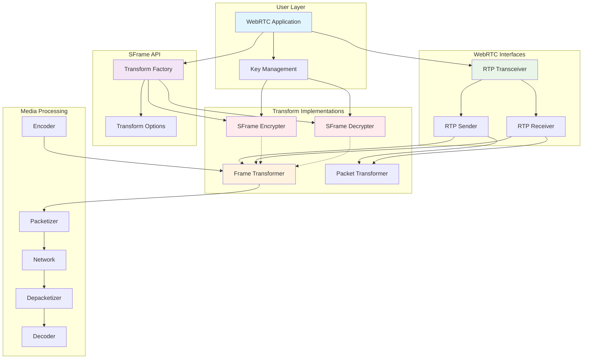

## Core Interface Architecture

### Transformation Features Hierarchy

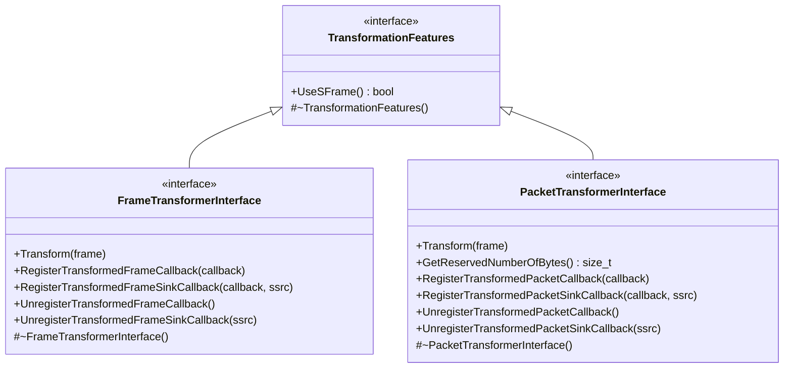

> **Note**: The `GetReservedNumberOfBytes()` method in `PacketTransformerInterface` ensures that the packetizer reserves enough space for transformer data to avoid MTU overflow. This is critical for packet-level transformations where additional encryption overhead needs to be accommodated within network packet size constraints.

### RTP Interface Integration

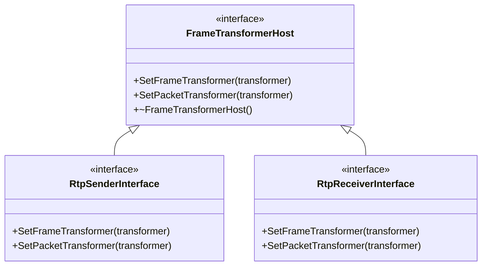

### SFrame Management Interfaces

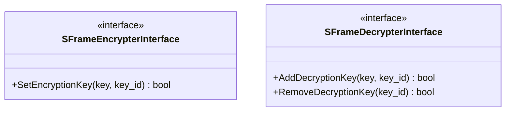

> **Note**: These interfaces provide key management capabilities for SFrame transformers. The encrypter interface manages a single encryption key, while the decrypter interface can manage multiple decryption keys simultaneously to handle key rotation scenarios.

For each of `SFrameEncrypterInterface` and `SFrameDecrypterInterface` proxy will be defined.
To ensure that calls of `SetEncryptionKey` and `AddDecryptionKey`/`RemoveDecryptionKey` will be delegated to valid thread.

## Configuration and Options

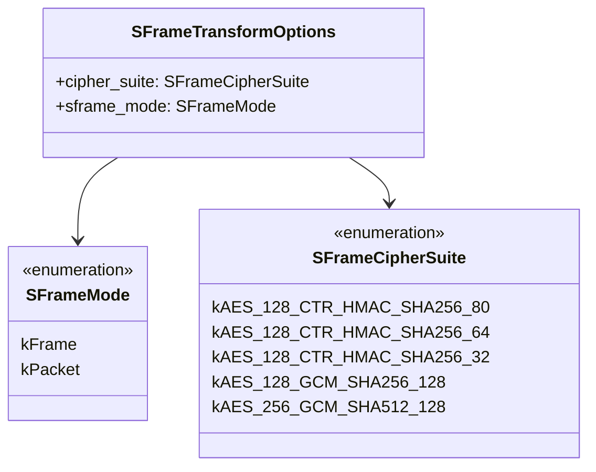

## Core objects

### SFrameSenderFrameTransformer

The `SFrameSenderFrameTransformer` provides frame-level SFrame encryption that operates on frames.

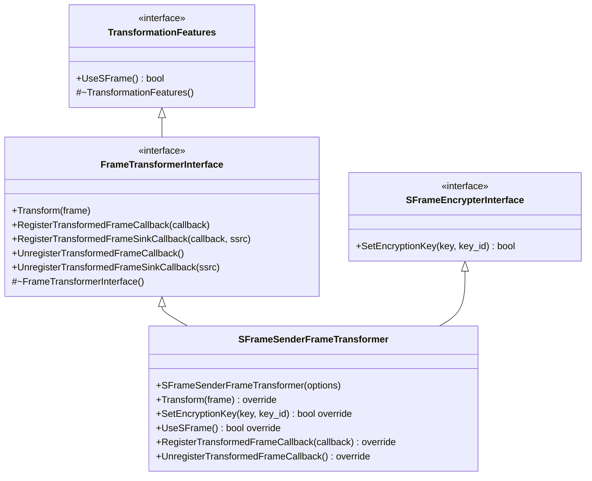

### SFrameSenderPacketTransformer

The `SFrameSenderPacketTransformer` provides packet-level SFrame encryption that operates on individual RTP packets.

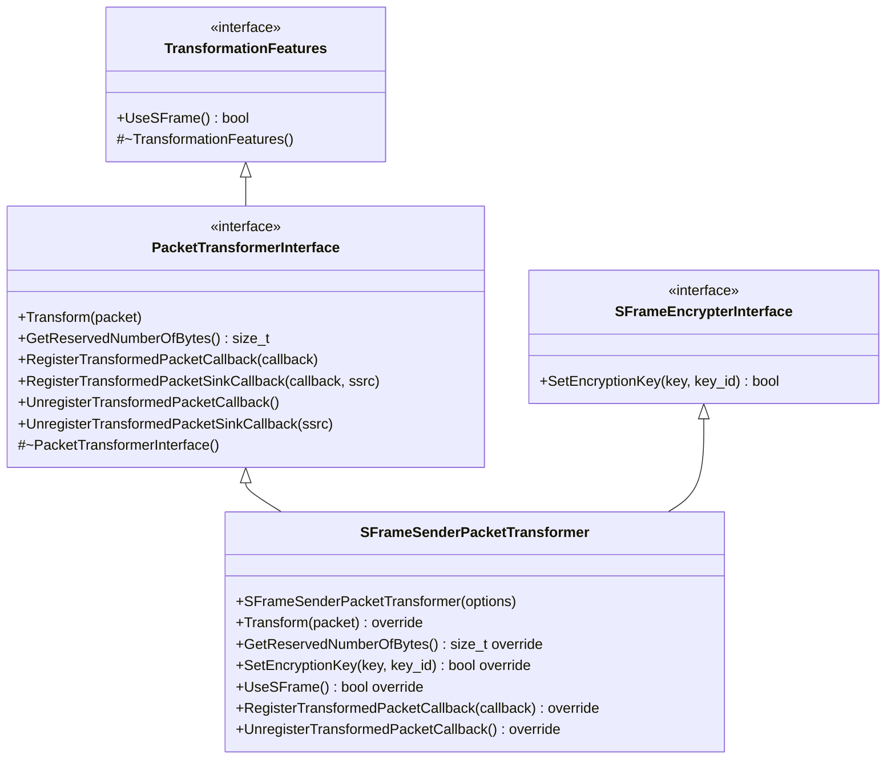

> **MTU Consideration**: The transformer reserves additional bytes for encryption overhead to prevent packet fragmentation. This is critical for maintaining network efficiency and avoiding packet loss due to size constraints.

### SFrameSenderTransform

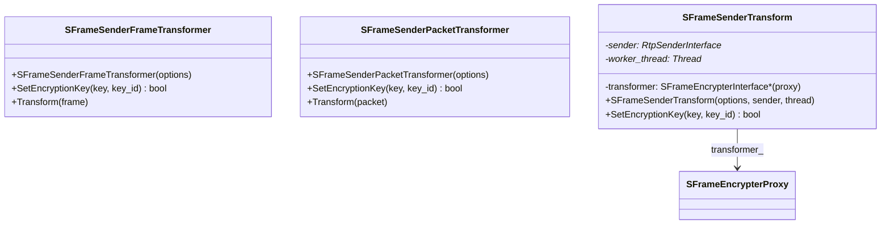

The `SFrameSenderTransform` class serves as the main orchestrator for sender-side SFrame encryption. 
The key architectural pattern is that the proxy wraps the transformer for thread safety:

**Architecture Responsibilities:**

- **SFrameSenderFrameTransformer**: The actual encryption implementation that transforms frames
- **SFrameSenderPacketTransformer**: The actual encryption implementation that transforms packets
- **SFrameEncrypterProxy**: Thread-safe wrapper that marshals calls to the worker thread
- **SFrameSenderTransform**: High-level orchestrator that manages the proxy-wrapped transformer

**Key Design Elements:**

- **Proxy Wrapping**: The proxy wraps the `SFrameSenderFrameTransformer`/`SFrameSenderPacketTransformer` instance for thread safety
- **Thread Marshaling**: All `SetEncryptionKey()` calls are automatically routed to the worker thread

**Initialization Flow:**
1. `SFrameSenderTransform` constructor receives options, sender, and worker thread
2. Creates `SFrameSenderFrameTransformer`or `SFrameSenderPacketTransformer` instance with encryption based on the provided sframe mode.
3. Sets created transformer to corresponding transformation slot (`SetFrameTransformer`/`SetPacketTransformer`).
4. Wraps transformer in `SFrameEncrypterProxy` for thread safety.
5. Stores the proxy as `transformer_`.

> **Thread Safety**: The proxy pattern ensures all key management operations are thread-safe by automatically marshaling calls from any thread to the designated worker thread, while maintaining the same interface as the underlying transformer.
Transformer itself will always work on the worker thread, which will ensure that tranformer will get modified only from that one thread.

### SFrameReceiverFrameTransformer

The `SFrameReceiverFrameTransformer` provides frame-level SFrame decryption that operates on encrypted frames.

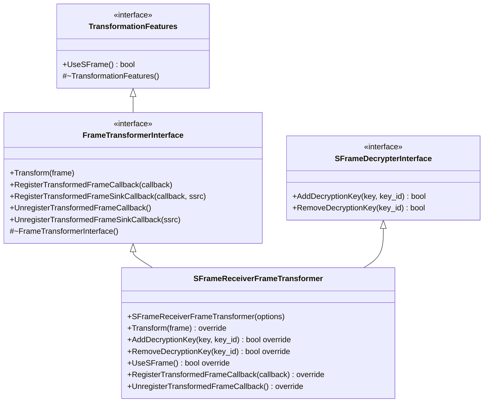

### SFrameReceiverPacketTransformer

The `SFrameReceiverPacketTransformer` provides packet-level SFrame decryption that operates on individual encrypted RTP packets.

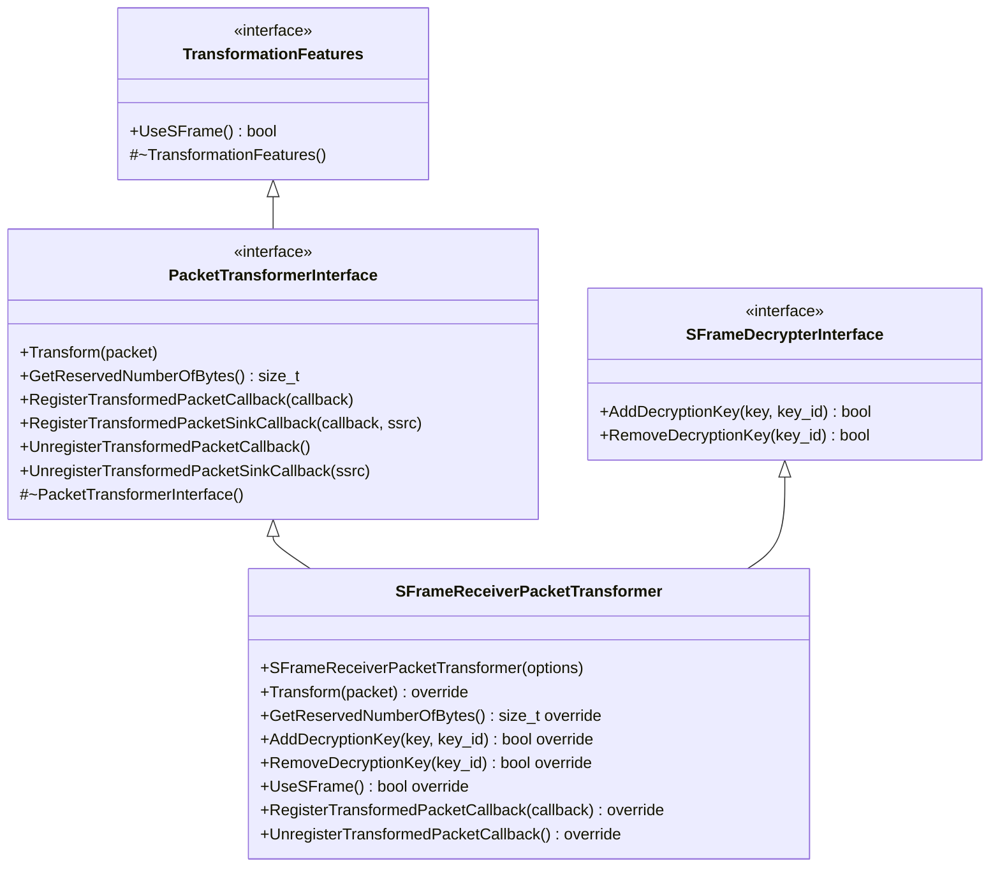

> **Key Management**: The receiver transformers can manage multiple decryption keys simultaneously to handle key rotation scenarios, where new keys are added before old keys are removed to ensure seamless decryption during key transitions.

### SFrameReceiverTransform

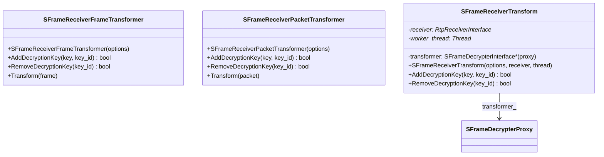

The `SFrameReceiverTransform` class serves as the main orchestrator for receiver-side SFrame decryption. The key architectural pattern is that the proxy wraps the transformer for thread safety:

**Architecture Responsibilities:**

- **SFrameReceiverFrameTransformer**: The actual decryption implementation that transforms encrypted frames
- **SFrameReceiverPacketTransformer**: The actual decryption implementation that transforms encrypted packets
- **SFrameDecrypterProxy**: Thread-safe wrapper that marshals calls to the worker thread
- **SFrameReceiverTransform**: High-level orchestrator that manages the proxy-wrapped transformer

**Key Design Elements:**

- **Proxy Wrapping**: The proxy wraps the `SFrameReceiverFrameTransformer`/`SFrameReceiverPacketTransformer` instance for thread safety
- **Thread Marshaling**: All `AddDecryptionKey()`/`RemoveDecryptionKey()` calls are automatically routed to the worker thread
- **Multi-Key Support**: Can manage multiple decryption keys simultaneously for seamless key rotation

**Initialization Flow:**
1. `SFrameReceiverTransform` constructor receives options, receiver, and worker thread
2. Creates `SFrameReceiverFrameTransformer` or `SFrameReceiverPacketTransformer` instance based on the provided sframe mode
3. Sets created transformer to corresponding transformation slot (`SetFrameTransformer`/`SetPacketTransformer`)
4. Wraps transformer in `SFrameDecrypterProxy` for thread safety
5. Stores the proxy as `transformer_`

> **Thread Safety**: The proxy pattern ensures all key management operations are thread-safe by automatically marshaling calls from any thread to the designated worker thread. The transformer itself always works on the worker thread, ensuring single-threaded access to decryption state.

## Media Pipeline Integration

### Key Management Architecture

### Sender Key Management Flow

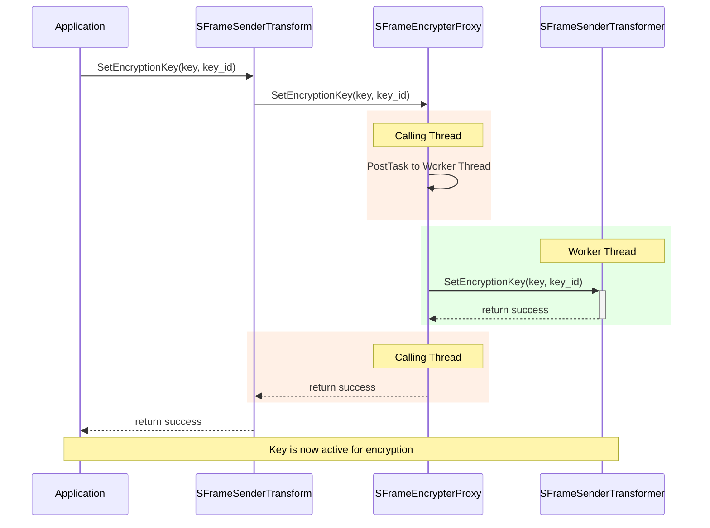

### Receiver Key Management Flow

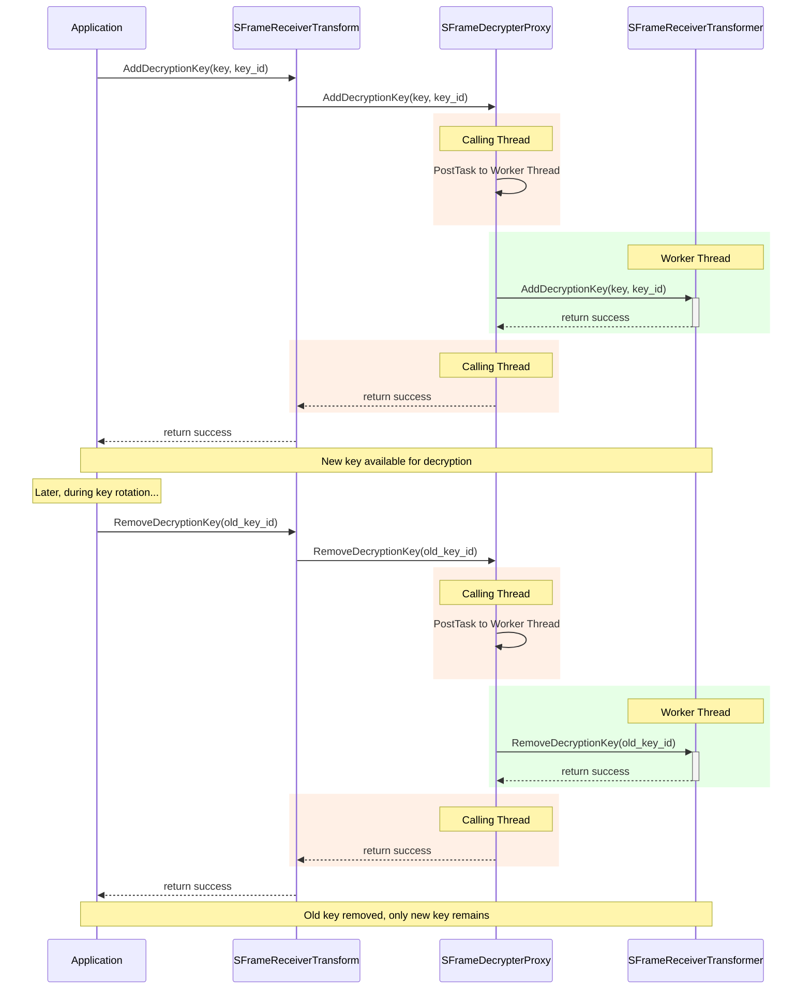

### RtpSender FrameTransformer Installation Flow

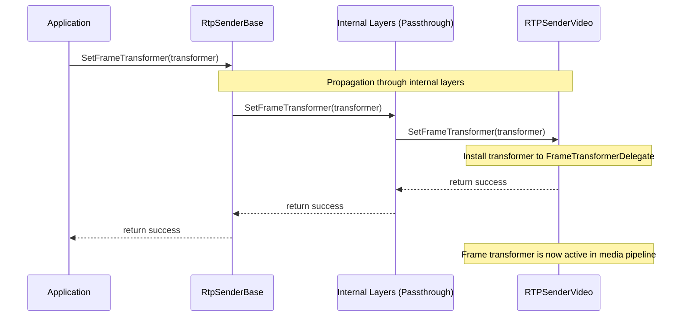

### RtpSender PacketTransformer Installation Flow

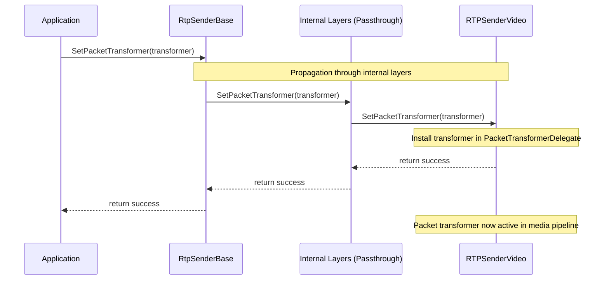

