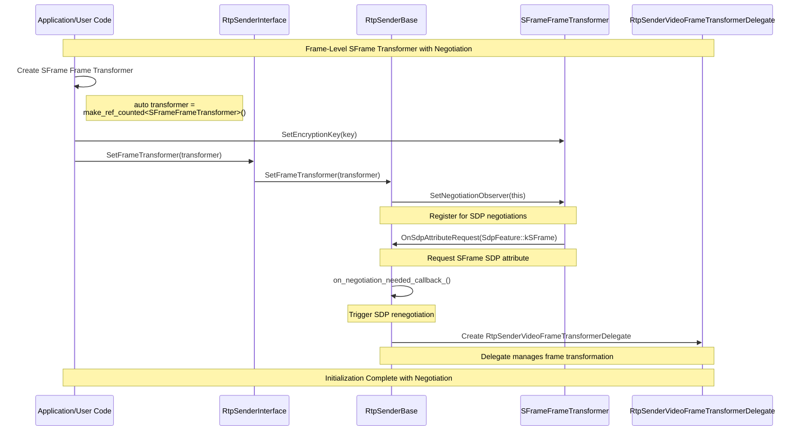
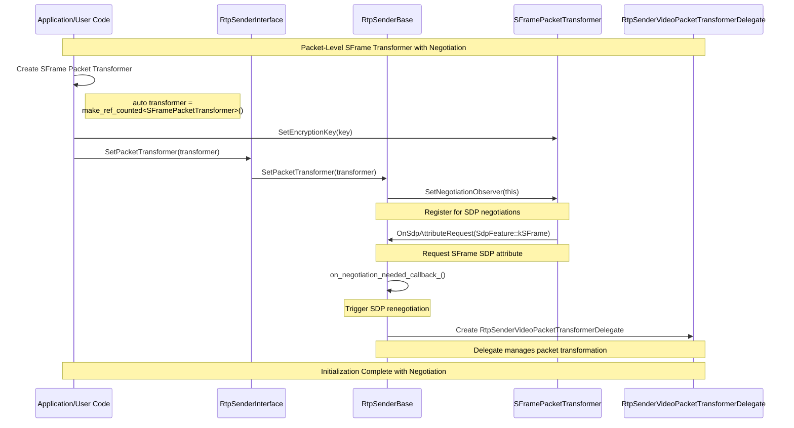
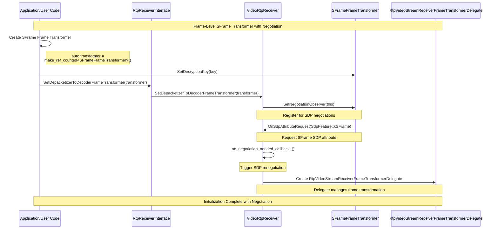
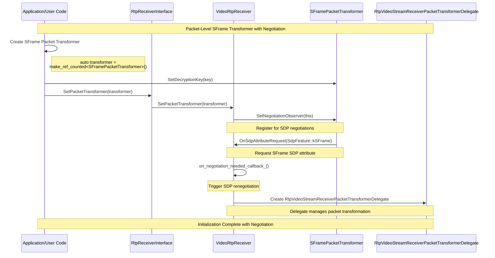

# SFrame Negotiation Trigger Proposals

This document contains various proposals for how SFrame transformers can trigger SDP negotiation and modify SDP attributes.

## Overview

When implementing SFrame encryption through frame transformers, there's a need for transformers to:
1. Signal that specific SDP attributes should be added (e.g., `a=sframe`)
2. Trigger SDP renegotiation when transformers are attached
3. Control which packetizer/depacketizer is used based on the encryption mode

### Comparison of Approaches

| Aspect | Proposal 1: Features Parameter | Proposal 2: Observer Pattern |
|--------|-------------------------------|------------------------------|
| **Pattern** | Parameter-passing (pull) | Observer/callback (push) |
| **Control** | Application explicitly specifies features | Transformer requests features via callback |
| **Complexity** | Simple transformer implementation | Transformers need negotiation logic |
| **Flexibility** | Features can be changed independently | Transformers control their own requirements |
| **Testability** | Easy to test with explicit parameters | Requires observer mock/stub setup |
| **Timing** | Features specified at attachment time | Features can be requested dynamically |
| **Thread Safety** | Clear ownership model | Requires careful callback threading |
| **API Surface** | Extends SetFrameTransformer signature | Adds new observer interface |
| **Discovery** | Application must know required features | Transformers declare their needs |

## Proposal 1: Features Parameter Approach

### Motivation

This approach uses a **parameter-passing pattern** where the application explicitly specifies which SDP features should be associated with a transformer when attaching it to a sender/receiver. This keeps the transformer implementation simple and gives the application explicit control over feature negotiation.

### API Design

#### SdpFeature Enum

Define an enumeration of SDP features that can be requested:

```cpp
enum class SdpFeature {
  // Secure Frame (SFrame) encryption
  // Adds "a=sframe" to the SDP
  kSFrame,
};
```

#### FrameTransformerHost Interface

The base interface that RTP senders/receivers implement to accept transformers with features:

```cpp
class FrameTransformerHost {
 public:
  virtual ~FrameTransformerHost() {}
  
  virtual void SetFrameTransformer(
      scoped_refptr<FrameTransformerInterface> frame_transformer,
      const std::vector<SdpFeature>& features = {}) = 0;
      
  virtual void SetPacketTransformer(
      scoped_refptr<FrameTransformerInterface> packet_transformer,
      const std::vector<SdpFeature>& features = {}) = 0;
};
```

#### RtpSenderInterface / RtpReceiverInterface

Extended to accept features parameter:

```cpp
class RtpSenderInterface : public FrameTransformerHost {
 public:
  void SetFrameTransformer(
      scoped_refptr<FrameTransformerInterface> frame_transformer,
      const std::vector<SdpFeature>& features = {}) override;
      
  void SetPacketTransformer(
      scoped_refptr<FrameTransformerInterface> packet_transformer,
      const std::vector<SdpFeature>& features = {}) override;
};
```

### Implementation

#### RtpSenderBase

Stores features and triggers negotiation when they change:

```cpp
class RtpSenderBase : public RtpSenderInternal {
 public:
  void SetFrameTransformer(
      scoped_refptr<FrameTransformerInterface> frame_transformer,
      const std::vector<SdpFeature>& features) override {
    RTC_DCHECK_RUN_ON(signaling_thread_);
    
    // Check if features have changed
    bool features_changed = (frame_transformer_features_ != features);
    
    frame_transformer_ = std::move(frame_transformer);
    frame_transformer_features_ = features;
    
    // Trigger negotiation if features changed
    if (features_changed && on_negotiation_needed_) {
      on_negotiation_needed_();
    }
    
    // Set transformer on worker thread
    if (media_channel_ && ssrc_ && !stopped_) {
      worker_thread_->BlockingCall([&] {
        media_channel_->SetEncoderToPacketizerFrameTransformer(
            ssrc_, frame_transformer_);
      });
    }
  }

 private:
  std::vector<SdpFeature> frame_transformer_features_;
  std::vector<SdpFeature> packet_transformer_features_;
  OnNegotiationNeededCallback on_negotiation_needed_;
};
```

#### VideoRtpReceiver

Similar implementation for receivers:

```cpp
class VideoRtpReceiver : public RtpReceiverInternal {
 public:
  void SetFrameTransformer(
      scoped_refptr<FrameTransformerInterface> frame_transformer,
      const std::vector<SdpFeature>& features) override {
    RTC_DCHECK_RUN_ON(&signaling_thread_checker_);
    
    // Store features on signaling thread
    frame_transformer_features_ = features;
    
    // Set transformer on worker thread
    worker_thread_->BlockingCall([this, frame_transformer = std::move(frame_transformer)]() mutable {
      RTC_DCHECK_RUN_ON(worker_thread_);
      frame_transformer_ = std::move(frame_transformer);
      
      if (media_channel_) {
        media_channel_->SetDepacketizerToDecoderFrameTransformer(
            signaled_ssrc_.value_or(0), frame_transformer_);
      }
    });
  }

 private:
  std::vector<SdpFeature> frame_transformer_features_
      RTC_GUARDED_BY(signaling_thread_checker_);
};
```

### Usage Example

```cpp
// Create SFrame transformer
auto sframe_transformer = CreateSFrameTransformer();

// Attach to sender with SFrame feature
sender->SetPacketTransformer(sframe_transformer, {SdpFeature::kSFrame});

// This triggers negotiation needed event, which causes:
// 1. PeerConnection to call CreateOffer/CreateAnswer
// 2. SDP generation to check transformer features
// 3. Add "a=sframe" attribute to m-line if kSFrame feature present
```

### Advantages

1. **Explicit Control**: Application has full visibility and control over which features are enabled
2. **Simple Transformer Implementation**: Transformers don't need to know about negotiation
3. **Testable**: Easy to test feature changes and negotiation triggers
4. **Flexible**: Can attach transformers without features, or change features later
5. **Thread-Safe**: Clear ownership - features stored on signaling thread, transformers on worker thread

### Disadvantages

1. **Application Responsibility**: Application must know which features to request
2. **Timing**: Application must coordinate transformer attachment with feature specification
3. **No Dynamic Discovery**: Transformers can't dynamically request features based on runtime state

### Integration Points

#### SDP Offer/Answer Generation

When generating SDP, check sender/receiver features:

```cpp
// In MediaSessionDescriptionFactory
for (auto& sender : transceivers->senders()) {
  const auto& features = sender->GetTransformerFeatures();
  
  if (std::find(features.begin(), features.end(), 
                SdpFeature::kSFrame) != features.end()) {
    // Add a=sframe attribute to media description
    media_desc->AddAttribute("sframe", "");
  }
}
```

#### Proxy Support

Proxy classes updated to handle features parameter:

```cpp
// In rtp_sender_proxy.h
PROXY_METHOD2(void,
              SetFrameTransformer,
              scoped_refptr<FrameTransformerInterface>,
              const std::vector<SdpFeature>&)
```

## Proposal 2: FrameTransformerNegotiationObserver Pattern (Archived)

### Motivation

This archived approach used an **observer/push pattern** where transformers actively request SDP features through a callback interface.

## Proposal 2: FrameTransformerNegotiationObserver Pattern (Archived)

### Motivation

This archived approach used an **observer/push pattern** where transformers actively request SDP features through a callback interface.

With an SFrame feature implemented through transformers, it requires an ability to trigger additional actions at the libWebRTC level for it to work correctly, such as:
* **SDP Modification**: Add `a=sframe` attribute to the m-line
* **Packetizer Selection**: Use SFrame-specific packetizer/depacketizer

One approach is to extend `FrameTransformerInterface` with an ability to register an observer with a predefined list of features that can be signaled.

### API Design

#### SdpFeature Enum

Define an enumeration of SDP features that transformers can request:

```cpp
enum class SdpFeature {
  // Secure Frame (SFrame) encryption
  // Adds "a=sframe" to the SDP
  kSFrame,
};
```

#### FrameTransformerNegotiationObserver Interface

The observer interface that RTP senders/receivers implement to handle negotiation requests:

```cpp
class FrameTransformerNegotiationObserver {
 public:
  virtual ~FrameTransformerNegotiationObserver() = default;

  // Called when the transformer wants to enable a predefined SDP feature.
  // This automatically triggers SDP renegotiation.
  // Parameters:
  //   feature - The predefined feature to enable (e.g., SdpFeature::kSFrame)
  virtual void OnSdpAttributeRequest(SdpFeature feature) = 0;
};
```

#### FrameTransformerInterface Extension

Extend `FrameTransformerInterface` to support observer registration:

```cpp
class FrameTransformerInterface : public RefCountInterface {
 public:
  // Register an observer to receive negotiation requests
  virtual void SetNegotiationObserver(
      FrameTransformerNegotiationObserver* observer) {}

  // Unregister the current observer
  virtual void UnsetNegotiationObserver() {}

 protected:
  ~FrameTransformerInterface() override = default;
};
```

### Implementation in SFrame Transformers

#### SFrameTransformerBase

The base class implements observer registration and triggers negotiation when needed:

```cpp
class SFrameTransformerBase : public SFrameTransformerInterface {
 public:
  SFrameTransformerBase();

  // SFrameTransformerInterface implementation
  void SetEncryptionKey(const std::vector<uint8_t>& key) override;
  std::vector<uint8_t> GetEncryptionKey() const override;

  // FrameTransformerInterface implementation
  void SetNegotiationObserver(
      FrameTransformerNegotiationObserver* observer) override;
  void UnsetNegotiationObserver() override;

 protected:
  void RequestSdpFeature(SdpFeature feature);

 private:
  FrameTransformerNegotiationObserver* negotiation_observer_ = nullptr;
};
```

Implementation:

```cpp
void SFrameTransformerBase::SetNegotiationObserver(
    FrameTransformerNegotiationObserver* observer) {
  negotiation_observer_ = observer;
  
  // Immediately request SFrame SDP attribute when observer is set
  if (negotiation_observer_) {
    RequestSdpFeature(SdpFeature::kSFrame);
  }
}

void SFrameTransformerBase::UnsetNegotiationObserver() {
  negotiation_observer_ = nullptr;
}

void SFrameTransformerBase::RequestSdpFeature(SdpFeature feature) {
  if (negotiation_observer_) {
    negotiation_observer_->OnSdpAttributeRequest(feature);
  }
}
```

## Integration with RTP Senders

### RtpSenderBase Implementation

`RtpSenderBase` implements `FrameTransformerNegotiationObserver` to handle negotiation requests from transformers:

```cpp
class RtpSenderBase : public RtpSenderInternal,
                      public FrameTransformerHost,
                      public FrameTransformerNegotiationObserver {
 public:
  // FrameTransformerHost implementation
  void SetFrameTransformer(
      scoped_refptr<FrameTransformerInterface> frame_transformer) override;

  void SetPacketTransformer(
      scoped_refptr<FrameTransformerInterface> packet_transformer) override;

  // FrameTransformerNegotiationObserver implementation
  void OnSdpAttributeRequest(SdpFeature feature) override;

 private:
  // Stored transformer references
  scoped_refptr<FrameTransformerInterface> frame_transformer_;
  scoped_refptr<FrameTransformerInterface> packet_transformer_;
  
  // Requested SDP features from transformers
  std::vector<SdpFeature> transformer_sdp_features_;
  
  // Callback to trigger SDP renegotiation
  OnNegotiationNeededCallback on_negotiation_needed_;
};
```

### Transformer Registration and Negotiation

```cpp
void RtpSenderBase::SetFrameTransformer(
    scoped_refptr<FrameTransformerInterface> frame_transformer) {
  // Unregister from old transformer if present
  if (frame_transformer_) {
    frame_transformer_->UnsetNegotiationObserver();
  }

  frame_transformer_ = std::move(frame_transformer);

  // Register as negotiation observer
  if (frame_transformer_) {
    frame_transformer_->SetNegotiationObserver(this);
  }

  if (media_channel_ && ssrc_ && !stopped_) {
    worker_thread_->BlockingCall([&] {
      media_channel_->SetEncoderToPacketizerFrameTransformer(
          ssrc_, frame_transformer_);
    });
  }
}

void RtpSenderBase::SetPacketTransformer(
    scoped_refptr<FrameTransformerInterface> packet_transformer) {
  // Unregister from old transformer if present
  if (packet_transformer_) {
    packet_transformer_->UnsetNegotiationObserver();
  }

  packet_transformer_ = std::move(packet_transformer);

  // Register as negotiation observer
  if (packet_transformer_) {
    packet_transformer_->SetNegotiationObserver(this);
  }

  if (media_channel_ && ssrc_ != 0) {
    worker_thread_->BlockingCall([&] {
      media_channel_->SetPacketTransformer(ssrc_, packet_transformer_);
    });
  }
}

void RtpSenderBase::OnSdpAttributeRequest(SdpFeature feature) {
  transformer_sdp_features_.push_back(feature);
  
  // Trigger SDP renegotiation
  if (on_negotiation_needed_) {
    on_negotiation_needed_();
  }
}
```

### Sequence Diagram: Frame-Level Transformer with Negotiation



### Sequence Diagram: Packet-Level Transformer with Negotiation



## Integration with RTP Receivers

### VideoRtpReceiver Implementation

`VideoRtpReceiver` implements `FrameTransformerNegotiationObserver` to handle negotiation requests from transformers:

```cpp
class VideoRtpReceiver : public RtpReceiverInternal,
                         public FrameTransformerNegotiationObserver {
 public:
  void SetFrameTransformer(
      scoped_refptr<FrameTransformerInterface> frame_transformer) override;

  void SetPacketTransformer(
      scoped_refptr<FrameTransformerInterface> packet_transformer) override;

  // FrameTransformerNegotiationObserver implementation
  void OnSdpAttributeRequest(SdpFeature feature) override;

 private:
  // Stored transformer references
  scoped_refptr<FrameTransformerInterface> frame_transformer_
      RTC_GUARDED_BY(worker_thread_);
  scoped_refptr<FrameTransformerInterface> packet_transformer_
      RTC_GUARDED_BY(worker_thread_);

  // Callback to trigger SDP renegotiation
  OnNegotiationNeededCallback on_negotiation_needed_;
};
```

### Transformer Registration and Negotiation

```cpp
void VideoRtpReceiver::SetFrameTransformer(
    scoped_refptr<FrameTransformerInterface> frame_transformer) {
  RTC_DCHECK_RUN_ON(worker_thread_);
  
  // Unregister from old transformer
  if (frame_transformer_) {
    frame_transformer_->UnsetNegotiationObserver();
  }
  
  frame_transformer_ = std::move(frame_transformer);
  
  // Register with new transformer
  if (frame_transformer_) {
    frame_transformer_->SetNegotiationObserver(this);
  }

  if (media_channel_) {
    media_channel_->SetDepacketizerToDecoderFrameTransformer(
        signaled_ssrc_.value_or(0), frame_transformer_);
  }
}

void VideoRtpReceiver::SetPacketTransformer(
    scoped_refptr<FrameTransformerInterface> packet_transformer) {
  RTC_DCHECK_RUN_ON(worker_thread_);
  
  // Unregister from old transformer
  if (packet_transformer_) {
    packet_transformer_->UnsetNegotiationObserver();
  }
  
  packet_transformer_ = std::move(packet_transformer);
  
  // Register with new transformer
  if (packet_transformer_) {
    packet_transformer_->SetNegotiationObserver(this);
  }

  if (media_channel_) {
    media_channel_->SetPacketTransformer(signaled_ssrc_.value_or(0),
                                         packet_transformer_);
  }
}

void VideoRtpReceiver::OnSdpAttributeRequest(SdpFeature feature) {
  RTC_DCHECK_RUN_ON(worker_thread_);
  
  // Trigger SDP renegotiation
  if (on_negotiation_needed_) {
    on_negotiation_needed_();
  }
}
```

### Sequence Diagram: Frame-Level Transformer with Negotiation



### Sequence Diagram: Packet-Level Transformer with Negotiation



## Design Rationale

This design is primarily driven by how Chromium's `blink` level leverages the `Encoded Transform` API. The observer pattern allows:

1. **Decoupling**: Transformers don't need direct access to SDP generation logic
2. **Flexibility**: New SDP features can be added to the enum without changing transformer implementations
3. **Automatic Triggering**: Negotiation is triggered immediately when transformers are attached
4. **Clear Ownership**: RTP senders/receivers own the negotiation lifecycle

## Alternative Approaches

Other approaches to consider:

1. **Direct SDP Modification**: Transformers directly modify MediaDescriptionOptions (see main implementation)
2. **Configuration Object**: Pass configuration during transformer creation instead of runtime negotiation
3. **Separate Negotiation API**: Decouple SDP feature requests from transformer lifecycle

## Status

This approach is documented for reference but is **not currently implemented** in the main codebase. The current implementation uses a different pattern where transformers directly modify SDP options during offer/answer creation.

See the main architecture documentation for the currently implemented approach.
