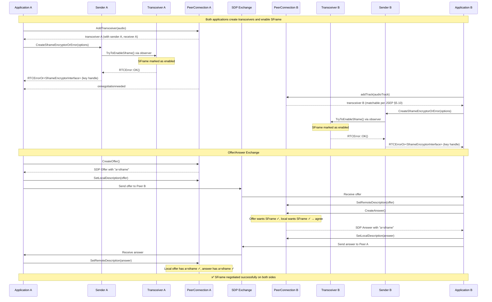
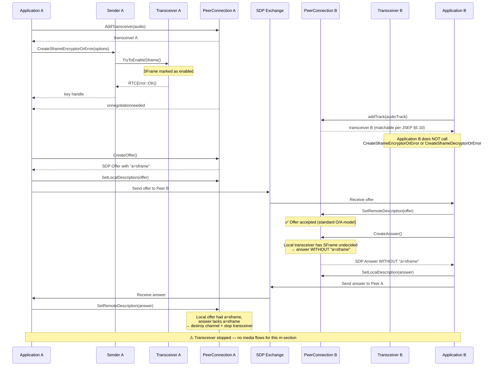
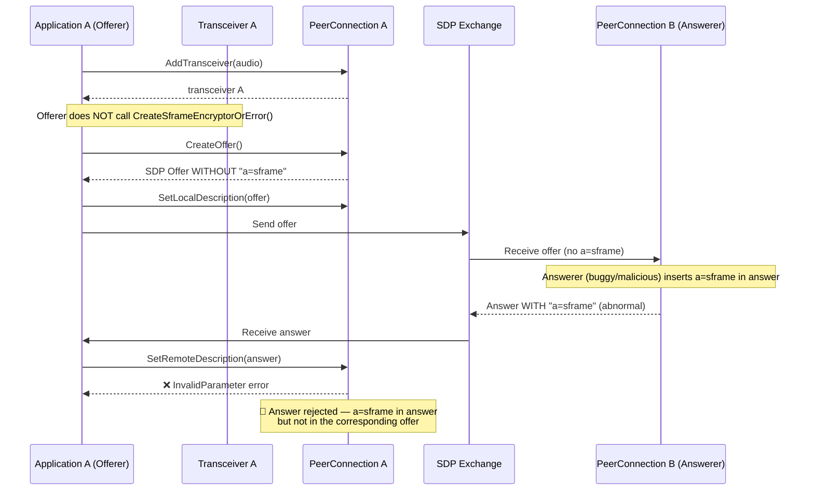
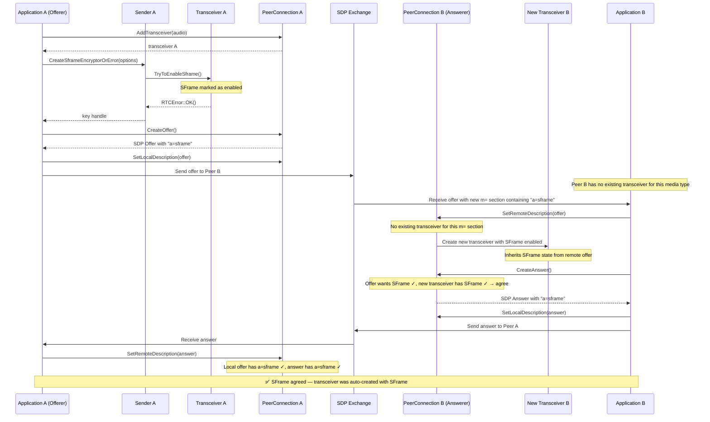
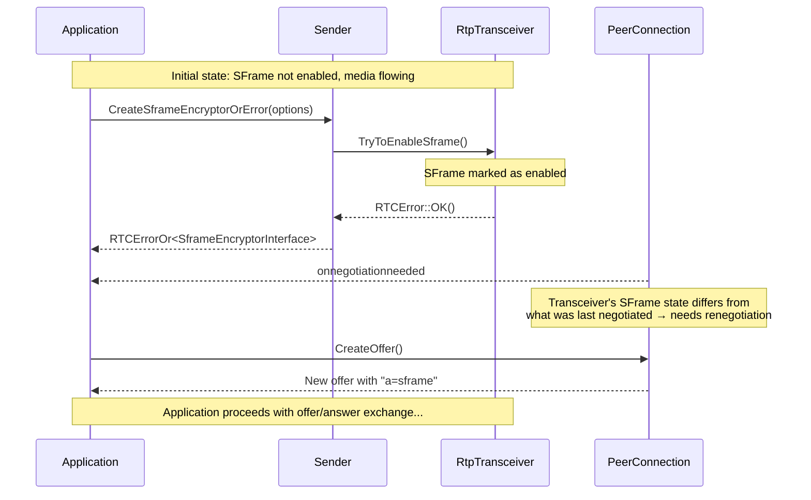
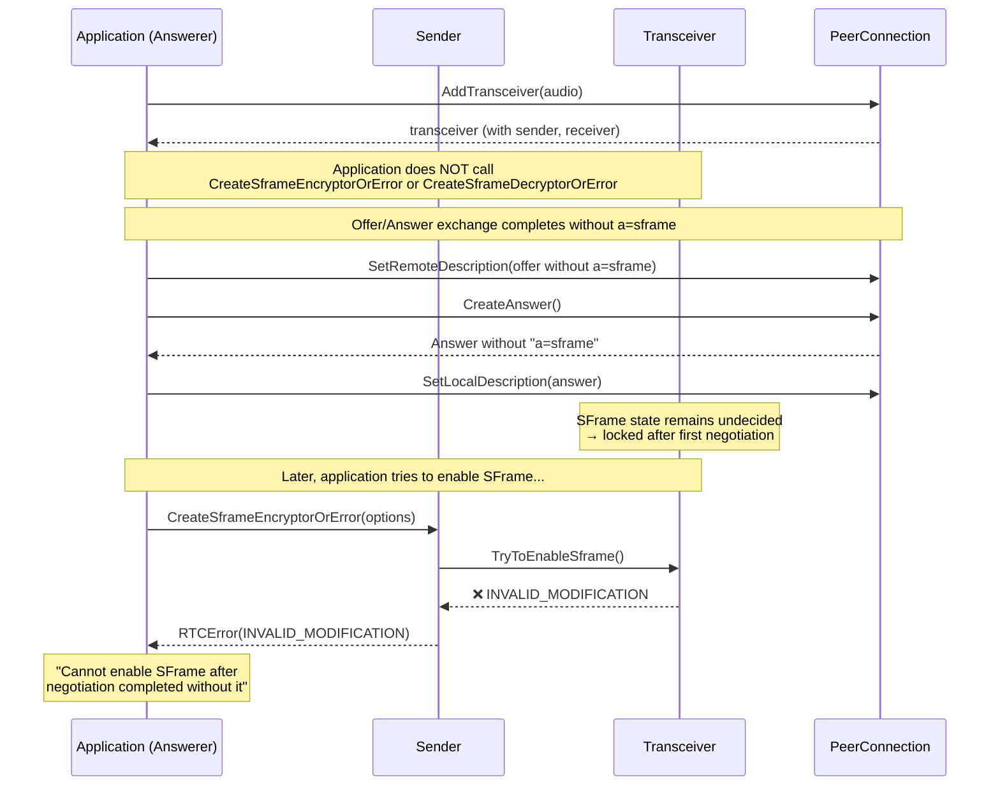

# SFrame SDP Negotiation

This document describes the SFrame negotiation flow within the WebRTC offer/answer exchange. SFrame support is signaled per media section using the `a=sframe` SDP attribute (per `draft-ietf-avtcore-rtp-sframe`).

## Design Principle

SFrame negotiation follows the **standard SDP offer/answer model** (RFC 3264).
The presence of `a=sframe` in an offer or answer indicates that the endpoint
expects to receive SFrame-encrypted RTP packets for that media section.

Key rule from draft-ietf-avtcore-rtp-sframe Section 6:

> *"If one peer expects to use SFrame for a media section and identifies that
> the other peer does not support it, the peer is expected to stop the
> transceiver associated with the media section."*

This means:
- **An offer is never rejected** because it contains `a=sframe`
- The answerer honestly declares its capabilities in the answer
- The **offerer** handles any mismatch by stopping the transceiver

## Negotiation Layers

| Layer | Description |
|-------|-------------|
| **Application API** | `RtpSenderInterface::CreateSframeEncryptorOrError()` / `RtpReceiverInterface::CreateSframeDecryptorOrError()` - enables SFrame on the sender/receiver, which internally notifies the transceiver via the `enable_sframe_at_owner_` callback |
| **Transceiver State** | Each transceiver tracks an SFrame enabled state (not yet decided / enabled / disabled) - set to enabled when the owner callback fires, drives SDP generation |
| **Offer/Answer** | SFrame preference is carried per media section during offer/answer creation |
| **SDP Wire Format** | `a=sframe` attribute line present in the m= section when SFrame is enabled |

## SFrame Negotiation Rules

1. **Opt-in only**: SFrame is disabled by default. The application must call `CreateSframeEncryptorOrError()` on the sender and/or `CreateSframeDecryptorOrError()` on the receiver to enable it. These calls internally notify the transceiver via the `enable_sframe_at_owner_` callback bound to `RtpTransceiver::TryToEnableSframe()`.
2. **No downgrade**: Once SFrame has been enabled on a transceiver (via the owner callback), the SFrame enabled state is permanent. Calling `CreateSframeEncryptorOrError`/`CreateSframeDecryptorOrError` again returns `INVALID_MODIFICATION` if the transceiver has already completed negotiation without SFrame.
3. **Offers are never rejected for `a=sframe`**: Per the standard O/A model, the answerer accepts the offer and answers honestly — omitting `a=sframe` if it doesn't support SFrame.
4. **Answers cannot introduce `a=sframe`**: If the offer did not include `a=sframe` for a media section, the answer must not add it. This is an RFC 3264 constraint — the answer is bounded by the offer. The SDP factory ensures answers only include `a=sframe` when both the offer and local preferences agree, and malicious answers that violate this are rejected.
5. **Answer SFrame is negotiated, not copied**: The answer's `a=sframe` is only set when both the offer contains `a=sframe` AND the answerer's local preference has SFrame enabled. A mismatch is not an error at the SDP factory level; it simply means the answer lacks `a=sframe`.
6. **Downgrade protection**: If a local offer included `a=sframe` but the remote answer does not, the offerer stops the transceiver. This is the primary mismatch-handling mechanism (per draft-ietf-avtcore-rtp-sframe §6).
7. **New transceivers inherit SFrame from offers**: When a remote offer creates a new transceiver (no local match), the transceiver is created with SFrame already enabled based on the offer.
8. **Triggers negotiation**: When the state observer transitions the transceiver's SFrame state from undecided to enabled, this triggers the negotiation-needed event, initiating a new offer/answer exchange.

## Transceiver SFrame State

Each transceiver tracks an SFrame enabled state, updated internally via the owner callback (not directly by the application):

| State | Meaning |
|-------|--------|
| Not yet decided | SFrame has not been enabled on sender or receiver |
| Enabled | SFrame is active (set when `CreateSframeEncryptorOrError` or `CreateSframeDecryptorOrError` is called on the sender/receiver, which triggers the observer) |

The transceiver implements the state observer. When the callback fires:
- If SFrame is not yet decided: marks it as enabled, returns OK, triggers negotiation-needed
- If SFrame is already enabled: returns OK (idempotent — both sender and receiver may call it)

Once the first negotiation completes without SFrame (because the application never called `CreateSframeEncryptorOrError`/`CreateSframeDecryptorOrError`), subsequent attempts to enable SFrame return `INVALID_MODIFICATION`.

---

## SDP Representation

When SFrame is enabled for a media section, the `a=sframe` attribute is added to the corresponding m= block:

```
m=audio 9 UDP/TLS/RTP/SAVPF 111
a=rtpmap:111 opus/48000/2
a=sframe
...

m=video 9 UDP/TLS/RTP/SAVPF 96
a=rtpmap:96 VP8/90000
a=sframe
...
```

The attribute follows `draft-ietf-avtcore-rtp-sframe`:
- **Serialization**: If SFrame is enabled for a media section, `a=sframe` is written to the SDP
- **Parsing**: When `a=sframe` is encountered in a received SDP, SFrame is marked as enabled for that media section

---

## Offer/Answer Negotiation Flows

### Flow 1: Successful SFrame Enablement (Both Sides)

The happy path where both peers enable SFrame and negotiate successfully.
The offerer uses `AddTransceiver` while the answerer uses `addTrack` — per JSEP §5.10, only `addTrack`-created transceivers are eligible for matching when processing a remote offer.



---

### Flow 2: Offerer Enables SFrame, Answerer Does Not — Transceiver Stopped

The offerer enables SFrame but the answerer does not. Per the standard O/A model, the offer is **accepted** (not rejected). The answerer creates an answer without `a=sframe`. When the offerer processes the answer, it detects the mismatch and **stops the transceiver**.



**What happens:**
1. The offerer detects that the local offer had `a=sframe` but the answer does not
2. The media channel is destroyed
3. The transceiver is stopped
4. The next offer will include a zero port for this m-section

---

### Flow 3: Answerer Adds `a=sframe` That Was Not In the Offer

This is an abnormal case — a spec-compliant answerer should not introduce `a=sframe` if the offer did not include it. A buggy or malicious remote peer could produce such an answer. The offerer rejects it with an invalid SDP error.



**What happens:**

1. During `SetRemoteDescription(answer)`, each media section in the answer is compared against the local offer.
2. If an answer media section contains `a=sframe` but the corresponding offer media section does not, the answer is rejected with an **INVALID_PARAMETER** error.
3. The PeerConnection state is not modified — the previous session description remains in effect.
4. Rejected m-sections with spurious `a=sframe` are tolerated (skipped).

**Rationale:** Silently ignoring the spurious `a=sframe` would lead to a state mismatch: the answerer believes SFrame is active and encrypts its outgoing media, while the offerer has no SFrame decryptor. This causes media failure on the offerer's receive path (undecryptable media). Failing early with a clear error is safer and easier to diagnose.

> **Note:** A well-behaved answerer should never add `a=sframe` if the offer did not include it. This case represents a protocol violation by the answerer (RFC 3264: answer is constrained by the offer).

---

### Flow 4: New Transceiver Created From Remote Offer With SFrame

When a remote offer contains a new m= section with `a=sframe`, the answerer has no existing transceiver for it. A new transceiver is created with SFrame already enabled from the offer. The answerer can then create an answer with matching SFrame.



---

### Summary of Negotiation Outcomes

| Offer `a=sframe` | Answer `a=sframe` | Result |
|:-:|:-:|:--|
| ✅ | ✅ | SFrame active on both sides (Flow 1) |
| ✅ | — | Offerer stops transceiver — downgrade protection (Flow 2) |
| ❌ | ❌ | No SFrame, normal media flow |
| ❌ | ✅ | **Rejected** — INVALID_PARAMETER error (Flow 3) |
| ✅ (new m=) | ✅ (auto) | New transceiver created with SFrame from offer (Flow 4) |

### What is NOT done (by design)

- **Offers are never rejected for `a=sframe`**: The answerer accepts the offer and answers honestly. The offerer handles mismatches.
- **SFrame is not auto-enabled on existing transceivers**: When an existing transceiver does not have SFrame enabled, the remote offer's `a=sframe` does not auto-enable it. SFrame is an encryption feature requiring explicit opt-in via `CreateSframeEncryptorOrError`/`CreateSframeDecryptorOrError` and key management infrastructure.

---

## Additional Scenarios

### Negotiation-Needed Triggered by SFrame Enablement

When `CreateSframeEncryptorOrError` or `CreateSframeDecryptorOrError` is called, the sender/receiver notifies the transceiver via the state observer. This marks SFrame as enabled on the transceiver, which differs from what was last negotiated, triggering a new offer/answer round.



---

### SFrame Cannot Be Enabled After Negotiation Without It

If a transceiver completes a negotiation round without SFrame enabled, `SetLocalDescription(answer)` locks the SFrame state. After that, calling `CreateSframeEncryptorOrError` or `CreateSframeDecryptorOrError` is rejected because the observer returns `INVALID_MODIFICATION`.



> **Key point:** `CreateSframeEncryptorOrError`/`CreateSframeDecryptorOrError` must be called **before** the first negotiation completes. Once `SetLocalDescription(answer)` is called without SFrame, the transceiver's SFrame state is permanently locked.
