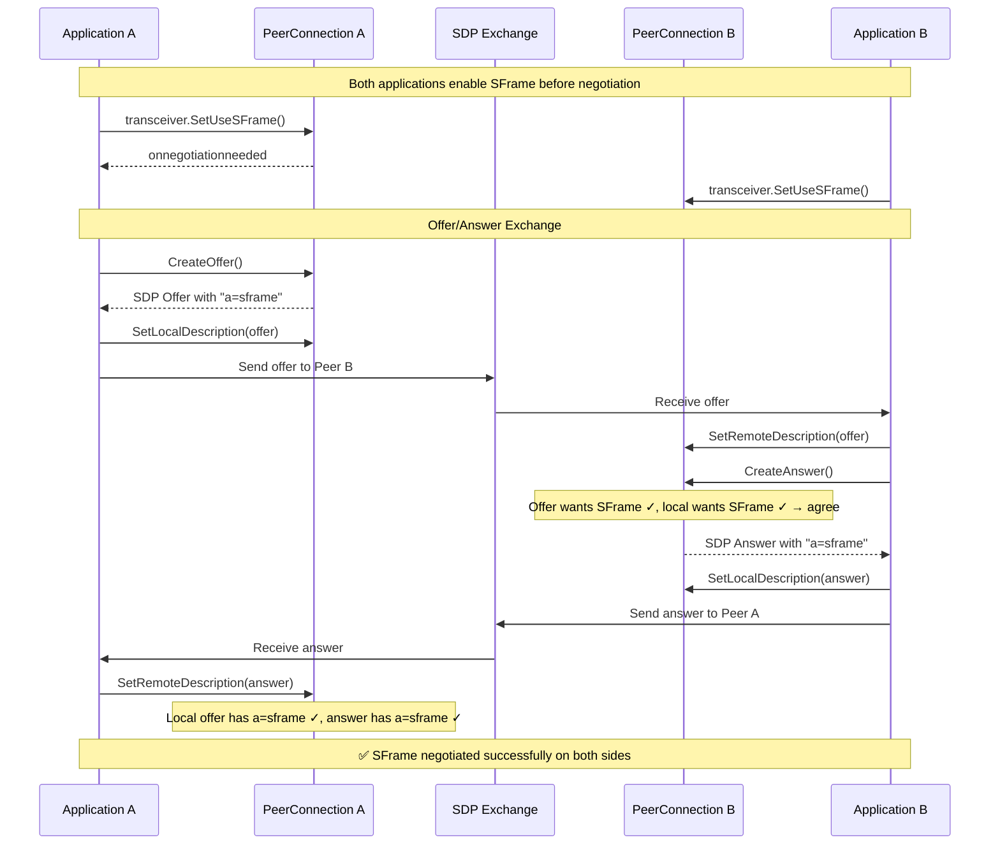
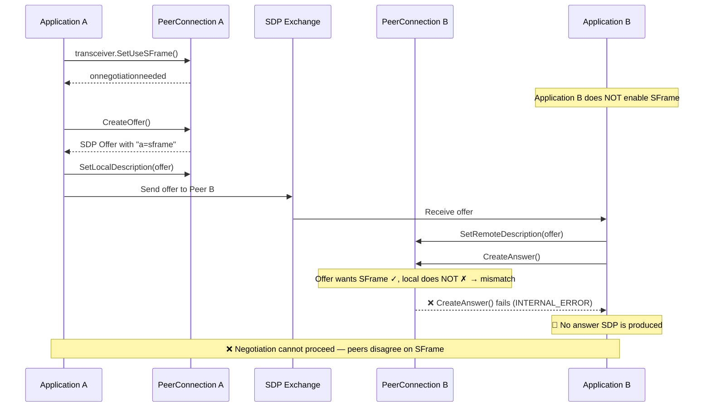
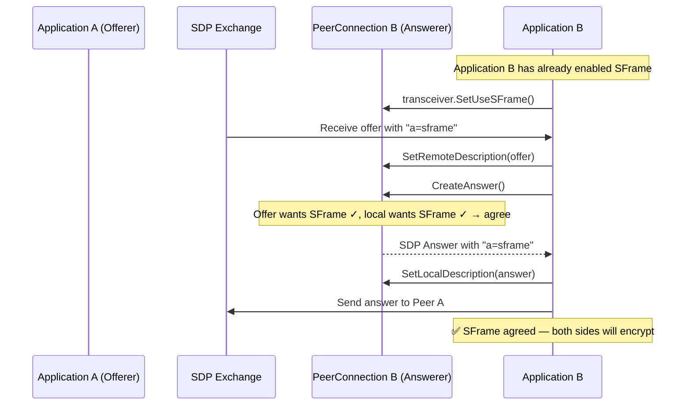
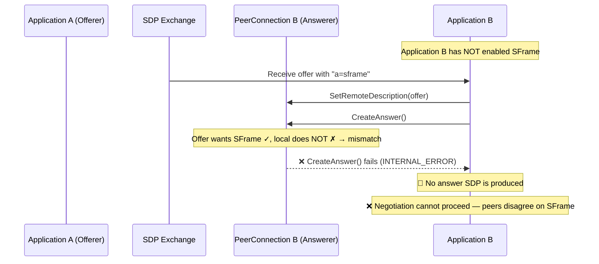
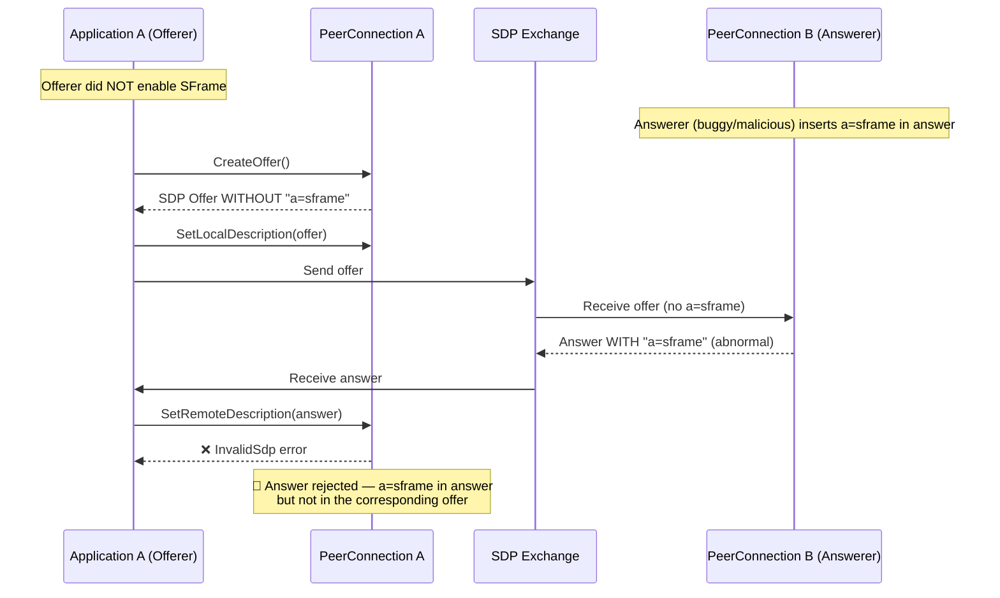
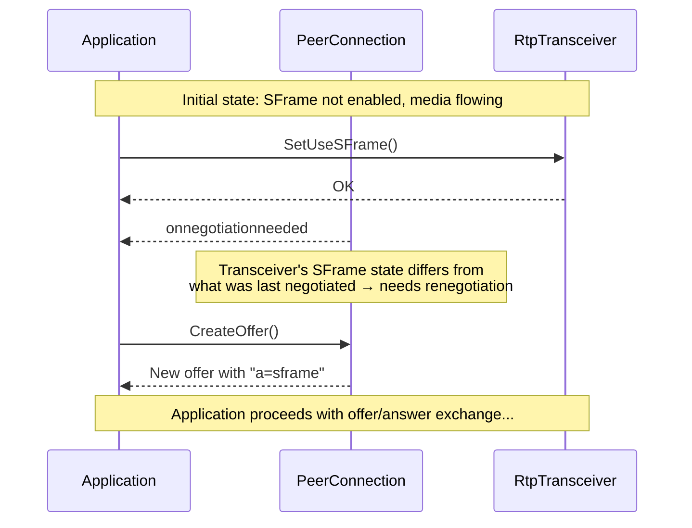
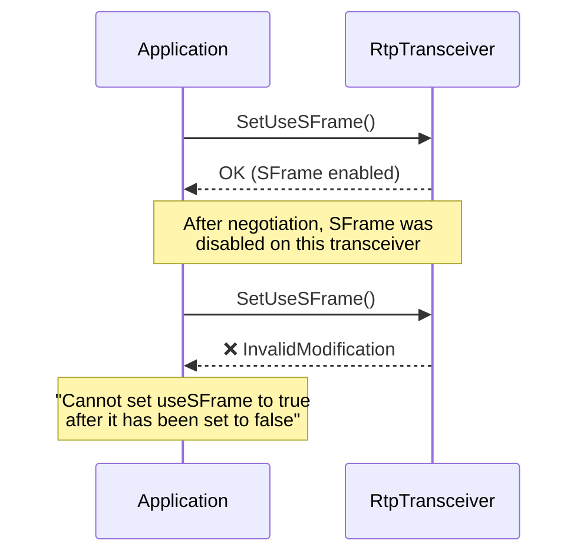
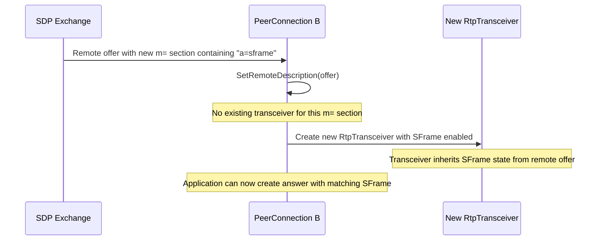

# SFrame SDP Negotiation

This document describes the SFrame negotiation flow within the WebRTC offer/answer exchange. SFrame support is signaled per media section using the `a=sframe` SDP attribute (per `draft-ietf-avtcore-rtp-sframe`).

## Negotiation Layers

| Layer | Description |
|-------|-------------|
| **Application API** | `RtpTransceiverInterface::SetUseSFrame()` / `UseSFrame()` — the application's intent |
| **Offer/Answer** | SFrame preference is carried per media section during offer/answer creation |
| **SDP Wire Format** | `a=sframe` attribute line present in the m= section when SFrame is enabled |

## SFrame Negotiation Rules

1. **Opt-in only**: SFrame is disabled by default. The application must call `SetUseSFrame()` to enable it.
2. **No downgrade**: Once SFrame has been set, it cannot be re-enabled after being explicitly disabled. Attempting to do so returns `InvalidModification`.
3. **Both sides must agree**: During answer creation, if the offer and answerer disagree on SFrame, `CreateAnswer()` fails with an error. No answer SDP is produced.
4. **Downgrade protection (safety net)**: If a local offer included `a=sframe` but the remote answer does not (e.g. due to SDP munging), the transceiver is stopped. This is a second line of defense — normally `CreateAnswer()` prevents this situation from arising.
5. **Triggers negotiation**: Changing the SFrame state triggers the `onnegotiationneeded` event, initiating a new offer/answer exchange.

---

## SDP Representation

When SFrame is enabled for a media section, the `a=sframe` attribute is added to the corresponding m= block:

```
m=audio 9 UDP/TLS/RTP/SAVPF 111
a=rtpmap:111 opus/48000/2
a=sframe
...

m=video 9 UDP/TLS/RTP/SAVPF 96
a=rtpmap:96 VP8/90000
a=sframe
...
```

The attribute follows `draft-ietf-avtcore-rtp-sframe`:
- **Serialization**: If SFrame is enabled for a media section, `a=sframe` is written to the SDP
- **Parsing**: When `a=sframe` is encountered in a received SDP, SFrame is marked as enabled for that media section

---

## Offer/Answer Negotiation Flows

### Flow 1: Successful SFrame Enablement (Both Sides)

The happy path where both peers enable SFrame and negotiate successfully.



---

### Flow 2: Offerer Enables SFrame, Answerer Does Not — CreateAnswer Fails

The offerer enables SFrame but the answerer does not. `CreateAnswer()` fails on the answerer — no answer is ever produced.



---

### Flow 3: Remote Offer With SFrame, Local Agrees

The remote peer offers SFrame and the local peer also has SFrame enabled.



---

### Flow 4: Remote Offer With SFrame, Local Does Not Support — CreateAnswer Fails

The remote peer offers SFrame but the local peer has not enabled it. `CreateAnswer()` fails — no answer is produced.



---

### Flow 5: Answerer Adds `a=sframe` That Was Not In the Offer

This is an abnormal case — a spec-compliant answerer should not introduce `a=sframe` if the offer did not include it. A buggy or malicious remote peer could produce such an answer. The offerer rejects it with an invalid SDP error.



**What happens:**

1. During `SetRemoteDescription(answer)`, the offerer compares each media section in the answer against the local offer.
2. If an answer media section contains `a=sframe` but the corresponding offer media section does not, the answer is rejected with an **invalid SDP** error.
3. The PeerConnection state is not modified — the previous session description remains in effect.

**Rationale:** Silently ignoring the spurious `a=sframe` would lead to a state mismatch: the answerer believes SFrame is active and encrypts its outgoing media, while the offerer has no SFrame decryptor. This causes media failure on the offerer's receive path (undecryptable media). Failing early with a clear error is safer and easier to diagnose.

> **Note:** A well-behaved answerer should never add `a=sframe` if the offer did not include it. This case represents a protocol violation by the answerer.

---

### Summary of Negotiation Outcomes

| Offer `a=sframe` | Answer `a=sframe` | Result |
|:-:|:-:|:--|
| ✅ | ✅ | SFrame active on both sides (Flow 1) |
| ✅ | ❌ | `CreateAnswer()` fails — no answer produced (Flow 2) |
| ❌ | ❌ | No SFrame, normal media flow |
| ❌ | ✅ | **Rejected** — invalid SDP error (Flow 5) |

> **Safety net:** If an answer without `a=sframe` is received despite the offer including it (e.g. due to SDP munging), the offerer stops the transceiver as a downgrade protection measure.

---

## Additional Scenarios

### Negotiation-Needed Triggered by SFrame State Change

When the transceiver's SFrame state differs from what was last negotiated, a new offer/answer round is triggered.



---

### SFrame Cannot Be Re-Enabled After Being Disabled

Once SFrame has been explicitly disabled (e.g. through a negotiation outcome), attempting to re-enable it is rejected.



---

### New Transceiver Created From Remote Offer With SFrame

When a remote offer creates a new transceiver, the SFrame state from the offer is applied to it.


