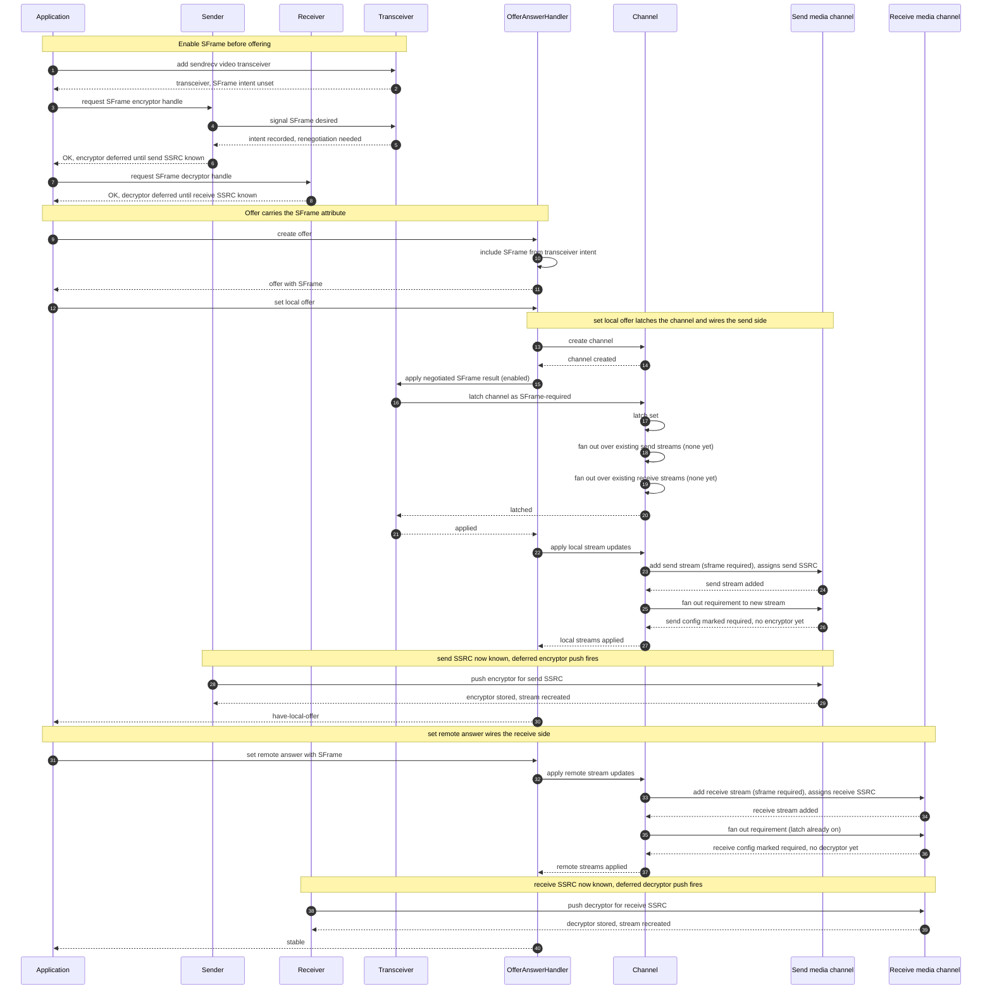
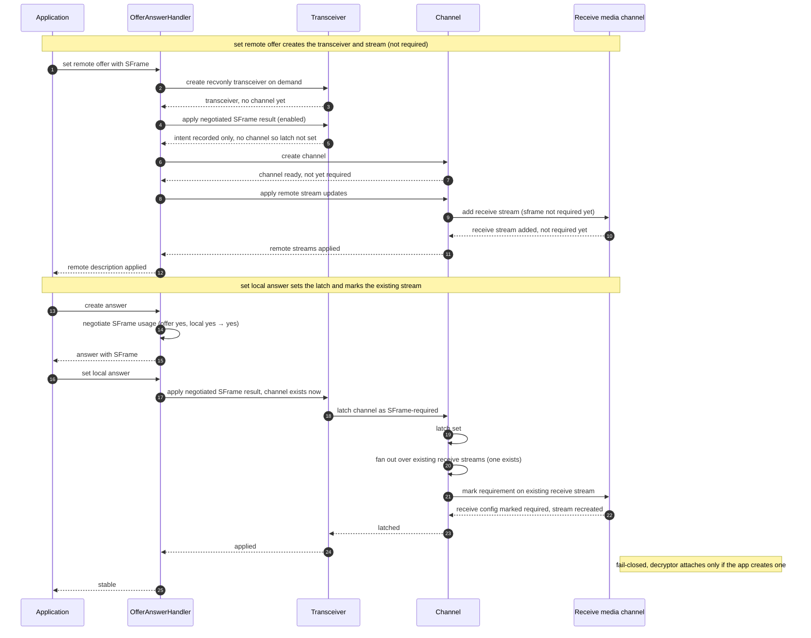
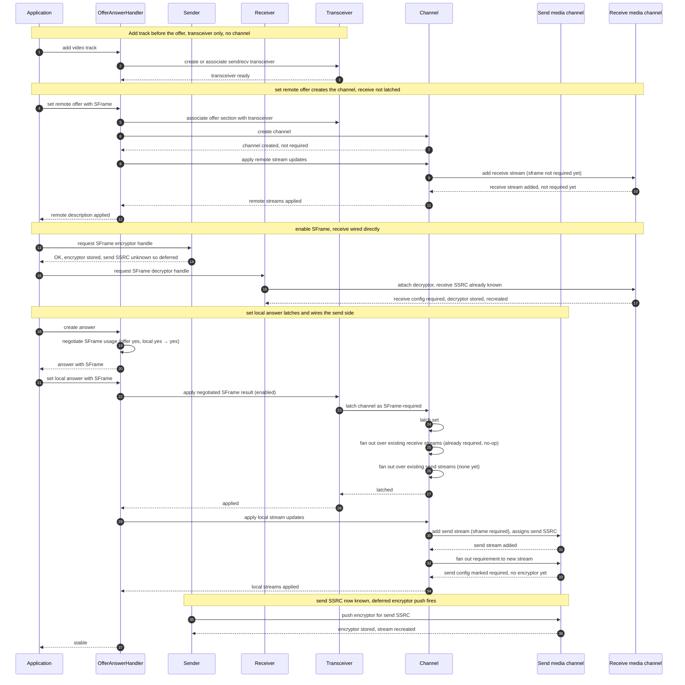
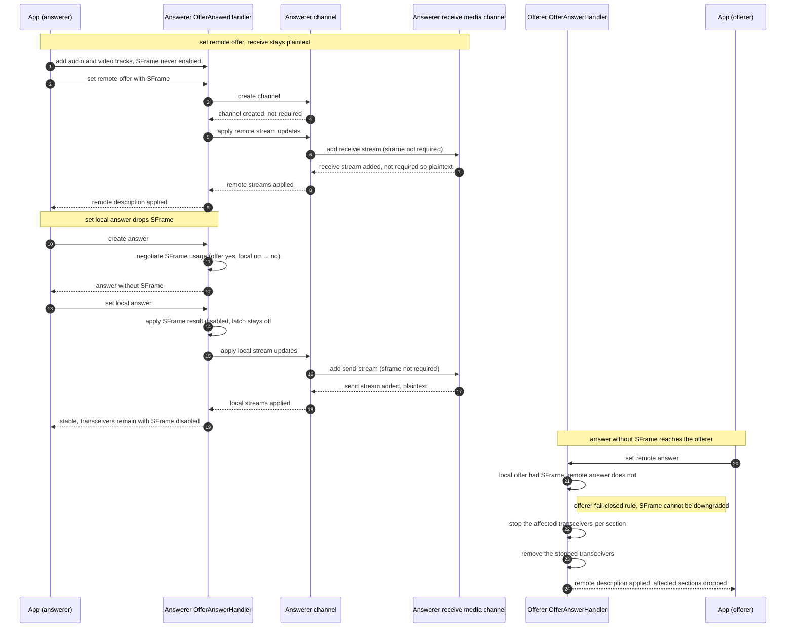

# Propagation Option 1 — Channel Latch with Fan-Out

> Part of [SFrame Requirement Propagation](channel-to-stream-propagation.md).
> This file gives the full design and the four offer/answer flows for this
> option. For the problem statement, the per-stream contract, and the comparison
> against the other options, see the overview.

The base channel for the section holds the requirement as a single **latch** and
fans it out into stream configuration. No per-direction media channel keeps its
own copy.

## How it works

When the negotiated value for the section becomes known, the transceiver applies
the result and latches it onto the section's base channel. The channel records
that SFrame is required — the latch is the one place the value lives — and pushes
it down to the send and receive media channels, which stamp it into each owned
stream's configuration.

## Streams that already exist

Setting the latch immediately scans the streams the channel already owns and
marks each one's configuration required.

## Streams added later

Applying a local or remote stream update re-runs the fan-out from the latch, so
a stream added after the latch flipped is marked too. Marking is idempotent: it
has no effect on a stream that is already required, so re-fanning never clears a
crypto object that was attached earlier.

Under Unified Plan there is at most one send stream and one receive stream per
section, so this path marks a single stream per direction. Re-running the fan-out
matters for *ordering* — the stream may appear after the latch flips — not for
stream count.

## Ownership and threading

The latch lives on the base channel and is read and written on the worker
thread; the transceiver applies the negotiated result onto it. When the channel
is recreated (for example on a BUNDLE or transport change) the latch is dropped
with it and must be re-applied.

## Trade-offs

- **Single source of truth:** the channel latch — no duplicate copies in the
  per-direction media channels.
- **Strengths:** one place to read and reason about; nothing is re-cached across
  layers; the requirement is naturally scoped to the channel/section.
- **Costs:** the base channel (a signaling-layer object) gains SFrame-specific
  runtime policy and a worker-thread fan-out path; the latch must be re-applied
  each time the channel is recreated.

## Flows

The four scenarios below cover the offerer, the passive answerer, and the two
add-track answerer cases (accepting and declining SFrame). They focus on the
video path; audio takes the same route.

### Flow 1 — Offerer

The offerer enables SFrame before offering. When it applies its local offer the
channel latch is set and the **send** stream becomes required; the **receive**
stream becomes required when the answer is applied (the latch is already on, so
the new receive stream is marked during the remote stream update).

**Step by step:**

1. *Enable before offering (1–9).* The application creates a sendrecv
   transceiver, then asks the sender for an encryptor handle. That request tells
   the transceiver SFrame is desired and flags renegotiation; the encryptor is
   deferred until the send SSRC is known. The decryptor handle is requested the
   same way and also deferred.
2. *Offer carries SFrame (10–13).* Creating the offer includes the SFrame
   attribute for the section (taken from the transceiver's intent), and the offer
   is handed back to the application.
3. *Set local offer — latch (14–21).* Setting the local offer creates the
   channel, then applying the negotiated result latches the channel as required.
   The latch scans existing send and receive streams (none yet) and control
   returns up to the signaling layer.
4. *Set local offer — wire the send side (22–30).* Applying the local stream
   updates adds the send stream (which assigns the send SSRC) and the follow-up
   fan-out marks its configuration required, still without an encryptor. Once the
   send SSRC is known, the deferred encryptor push fires, the encryptor is stored,
   and the stream is recreated — reaching have-local-offer.
5. *Set remote answer — wire the receive side (31–40).* Setting the remote answer
   applies the remote stream updates and adds the receive stream (assigning the
   receive SSRC); because the latch is already on, the fan-out marks the new
   receive stream required. Once the receive SSRC is known, the deferred decryptor
   push fires, the decryptor is stored, and the stream is recreated — reaching the
   stable state.

### Flow 2 — Passive answerer (recvonly)

The answerer adds no local track and does not create an encryptor or decryptor.
The receive transceiver is created on demand while applying the offer, and the
negotiated result is applied there — **before that transceiver's channel
exists**, so only the intent is recorded. The latch is set later, when the local
answer is applied, where the fan-out marks the **already-existing** receive
stream required.

**Step by step:**

1. *Set remote offer — transceiver, no channel (1–5).* Applying the remote offer
   creates a recvonly transceiver on demand. The negotiated result is applied
   immediately, but the channel does not exist yet, so only the intent is
   recorded and control returns to the signaling layer — **the latch is not
   set**.
2. *Set remote offer — channel and stream, not required (6–12).* Still inside the
   same remote-description apply, the channel is created (not yet required) and
   the remote stream update adds the receive stream, still not required, before
   returning to the application.
3. *Answer keeps SFrame (13–15).* Creating the answer negotiates the offer
   against the local preference and keeps SFrame.
4. *Set local answer — latch and mark the existing stream (16–24).* Setting the
   local answer re-applies the result; now that the channel exists it latches
   required and fans out over the **already-existing** receive stream, marking it
   required and recreating it, then control returns up to the signaling layer.
   The stream stays fail-closed — a decryptor is attached only if the application
   later creates one. This is the one flow where the fan-out over existing streams
   (rather than the per-add fan-out) is what marks the stream.

### Flow 3 — Add-track answerer, SFrame enabled

The answerer adds a track before applying the offer, so its transceivers exist
sendrecv. It also enables SFrame, so the receive stream is wired **directly**
(the receive SSRC is already known from the offer), while the send stream
becomes required when the local answer is applied via the latch flip plus
fan-out.

**Step by step:**

1. *Add track before the offer (1–3).* The application adds a track, creating a
   sendrecv transceiver before any remote description.
2. *Set remote offer creates the channel (4–12).* Applying the remote offer
   associates the section and creates the channel (not required); the receive
   stream is added but not yet required, then control returns to the application.
3. *Enable SFrame — receive wired directly (13–17).* The encryptor handle is
   requested but deferred, because the send SSRC is not known yet. The decryptor
   handle, however, can be attached **directly**: the receive SSRC is already
   known from the offer, so the receive configuration is marked required, the
   decryptor is stored, and the stream is recreated — without waiting for the
   latch.
4. *Set local answer — latch (18–25).* Creating the answer keeps SFrame. Setting
   the local answer latches the channel; the latch scans the existing receive
   stream (already required, so a no-op) and the existing send streams (none
   yet), then control returns to the signaling layer.
5. *Set local answer — wire the send side (26–34).* Applying the local stream
   updates adds the send stream (assigning the send SSRC) and the fan-out marks
   its configuration required, still without an encryptor. Once the send SSRC is
   known, the deferred encryptor push fires, the encryptor is stored, and the
   stream is recreated, reaching the stable state.

Because marking a stream required is idempotent, the answer-time send-side
fan-out never clobbers the decryptor installed directly during enable.

### Flow 4 — Add-track answerer, SFrame declined (downgrade rejected)

The answerer adds tracks before the offer but **never** enables SFrame, while
the offerer offered SFrame. This exercises asymmetric negotiation and is the
case the latch design fixes by recording the **local/negotiated** value rather
than the offerer's intent.

- **Answerer:** negotiation of the offer's SFrame against the local "off"
  preference yields off, so the answer **drops SFrame** and the applied result
  leaves the latch off. No receive stream is marked required — the receive side
  stays plaintext, matching the local decision.
- **Offerer:** receives an answer without SFrame. The offerer-side fail-closed
  rule stops each affected transceiver — SFrame cannot be silently downgraded to
  plaintext — and the stopped transceivers are then removed.

**Step by step:**

1. *Set remote offer — receive stays plaintext (1–9).* The answerer added tracks
   but never enabled SFrame. Applying the remote offer creates the channel (not
   required) and adds the receive stream as plaintext, then control returns to
   the application.
2. *Set local answer — drops SFrame (10–14).* Negotiating the offer's SFrame
   against the local "off" preference yields off, so the answer omits SFrame.
   Setting the local answer applies a disabled result, leaving the latch off.
3. *Set local answer — stays plaintext (15–19).* Applying the local stream updates
   adds the send stream with the latch off, so it is not marked required, and
   control returns up to the application. Both directions remain plaintext while
   the transceivers stay alive — matching the local decision, not the offerer's
   intent.
4. *Offerer rejects the downgrade (20–24).* The offerer receives an answer without
   SFrame while its own offer required it. The offerer-side fail-closed rule stops
   each affected transceiver — SFrame cannot be silently downgraded to plaintext —
   and the stopped transceivers are then removed.
