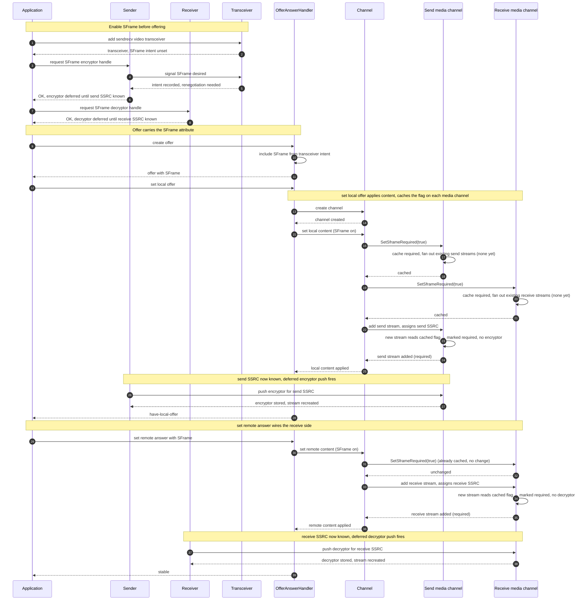
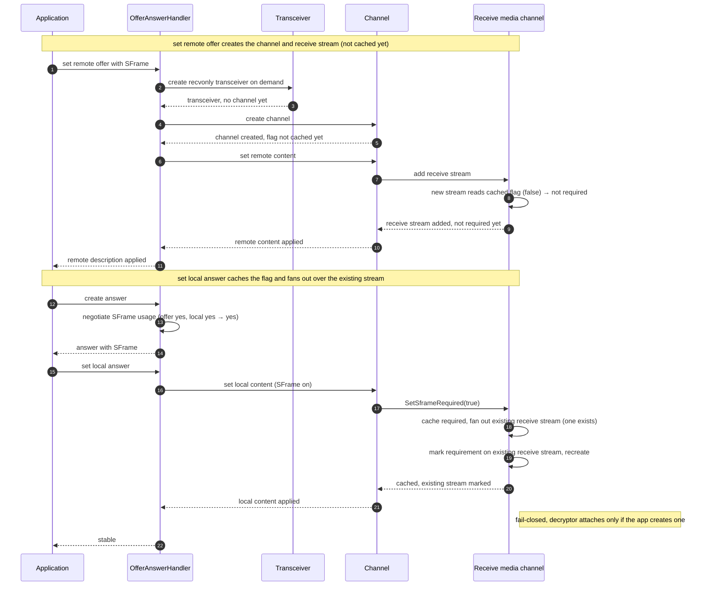
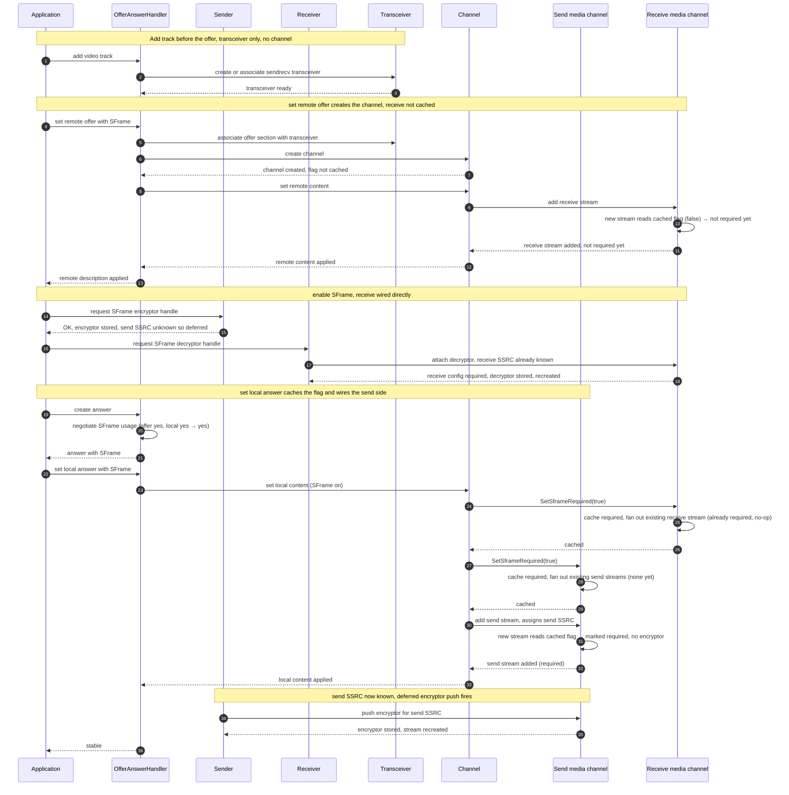
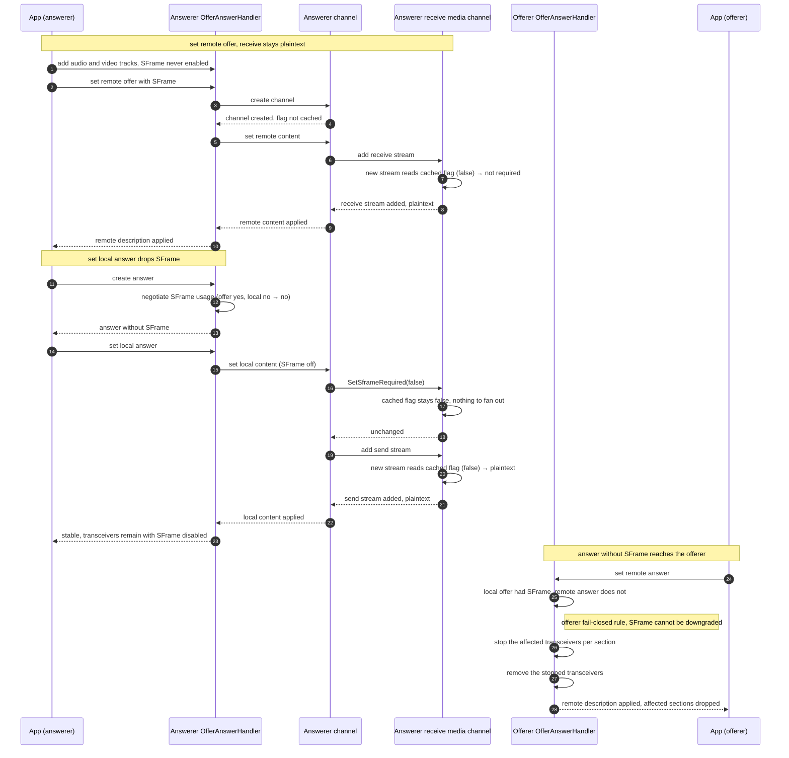

# Propagation Option 2 — Per-Channel Requirement Cache

> Part of [SFrame Requirement Propagation](channel-to-stream-propagation.md).
> This file gives the full design and the four offer/answer flows for this
> option. For the problem statement, the per-stream contract, and the comparison
> against the other options, see the overview.

Each media channel caches the requirement as its own member and fans it out to
its streams.

## How it works

Each media channel gains a `SetSframeRequired`-style setter, driven from the
base channel's content-application path. The setter caches the negotiated value
as a member on the media channel.

Because the value is applied from the **local** content (offer = local intent,
answer = the negotiated result), the cached flag reflects the *agreed*
media-section mode, not the remote peer's wish.

## Streams that already exist

When the setter runs it fans the cached value out over the streams the media
channel already owns, marking each one's configuration required.

## Streams added later

A stream added afterward reads the cached member at the moment it is added, so
it picks up the requirement without another push.

Under Unified Plan each channel owns at most one stream, so this read-the-cache
step configures a single stream per direction. The cache earns its place by
covering the case where the stream is added *after* the requirement, not by
handling many streams.

## Ownership and threading

Each of the two media channels (send and receive) keeps its own cached flag, set
on the worker thread from the same negotiated content. The negotiation tri-state
stays on the transceiver, as it does today.

## Trade-offs

- **Single source of truth:** none — the value is duplicated as a member on each
  of the two media channels, both set from the same negotiated content.
- **Strengths:** smallest code footprint (two setters plus a couple of lines in
  the content-apply path); no new types.
- **Costs:** the same value is cached in two places and must be kept consistent;
  it embraces the per-layer caching the other two designs avoid.

## Flows

The four scenarios below cover the offerer, the passive answerer, and the two
add-track answerer cases (accepting and declining SFrame). They focus on the
video path; audio takes the same route.

The defining move in every flow is the content-apply path calling
`SetSframeRequired(true)` on a media channel, which **caches** the flag on that
channel and fans it out over its existing streams; streams added afterward read
the cached flag.

### Flow 1 — Offerer

The offerer enables SFrame before offering. Setting the local offer applies the
local content, which caches the requirement on each media channel; the **send**
stream is added in the same apply and reads the cached flag. The **receive**
stream is added when the answer is applied and reads the (already cached) flag.

**Step by step:**

1. *Enable before offering (1–9).* The application creates a sendrecv
   transceiver, then asks the sender for an encryptor handle, which records the
   intent and flags renegotiation; the encryptor is deferred until the send SSRC
   is known. The decryptor handle is requested the same way and also deferred.
2. *Offer carries SFrame (10–13).* Creating the offer includes the SFrame
   attribute for the section, and the offer is handed back to the application.
3. *Set local offer — cache the flag (14–22).* Setting the local offer creates
   the channel and applies the local content. Applying content calls
   `SetSframeRequired(true)` on the send and receive media channels; each caches
   the flag and fans out over its existing streams (none yet).
4. *Set local offer — wire the send side (23–28).* Still inside the same apply,
   the send stream is added and reads the cached flag, so its configuration is
   marked required without an encryptor. Once the send SSRC is known, the
   deferred encryptor push fires and the stream is recreated — reaching
   have-local-offer.
5. *Set remote answer — wire the receive side (29–38).* Setting the remote answer
   applies the remote content; `SetSframeRequired(true)` on the receive channel
   is idempotent (already cached). The receive stream is added, reads the cached
   flag, and is marked required; once the receive SSRC is known the deferred
   decryptor push fires and the stream is recreated — reaching the stable state.

### Flow 2 — Passive answerer (recvonly)

The answerer adds no local track and creates no crypto. The receive stream is
added while applying the remote offer, **before the local answer caches the
flag**, so it is added plaintext. The local answer then applies local content,
which caches the flag on the receive channel and fans it out over the
**already-existing** receive stream.

**Step by step:**

1. *Set remote offer — channel and stream, not cached (1–9).* Applying the remote
   offer creates a recvonly transceiver on demand and its channel. Applying the
   remote content adds the receive stream, which reads the still-false cached
   flag, so it is added plaintext, before control returns to the application.
   The flag is **not cached yet** because the local (negotiated) decision is not
   final until the answer.
2. *Answer keeps SFrame (10–12).* Creating the answer negotiates the offer
   against the local preference and keeps SFrame.
3. *Set local answer — cache and mark the existing stream (13–20).* Setting the
   local answer applies the local content, which calls `SetSframeRequired(true)`
   on the receive channel; the channel caches the flag and fans out over the
   **already-existing** receive stream, marking it required and recreating it.
   The stream stays fail-closed — a decryptor is attached only if the application
   later creates one. This is the one flow where the fan-out over existing streams
   (rather than the per-add read of the cached flag) is what marks the stream.

### Flow 3 — Add-track answerer, SFrame enabled

The answerer adds a track before applying the offer, so its transceivers exist
sendrecv. It also enables SFrame, so the receive stream is wired **directly**
(the receive SSRC is already known from the offer), while the send stream picks
up the cached flag when it is added during the local answer.

**Step by step:**

1. *Add track before the offer (1–3).* The application adds a track, creating a
   sendrecv transceiver before any remote description.
2. *Set remote offer creates the channel (4–12).* Applying the remote offer
   associates the section and creates the channel; the receive stream is added
   and reads the still-false cached flag, so it is not yet required.
3. *Enable SFrame — receive wired directly (13–17).* The encryptor handle is
   requested but deferred (the send SSRC is unknown). The decryptor handle is
   attached **directly**: the receive SSRC is already known, so the receive
   configuration is marked required, the decryptor is stored, and the stream is
   recreated — independent of the cached flag.
4. *Set local answer — cache the flag (18–25).* Setting the local answer applies
   the local content. `SetSframeRequired(true)` on the receive channel caches the
   flag and fans out over the existing receive stream (already required, so a
   no-op); the send channel caches its flag and finds no send streams yet.
5. *Set local answer — wire the send side (26–32).* Still inside the same apply,
   the send stream is added and reads the cached flag, so it is marked required
   without an encryptor; once the send SSRC is known the deferred encryptor push
   fires and the stream is recreated — reaching the stable state.

Because the receive flag and the directly-attached decryptor both mark the same
stream required, the answer-time caching never clobbers the decryptor installed
during enable.

### Flow 4 — Add-track answerer, SFrame declined (downgrade rejected)

The answerer adds tracks before the offer but **never** enables SFrame, while
the offerer offered SFrame. This exercises asymmetric negotiation and is the
case the per-channel cache handles by caching the **local/negotiated** value
rather than the offerer's intent.

- **Answerer:** negotiation of the offer's SFrame against the local "off"
  preference yields off, so the answer **drops SFrame** and the content applied
  to the channel never sets the cached flag. No receive stream is marked required
  — the receive side stays plaintext, matching the local decision.
- **Offerer:** receives an answer without SFrame. The offerer-side fail-closed
  rule stops each affected transceiver — SFrame cannot be silently downgraded to
  plaintext — and the stopped transceivers are then removed.

**Step by step:**

1. *Set remote offer — receive stays plaintext (1–9).* The answerer added tracks
   but never enabled SFrame. Applying the remote offer creates the channel and
   adds the receive stream, which reads the false cached flag and stays
   plaintext.
2. *Set local answer — drops SFrame (10–14).* Negotiating the offer's SFrame
   against the local "off" preference yields off, so the answer omits SFrame.
3. *Set local answer — stays plaintext (15–21).* Applying the local content calls
   `SetSframeRequired(false)` (no change), and the send stream added afterward
   reads the false cached flag, so both directions remain plaintext while the
   transceivers stay alive — matching the local decision, not the offerer's
   intent.
4. *Offerer rejects the downgrade (22–26).* The offerer receives an answer without
   SFrame while its own offer required it. The offerer-side fail-closed rule stops
   each affected transceiver — SFrame cannot be silently downgraded to plaintext —
   and the stopped transceivers are then removed.
