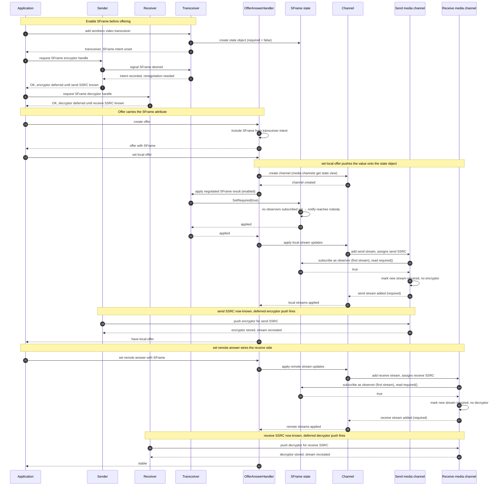
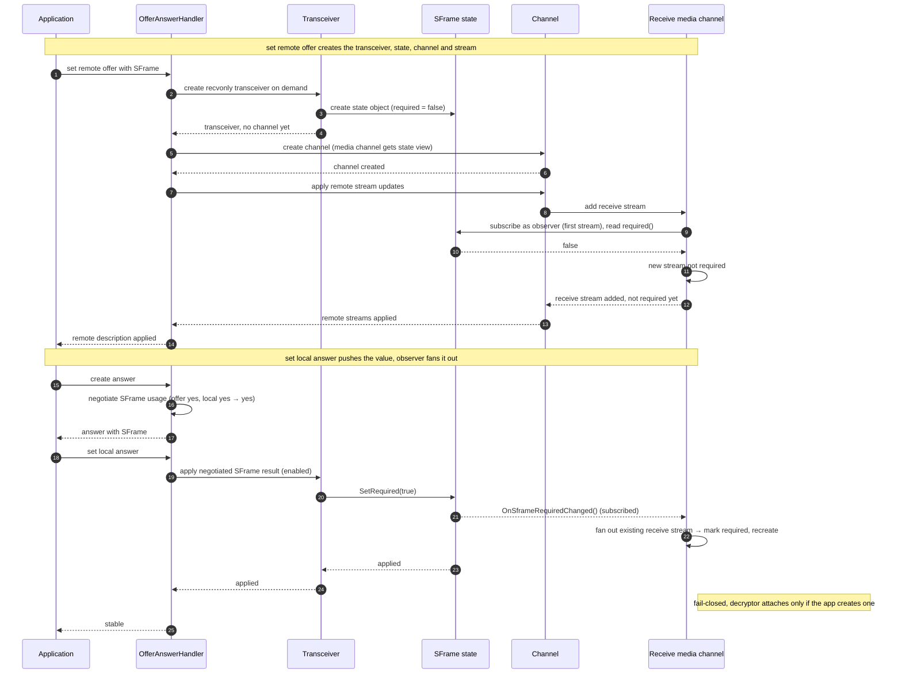
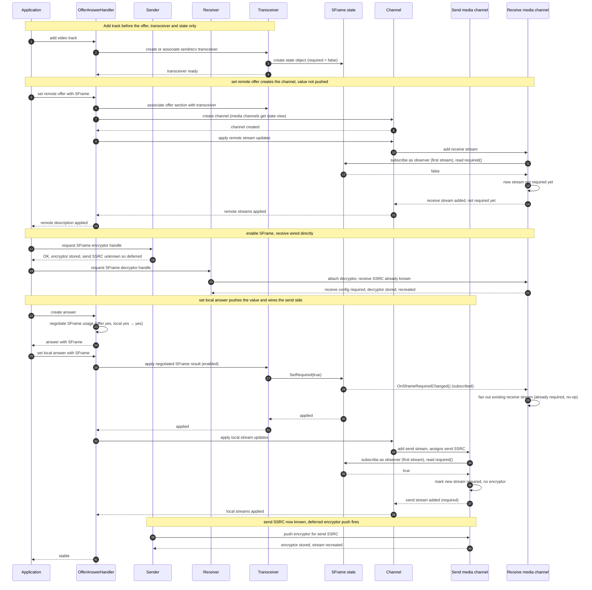
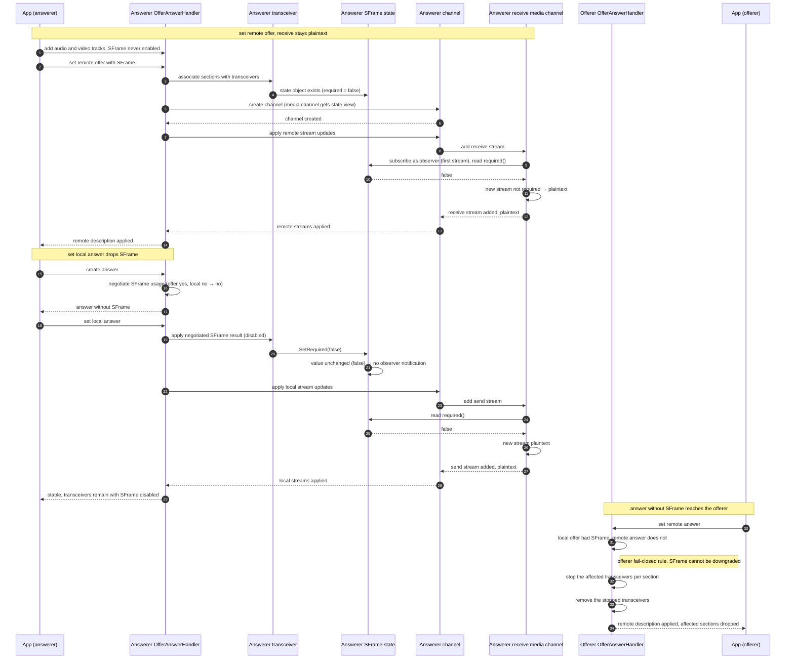

# Propagation Option 3 — Dedicated SFrame-State Object

> Part of [SFrame Requirement Propagation](channel-to-stream-propagation.md).
> This file gives the full design and the four offer/answer flows for this
> option. For the problem statement, the per-stream contract, and the comparison
> against the other options, see the overview.

A small, worker-confined state object is the single source of truth for the
section's requirement. Both media channels read through it and keep no copy.

## How it works

The state object is created and owned by the transceiver and handed to both
media channels as a non-owning view. The transceiver pushes the negotiated value
onto the object when the result is applied. Because the pushed value comes from
the **local** description (offer = local intent, answer = the negotiated
result), the object reflects the *agreed* media-section mode, not the remote
peer's wish.

Each media channel subscribes to the object as an observer the first time it
adds a stream (lazy registration on the worker thread), and unsubscribes when it
is destroyed.

## Streams that already exist

When the transceiver pushes a new value, the object notifies its registered
observers. Each media channel that has already subscribed fans the new value out
over the streams it already owns, marking each one's configuration required.

## Streams added later

A stream added afterward causes the media channel to read the current value
straight from the object — read-through, no cached copy — and configure the new
stream from it. (Adding the first stream is also what subscribes the channel as
an observer.)

Under Unified Plan each channel owns at most one stream, so the read-through
configures a single stream per direction. Reading from the object matters because
the stream may be added before or after the value is pushed, not because there
are multiple streams.

## Ownership and threading

The object is owned by the transceiver, which outlives the media channels, and
is confined to the worker thread. The media channels hold only a non-owning view
and must unsubscribe before they are destroyed, because the object is reused
across channel recreation and a stale observer would be called against freed
memory.

## Trade-offs

- **Single source of truth:** the shared object — both media channels read the
  same value, so they can never disagree, and neither caches it.
- **Strengths:** keeps the base channel out of SFrame policy entirely; the
  read-through model means no per-layer duplication; the requirement is owned at
  the section (transceiver) level and shared explicitly.
- **Costs:** a new type plus an observer interface and its lifetime/threading
  rules (worker-confined, transceiver-owned, reused and re-subscribed across
  channel recreation); a bespoke pattern rather than reusing an existing
  propagation path.

## Flows

The four scenarios below cover the offerer, the passive answerer, and the two
add-track answerer cases (accepting and declining SFrame). They focus on the
video path; audio takes the same route.

The defining move in every flow is that the transceiver pushes the value onto
the shared **state object** (`St`), which notifies already-subscribed observers;
streams added afterward read the value straight from the object.

### Flow 1 — Offerer

The offerer enables SFrame before offering. Setting the local offer pushes the
requirement onto the state object, but **no media channel has subscribed yet**
(neither has added a stream), so the notification reaches nobody. The send and
receive streams instead read the value through the object when they are added.

**Step by step:**

1. *Enable before offering (1–10).* Creating the transceiver also creates its
   state object (required = false). Asking the sender for an encryptor handle
   records the intent and flags renegotiation; the encryptor and decryptor are
   both deferred until their SSRCs are known.
2. *Offer carries SFrame (11–14).* Creating the offer includes the SFrame
   attribute for the section, and the offer is handed back to the application.
3. *Set local offer — push the value (15–21).* Setting the local offer creates
   the channel (the media channels receive a view of the state object), then the
   transceiver pushes `SetRequired(true)`. No media channel has added a stream
   yet, so no observer is subscribed and the notification reaches nobody.
4. *Set local offer — wire the send side (22–28).* Adding the send stream
   subscribes the send channel as an observer and reads `required()` straight
   from the object (true), so the new stream is marked required without an
   encryptor. Once the send SSRC is known the deferred encryptor push fires and
   the stream is recreated — reaching have-local-offer.
5. *Set remote answer — wire the receive side (29–38).* Adding the receive stream
   subscribes the receive channel and reads `required()` (true), marking the new
   stream required; once the receive SSRC is known the deferred decryptor push
   fires and the stream is recreated — reaching the stable state.

### Flow 2 — Passive answerer (recvonly)

The answerer adds no local track and creates no crypto. The receive stream is
added while applying the remote offer, **before the value is pushed**, so it
reads `required() == false` and subscribes as an observer. The local answer then
pushes the value, and the observer notification fans it out over that
**already-existing** receive stream.

**Step by step:**

1. *Set remote offer — transceiver, state, stream (1–11).* Applying the remote
   offer creates a recvonly transceiver on demand and its state object
   (required = false), then the channel. Adding the receive stream subscribes the
   receive channel as an observer and reads `required()` (false), so the stream
   is not required. The value is **not pushed yet** because the local
   (negotiated) decision is not final until the answer.
2. *Answer keeps SFrame (12–14).* Creating the answer negotiates the offer
   against the local preference and keeps SFrame.
3. *Set local answer — push and fan out (15–21).* Setting the local answer pushes
   `SetRequired(true)`. The receive channel is already subscribed, so the object
   notifies it; the channel fans the value out over the **already-existing**
   receive stream, marking it required and recreating it. The stream stays
   fail-closed — a decryptor is attached only if the application later creates
   one. This is the one flow where the observer notification (rather than the
   per-add read-through) is what marks the stream.

### Flow 3 — Add-track answerer, SFrame enabled

The answerer adds a track before applying the offer, so its transceivers exist
sendrecv. It also enables SFrame, so the receive stream is wired **directly**
(the receive SSRC is already known from the offer), while the send stream reads
the value through the object when it is added during the local answer.

**Step by step:**

1. *Add track before the offer (1–4).* Adding a track creates a sendrecv
   transceiver and its state object (required = false) before any remote
   description.
2. *Set remote offer creates the channel (5–13).* Applying the remote offer
   associates the section and creates the channel; adding the receive stream
   subscribes the receive channel and reads `required()` (false), so it is not
   yet required.
3. *Enable SFrame — receive wired directly (14–18).* The encryptor handle is
   requested but deferred (the send SSRC is unknown). The decryptor handle is
   attached **directly**: the receive SSRC is already known, so the receive
   configuration is marked required and the decryptor is stored — independent of
   the state object.
4. *Set local answer — push the value (19–24).* Setting the local answer pushes
   `SetRequired(true)`. The receive channel is already subscribed, so the object
   notifies it; fanning out over the existing receive stream is an idempotent
   no-op (already required).
5. *Set local answer — wire the send side (25–31).* Adding the send stream
   subscribes the send channel and reads `required()` (true), marking the new
   stream required without an encryptor; once the send SSRC is known the deferred
   encryptor push fires and the stream is recreated — reaching the stable state.

Because reading `required()` and attaching the decryptor both mark the same
stream required, the answer-time notification never clobbers the decryptor
installed during enable.

### Flow 4 — Add-track answerer, SFrame declined (downgrade rejected)

The answerer adds tracks before the offer but **never** enables SFrame, while
the offerer offered SFrame. This exercises asymmetric negotiation and is the
case the state object handles by pushing the **local/negotiated** value rather
than the offerer's intent.

- **Answerer:** negotiation of the offer's SFrame against the local "off"
  preference yields off, so the answer **drops SFrame** and the value pushed onto
  the object stays false. No receive stream is marked required — the receive side
  stays plaintext, matching the local decision.
- **Offerer:** receives an answer without SFrame. The offerer-side fail-closed
  rule stops each affected transceiver — SFrame cannot be silently downgraded to
  plaintext — and the stopped transceivers are then removed.

**Step by step:**

1. *Set remote offer — receive stays plaintext (1–12).* The answerer added tracks
   but never enabled SFrame. Applying the remote offer creates the channel;
   adding the receive stream subscribes the receive channel and reads `required()`
   (false), so it stays plaintext.
2. *Set local answer — drops SFrame (13–17).* Negotiating the offer's SFrame
   against the local "off" preference yields off, so the answer omits SFrame and
   the transceiver pushes `SetRequired(false)`. The value is unchanged, so no
   observer is notified.
3. *Set local answer — stays plaintext (18–23).* Adding the send stream reads
   `required()` (false), so both directions remain plaintext while the
   transceivers stay alive — matching the local decision, not the offerer's
   intent.
4. *Offerer rejects the downgrade (24–28).* The offerer receives an answer without
   SFrame while its own offer required it. The offerer-side fail-closed rule stops
   each affected transceiver — SFrame cannot be silently downgraded to plaintext —
   and the stopped transceivers are then removed.
