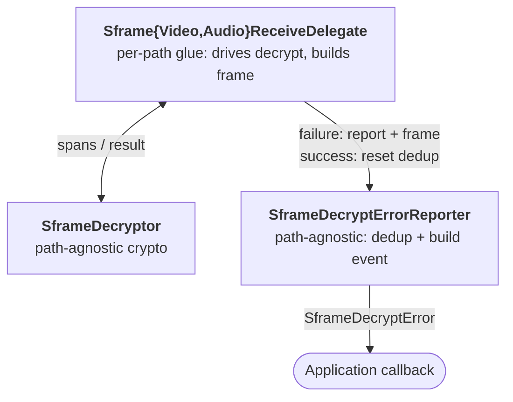
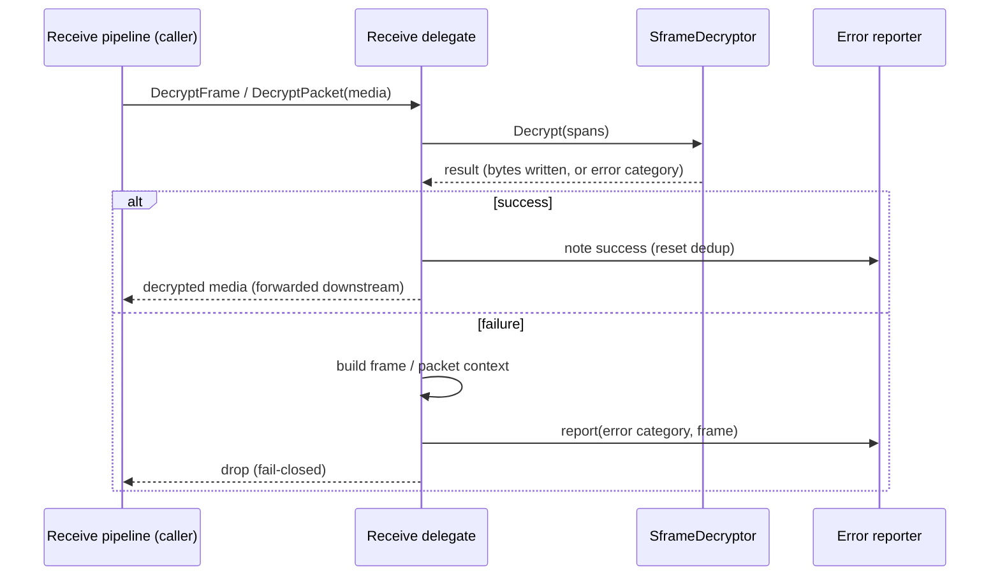
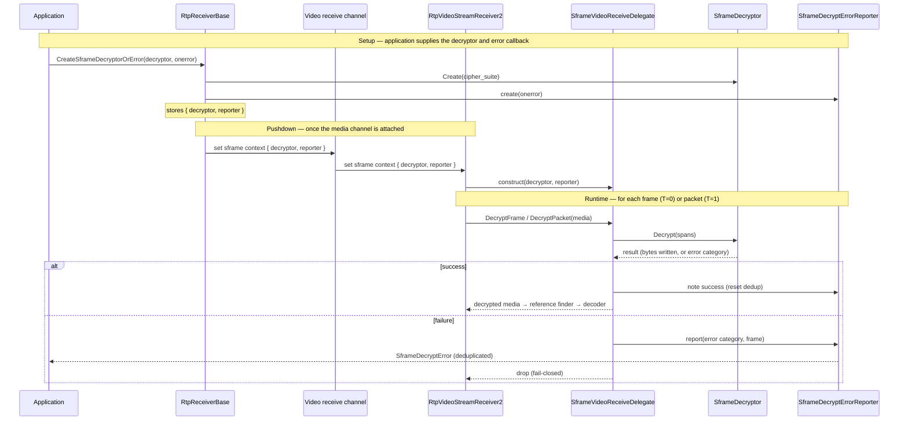

# SFrame Receive Decryption — Decryptor, Error Reporter, and Delegates

The receive side of SFrame is built from three objects. This document describes
their design, their APIs, and how they interact:

- **`SframeDecryptor`** — the pure crypto core.
- **`SframeDecryptErrorReporter`** — wraps the application error callback and
  owns failure reporting.
- **`Sframe{Video,Audio}ReceiveDelegate`** — the per-receive-path glue that drives
  decryption and builds the error event.

The application error event is `SframeDecryptError`, aligned with the W3C Encoded
Transform `SFrameTransformErrorEvent`.

> **`SframeDecryptErrorCallback`** is the native analogue of the spec's `onerror`
> handler. The application registers it when it creates a decryptor, and the
> receive side invokes it with a `SframeDecryptError` whenever a frame or packet
> fails to decrypt.

## Design Overview

Three responsibilities — *do the crypto*, *report failures*, *adapt to the
receive path and wire mode* — are split across three objects so each stays simple
and independently testable.

| Object | Role |
|---|---|
| `SframeDecryptor` | Pure crypto: decrypt byte spans and return a result. |
| `SframeDecryptErrorReporter` | Wraps `SframeDecryptErrorCallback`, dedups (#307), builds `SframeDecryptError`. |
| `SframeVideoReceiveDelegate` | Drives decrypt for video; builds the offending `TransformableFrameInterface`. |
| `SframeAudioReceiveDelegate` | Same role for audio. |

### Where each responsibility lives

The split follows from what each object is positioned to do:

- **The decryptor works on bytes.** Decryption operates on byte spans (encrypted
  input, additional data, plaintext output), so it returns a result and lets the
  delegate — which holds the assembled frame or received packet, with all its
  metadata — build the error event's `frame` (a `TransformableFrameInterface`).
- **The decryptor stays path-agnostic.** The same crypto core serves both the
  video and audio receive paths and both wire modes (per-frame `T=0` and
  per-packet `T=1`); the per-path frame type and call site live in the delegates,
  keeping the crypto core independent of the receive pipeline.
- **The reporter owns deduplication.** Error throttling (issue #307) is policy
  about how often to notify the application, so it lives with the reporter.

### Responsibility split

## The Decryptor

The pure crypto core, created by `SframeDecryptor::Create(cipher_suite)`. Its
interface is small:

| Method | Purpose |
|---|---|
| `Decrypt` | Decrypt one frame/packet. Takes the encrypted input, additional authenticated data, and the plaintext output buffer (all byte spans); returns a result. |
| `AddDecryptionKey` / `RemoveDecryptionKey` | Manage the receive key set. |
| `GetMaxPlaintextByteSize` | Size the plaintext output buffer before decrypting. |

The `Decrypt` result reports the outcome and nothing more — either the number of
plaintext bytes written, or, on failure, an error category. It says *what* went
wrong and leaves *how* to surface it to the reporter.

The error categories are spec-aligned:

| `SframeDecryptErrorType` | Meaning |
|---|---|
| `kAuthentication` | tag/AEAD verification failed |
| `kKeyId` | no key for the header's key id |
| `kSyntax` | header could not be parsed |

The result carries only the category. The error event's `key_id` and `frame` are
filled in elsewhere — the key id once the crypto library returns the parsed id
(TODO), and the frame by the delegate.

## The Error Reporter

A path-agnostic object (depending only on the public api types — the callback
and `TransformableFrameInterface`) that wraps the application
`SframeDecryptErrorCallback`, owns the deduplication state, and builds the
`SframeDecryptError` event. It is the single sink through which the delegates
report. Constructed with the application callback, it exposes two operations:

| Operation | Purpose |
|---|---|
| Report a failure | Given an error category and the offending frame/packet context (built by the caller), assembles the `SframeDecryptError` (`error_type`, `frame`, and later `key_id`), applies deduplication, and invokes the callback. |
| Note a success | Clears the dedup state so a later failure of the same type is reported again. |

**Deduplication (#307).** The reporter remembers the last reported error category
and suppresses consecutive duplicates, so a sustained failure (e.g. a missing key
for a whole call) raises one event rather than one per frame. The exact policy
(per-type vs. global, time-based reset) lives entirely in the reporter and can
evolve without touching the crypto core or the delegates.

## The Delegates

One delegate per receive path (video, audio), constructed with the decryptor and
the reporter. It drives decryption and, on failure, builds the
`TransformableFrameInterface` and hands it to the reporter; the decryptor and
reporter hold all crypto and reporting state, so the delegate is just the per-path
glue between them. Its entry points mirror the wire modes — two for video, one for
audio — and each returns the decrypted media on success, or signals "drop" once it
has reported the failure.

### `SframeVideoReceiveDelegate`

| Method | Wire mode | Purpose |
|---|---|---|
| `DecryptFrame(RtpFrameObject)` | `T=0` (per-frame) | Invoked after frame assembly, for SFrame-encrypted frames. Returns the decrypted frame, or `nullptr` once the failure is reported. |
| `DecryptPacket(RtpPacketReceived)` | `T=1` (per-packet) | Invoked per packet, before the codec depacketizer; decrypts in place. Returns `false` once the failure is reported. |

### `SframeAudioReceiveDelegate`

TBD

## Interaction

For every frame/packet the receive pipeline hands in, the delegate runs the same
exchange against the decryptor and the reporter, then returns the decrypted media
or a drop signal to the caller:

**One reporter, both paths.** Both video wire modes — and, later, audio — funnel
into the *same* reporter instance, so deduplication is coherent: a sustained
failure (e.g. a missing key for the whole call) raises a single
`SframeDecryptError` rather than one event per frame/packet, and the first
successful decrypt resets the latch so a genuinely new failure is reported again.

**Creation and ownership.** The decryptor and reporter are created together when
the application supplies its decryptor and callback: the receiver layer builds the
pure decryptor and wraps the callback in a reporter, then hands both to the
delegate when the receive stream is built. The decryptor and reporter are created
once and shared, so the reporter's dedup state is stable even when the stream is
rebuilt.

**Downside.** The reporter is a second object to thread through the stack.
Because both are needed deep in the receive pipeline, both must be created and
stored at the `RtpReceiverBase` level — where the application supplies the
decryptor and callback — and then pushed down through the media-channel and
receive-stream layers once the media channel becomes available. To keep this
manageable they travel together: the decryptor and reporter are bundled and
pushed down with a single call (one setter taking both) rather than two separate
setters, so the pair can never get out of sync.

## End-to-end wiring

The full lifecycle — application setup, the single-call pushdown once the media
channel is attached, and the per-frame/packet runtime exchange — for the video
receive path:

The runtime step is invoked at the point that matches the negotiated wire mode:

- **`T=1` (per-packet):** the delegate decrypts each `RtpPacketReceived` **before**
  the depacketizer, so the packet buffer and assembler only ever see plaintext.
- **`T=0` (per-frame):** packets are assembled first, and the delegate decrypts the
  assembled `RtpFrameObject` **after** assembly, before it is handed downstream.
