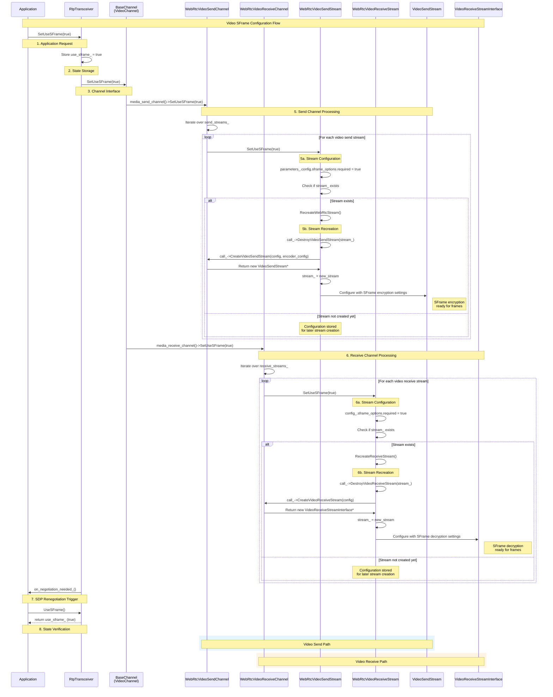

# RtpTransceiver

Add to RtpTransceiver ability to request enabling/disabling SFrame support.

## SFrame Configuration Flow

The following diagram illustrates how `RtpTransceiver` propagates SFrame configuration through the WebRTC video pipeline from transceiver to individual video streams:



### Detailed Flow Description:

1. **Application Request**: Application calls `SetUseSFrame(true)` on the video RtpTransceiver
2. **State Storage**: RtpTransceiver stores the setting in `use_sframe_` member variable
3. **Channel Interface**: RtpTransceiver calls `SetUseSFrame()` on the BaseChannel (VideoChannel)
4. **Video Channel Distribution**: BaseChannel distributes the setting to both WebRtcVideoSendChannel and WebRtcVideoReceiveChannel
5. **Send Channel Processing**:
   - WebRtcVideoSendChannel iterates over all `send_streams_` (map of SSRC → WebRtcVideoSendStream*)
   - Each WebRtcVideoSendStream updates `parameters_.config.sframe_options.required = true`
   - If VideoSendStream already exists, triggers `RecreateWebRtcStream()` which destroys and recreates the underlying stream with SFrame settings
   - New VideoSendStream is configured for SFrame encryption
6. **Receive Channel Processing**:
   - WebRtcVideoReceiveChannel iterates over all `receive_streams_` (map of SSRC → WebRtcVideoReceiveStream*)
   - Each WebRtcVideoReceiveStream updates `config_.sframe_options.required = true`
   - If VideoReceiveStreamInterface already exists, triggers `RecreateReceiveStream()` which destroys and recreates the underlying stream
   - New VideoReceiveStreamInterface is configured for SFrame decryption
7. **SDP Renegotiation**: RtpTransceiver triggers `on_negotiation_needed_()` callback for SDP update
8. **State Verification**: Application can verify current state via `UseSFrame()` method

### Key Implementation Details:

- **Stream Recreation Required**: Both send and receive streams require complete recreation when SFrame settings change
- **SSRC-based Management**: Each video stream is identified by SSRC and managed individually
- **Configuration Storage**: SFrame settings are stored in stream configuration even before underlying WebRTC streams are created
- **Logging Integration**: Each recreation logs the SSRC and reason for debugging purposes
- **Bidirectional Support**: Single transceiver configures both send and receive paths simultaneously
- **SSRC Mapping**: Each stream (identified by SSRC) gets individual SFrame configuration
- **Cross-Media Support**: Same flow applies to both audio and video with media-specific implementations

## RtpTransceiverInterface Extension

The `RtpTransceiverInterface` has been extended with two new methods to control SFrame encryption/decryption:

```cpp
// Enable or disable SFrame encryption/decryption for this transceiver
virtual void SetUseSFrame(bool use_sframe) = 0;

// Check if SFrame is currently enabled for this transceiver
virtual bool UseSFrame() const = 0;
```

These methods provide a high-level API for applications to control whether SFrame should be used for a particular transceiver.

## RtpTransceiver Implementation

The `RtpTransceiver` class implements the interface methods and manages the SFrame state:

### Member Variables

Store information about SFrame usage locally.

```cpp
class RtpTransceiver : public RtpTransceiverInterface {
public:
  void SetUseSFrame(bool use_sframe) override;
  bool UseSFrame() const override { return use_sframe_; }

private:
  /* Existing fields */

  // Whether this transceiver should use SFrame encryption/decryption.
  bool use_sframe_ RTC_GUARDED_BY(thread_) = false;
}
```

### Method Implementations

On the change of `SFrame` state, inform underlying media channel about it, and trigger `on negotiation needed` event.

```cpp
namespace webrtc {

void RtpTransceiver::SetUseSFrame(bool use_sframe) {
  if (use_sframe_ != use_sframe) {
    use_sframe_ = use_sframe;
    
    // Propagate the SFrame setting to the underlying channel if it exists
    if (channel()) {
      channel()->SetUseSFrame(use_sframe);
    }
    
    // Trigger negotiation needed event when SFrame setting changes
    if (on_negotiation_needed_) {
      on_negotiation_needed_();
    }
  }
}

}
```

## ChannelInterface Extension

The `ChannelInterface` has been extended with SFrame control capabilities. This interface is the base class for both audio and video channels:

```cpp
// pc/channel_interface.h
class ChannelInterface {
 public:
  /* Existing pure virtual methods */
  
  // SFrame control - newly added
  virtual void SetUseSFrame(const bool use_sframe) = 0;
};
```

**Context**: This interface serves as the abstraction layer between RtpTransceiver and the underlying media channels (VoiceChannel/VideoChannel). The `SetUseSFrame` method allows the transceiver to communicate SFrame requirements down to the media implementation.

### BaseChannel Implementation

The `BaseChannel` class, which serves as the base implementation for both `VoiceChannel` and `VideoChannel`, implements the `SetUseSFrame` method by propagating the setting to its underlying media channels:

```cpp
// pc/channel.h
class BaseChannel : public ChannelInterface {
 public:
  void SetUseSFrame(bool use_sframe) override {
    RTC_DCHECK_RUN_ON(&thread_checker_);
    
    // Propagate SFrame setting to the underlying media send channel
    if (media_send_channel()) {
      media_send_channel()->SetUseSFrame(use_sframe);
    }
    
    // Propagate SFrame setting to the underlying media receive channel
    if (media_receive_channel()) {
      media_receive_channel()->SetUseSFrame(use_sframe);
    }
  }
};
```

## SFrameOptions Configuration

The SFrame functionality is configured using the `SFrameOptions` structure, which is embedded in stream configurations:

```cpp
struct SFrameOptions {
  // Whether SFrame encryption/decryption should be used for this stream
  bool use_sframe = false;

  // Placeholder for the future fields (e.g. mode???)
};
```

**Usage Context**: This structure is embedded in both `VideoSendStream::Config` and `VideoReceiveStreamInterface::Config` to control SFrame behavior at the stream level. The `use_sframe` field determines whether the stream should apply SFrame encryption (for send streams) or decryption (for receive streams).

### Impact on Underlying Implementations

This extension affects the underlying channel implementations:

1. **VoiceChannel**: Must implement `SetUseSFrame()` to enable/disable SFrame for audio streams
2. **VideoChannel**: Must implement `SetUseSFrame()` to enable/disable SFrame for video streams

The `SetUseSFrame()` method propagates the SFrame setting from the transceiver level down to the media channel level, ensuring that:
- Media channels are configured for SFrame processing when enabled
- Proper initialization of SFrame-related components occurs
- SFrame transformers can be applied to the appropriate RTP streams

### Integration Flow

1. Application calls `RtpTransceiver::SetUseSFrame(true)`
2. Transceiver stores the setting in `use_sframe_` member
3. When channel is created or updated, transceiver calls `ChannelInterface::SetUseSFrame()`
4. Channel implementation configures underlying media channels for SFrame support
5. SFrame transformers can be attached to RTP senders/receivers as needed

## Proxy Support

The RtpTransceiver proxy includes the new SFrame methods:

```cpp
PROXY_METHOD1(void, SetUseSFrame, bool)
PROXY_CONSTMETHOD0(bool, UseSFrame)
```

This ensures that SFrame control methods work correctly across thread boundaries in WebRTC's multi-threaded architecture.

## Video Channel Implementation Details

The SFrame functionality has specific implementations in the video send and receive channels:

### WebRtcVideoSendChannel

The `WebRtcVideoSendChannel` implements the `ChannelInterface::SetUseSFrame()` method and manages multiple video send streams. When `SetUseSFrame()` is called, it propagates the setting to all active send streams:

```cpp
// media/engine/webrtc_video_engine.cc
class WebRtcVideoSendChannel : public VideoMediaSendChannelInterface {
 private:
  // Map of SSRC to WebRtcVideoSendStream instances
  std::map<uint32_t, std::unique_ptr<WebRtcVideoSendStream>> send_streams_;
  
 public:
  // Implementation of ChannelInterface::SetUseSFrame
  void SetUseSFrame(bool use_sframe) override {
    RTC_DCHECK_RUN_ON(&thread_checker_);
    
    // Propagate the SFrame setting to all active send streams
    // This ensures that all video streams for this channel use consistent SFrame settings
    for (const auto& stream_pair : send_streams_) {
      stream_pair.second->SetUseSFrame(use_sframe);
    }
  }
  
  // Other channel methods...
  bool SetSend(bool send) override;
  bool AddSendStream(const StreamParams& sp) override;
};
```

**Context**: The video send channel maintains a collection of individual video send streams (one per SSRC). When SFrame is enabled/disabled at the channel level, it must be applied to all streams to ensure consistent encryption behavior across all video tracks.

### WebRtcVideoSendChannel::WebRtcVideoSendStream

Each `WebRtcVideoSendStream` represents an individual video stream (identified by SSRC) and handles SFrame configuration at the stream level:

```cpp
// media/engine/webrtc_video_engine.cc
class WebRtcVideoSendChannel::WebRtcVideoSendStream {
 private:
  // Stream configuration containing SFrame options
  struct VideoSendStreamParameters {
    VideoSendStream::Config config;  // Contains sframe_options
    VideoOptions options;
    // ... other parameters
  } parameters_;
  
  VideoSendStream* stream_;  // The underlying WebRTC video send stream
  
 public:
  void SetUseSFrame(bool use_sframe) {
    RTC_DCHECK_RUN_ON(&thread_checker_);
    
    // Store the SFrame requirement in stream configuration
    // This affects how the stream will be configured for encryption
    parameters_.config.sframe_options.use_sframe = use_sframe;

    // Stream recreation is necessary because SFrame configuration
    // affects the underlying pipeline setup (encoders, transformers, etc.)
    if (stream_) {
      RecreateWebRtcStream();
    }
  }
};
```

### WebRtcVideoReceiveChannel

The receive channel implementation follows a similar pattern to the send channel, but focuses on decryption settings for incoming streams.

### WebRtcVideoReceiveChannel::WebRtcVideoReceiveStream

Each `WebRtcVideoReceiveStream` handles SFrame decryption configuration for incoming video streams:

```cpp
// media/engine/webrtc_video_engine.cc
class WebRtcVideoReceiveChannel::WebRtcVideoReceiveStream {
 private:
  VideoReceiveStreamInterface::Config config_;  // Contains SFrame decryption settings
  VideoReceiveStreamInterface* stream_;         // The underlying WebRTC receive stream
  const StreamParams stream_params_;            // Stream parameters including SSRC
  
 public:
  void SetUseSFrame(bool use_sframe) {
    RTC_DCHECK_RUN_ON(&thread_checker_);
    
    // Configure SFrame decryption settings for the receive stream
    // This determines whether incoming frames should be decrypted
    config_.sframe_options.use_sframe = use_sframe;
    
    // Trigger stream recreation to apply new decryption settings
    // Similar to send streams, receive streams need recreation for SFrame changes
    if (stream_) {
      RecreateReceiveStream();
    }
  }
};
```
