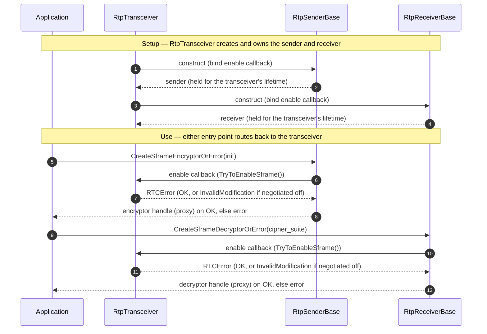
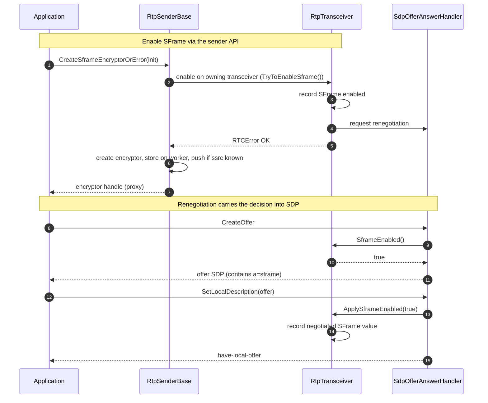
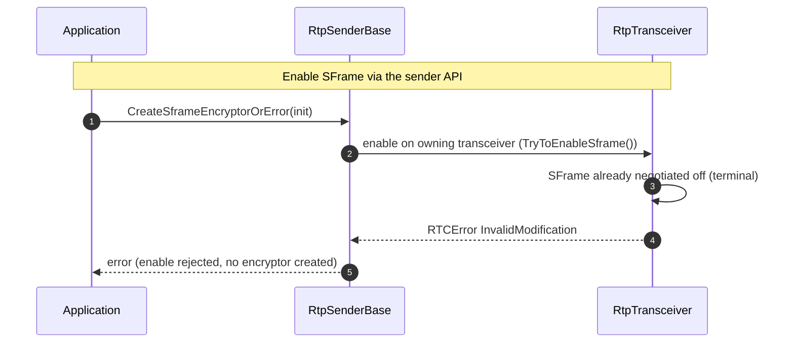

# Enabling SFrame on a Transceiver

This document describes how an application turns SFrame on for a media section
and how that intent is recorded on the transceiver. It covers the public entry
points, the transceiver-level SFrame state, the enable callback that connects
senders and receivers to their owning transceiver, and the renegotiation that
carries the decision into SDP.

The downstream half — how a negotiated requirement reaches each media stream —
is handled by the channel-level fan-out into per-stream enforcement.
The offer/answer rules are covered in [negotiation.md](negotiation.md).

## Overview

An application never flips a global SFrame switch. Instead it asks a specific
sender or receiver to create an SFrame encryptor or decryptor. That request does
two things, in order:

1. It enables SFrame on the **owning transceiver**, which records the intent and
   asks for renegotiation.
2. If (and only if) that succeeds, it creates the media crypto object for the
   stream and returns a handle to the application.

This ordering is deliberate: SFrame is a property of the negotiated media
section, so the transceiver-level decision is made first and the per-stream
crypto object is attached second.

## The Enable Entry Points

SFrame is enabled through two public APIs:

| API | Caller | Effect |
|---|---|---|
| `RtpSenderInterface::CreateSframeEncryptorOrError(init)` | Application | Enables SFrame on the transceiver, then creates a send-side encryptor |
| `RtpReceiverInterface::CreateSframeDecryptorOrError(cipher_suite)` | Application | Enables SFrame on the transceiver, then creates a receive-side decryptor |

Both run on the signaling thread. The sender chooses the SFrame mode and cipher
suite; the receiver chooses only the cipher suite (the receive path derives
per-frame vs per-packet processing from the SFrame RTP descriptor).

Each call first invokes the enable callback on its owning transceiver. If the
callback returns an error, no crypto object is created and the error is
propagated back to the application unchanged.

## Transceiver SFrame State

The transceiver owns the SFrame decision for its media section as an optional
boolean with three states:

| State | Meaning |
|---|---|
| `std::nullopt` | No local or negotiated decision has been made yet |
| `true` | SFrame has been requested locally or negotiated on for this section |
| `false` | A completed negotiation resolved without SFrame; the section is locked to plaintext |

The transition to `false` is terminal: once a negotiation completes without
SFrame, the section can no longer be upgraded. This is what makes a later enable
attempt fail rather than silently producing an unprotected upgrade.

## The Enable Callback

A sender or receiver cannot mutate transceiver state directly. When the
transceiver creates a sender or receiver, it gives it a callback bound to
`RtpTransceiver::TryToEnableSframe()`. Calling either public creation API invokes
that callback first. Both the send and receive entry points route back to the
same owning transceiver through this callback:

Step by step:

1. The transceiver constructs the sender, binding the enable callback into it.
2. The sender is returned to and held by the transceiver for its lifetime.
3. The transceiver constructs the receiver, binding the same enable callback.
4. The receiver is returned to and held by the transceiver for its lifetime.
5. The application calls the create-encryptor API on the sender.
6. The sender invokes its enable callback, which runs `TryToEnableSframe()` on
   the owning transceiver.
7. The transceiver returns an `RTCError` — OK, or `InvalidModification` if the
   section was already negotiated off.
8. On OK the sender returns an encryptor handle (a worker-thread proxy);
   otherwise it returns the error.
9. The application calls the create-decryptor API on the receiver.
10. The receiver invokes its enable callback, again running `TryToEnableSframe()`.
11. The transceiver returns the same kind of `RTCError`.
12. On OK the receiver returns a decryptor handle; otherwise the error.

`TryToEnableSframe()` (signaling thread) does the following:

1. If SFrame has already been negotiated off for this section, return an
   `InvalidModification` error — it cannot be re-enabled.
2. Otherwise record that SFrame is enabled for the section.
3. Request renegotiation via the negotiation-needed callback.
4. Return success.

Only after this returns success does the sender or receiver build the actual
crypto object, store it on the worker thread, push it to the media channel when
the stream's SSRC is known, and return a worker-thread proxy handle to the
application.

## Renegotiation

Recording the enabled state does not by itself change any SDP. It marks the
transceiver dirty and asks the peer connection to renegotiate. On the next
offer, the media section advertises SFrame because the offer builder reads
`RtpTransceiver::SframeEnabled()` when assembling the media-section options.

This means the enable API has an immediate local effect (state recorded, crypto
object created) and a deferred wire effect (the SFrame attribute appears after
renegotiation).

## Applying the Negotiated Result

When a local description is applied, the signaling layer calls
`RtpTransceiver::ApplySframeEnabled(value)` with the value for that section. The
value comes from the **local** description: an offer carries local intent, an
answer carries the negotiated result. This is what keeps an answerer that
declines SFrame on the plaintext path — it never latches the requirement.

`ApplySframeEnabled(value)`:

1. Records the section's SFrame decision as `value`.
2. If the value is `true` **and** the media channel already exists, issues a
   one-shot `channel_->EnableSframe()` on the worker thread.

That one-shot channel notification is the boundary between signaling state and
the media engine. From there, the requirement fans out to every stream the
channel owns.

When the channel does not exist yet (for example, a recvonly transceiver created
on demand while applying a remote offer), only the state is recorded; the channel
latch is set later, when the local answer is applied and the channel exists.

## Sequence — Success

SFrame has not been negotiated off for the section, so the enable request is
accepted: the transceiver records the decision, a crypto object is created, and
renegotiation carries the decision into SDP.

Step by step:

1. The application calls the create-encryptor API on the sender.
2. The sender invokes the enable callback, running `TryToEnableSframe()` on the
   transceiver.
3. The transceiver records that SFrame is enabled for the section.
4. The transceiver requests renegotiation.
5. The transceiver returns `RTCError OK` to the sender.
6. The sender creates the encryptor, stores it on the worker thread, and pushes
   it to the media channel if the SSRC is already known.
7. The sender returns the encryptor handle (proxy) to the application.
8. Later, the application calls `CreateOffer`.
9. The offer builder reads the transceiver's SFrame intent.
10. The transceiver reports SFrame as enabled.
11. The offer SDP is returned with the SFrame attribute.
12. The application applies it with `SetLocalDescription(offer)`.
13. The signaling layer calls `ApplySframeEnabled(true)` for the section.
14. The transceiver records the negotiated value.
15. The local offer is applied; from here the channel latch and per-stream
    fan-out take over.

## Sequence — Failure

SFrame was already negotiated off for the section in a previous completed
negotiation. The decision is terminal, so the enable request is rejected and no
crypto object is created.

Step by step:

1. The application calls the create-encryptor API on the sender.
2. The sender invokes the enable callback, running `TryToEnableSframe()` on the
   transceiver.
3. The transceiver finds SFrame was already negotiated off — a terminal state.
4. The transceiver returns `RTCError InvalidModification`.
5. The sender propagates the error to the application and creates no encryptor.
