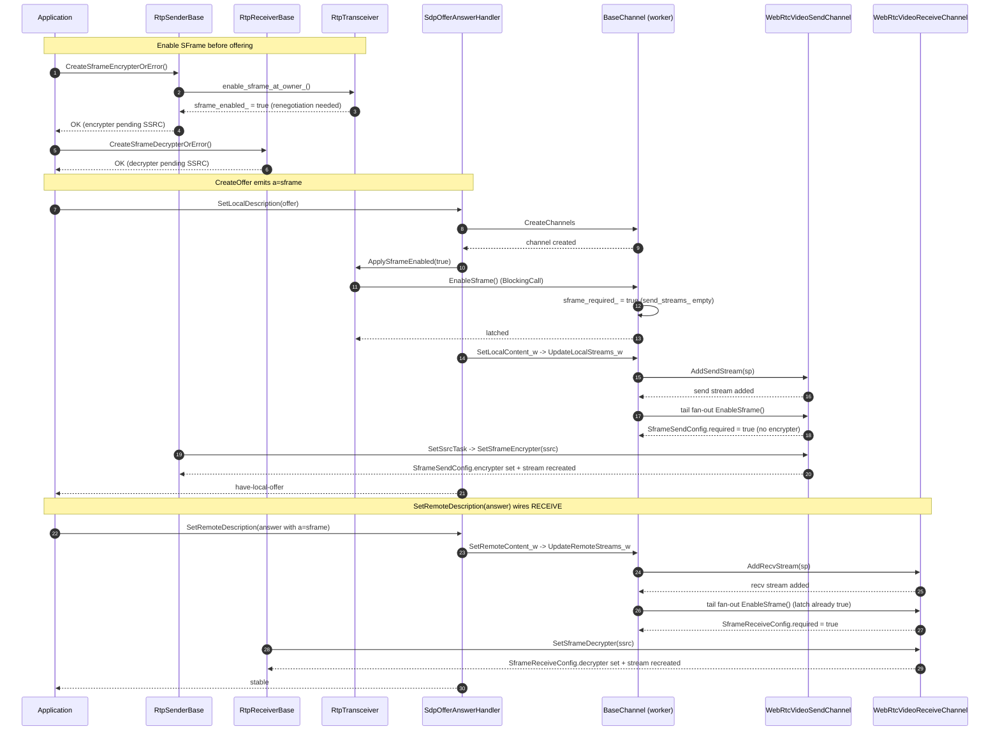
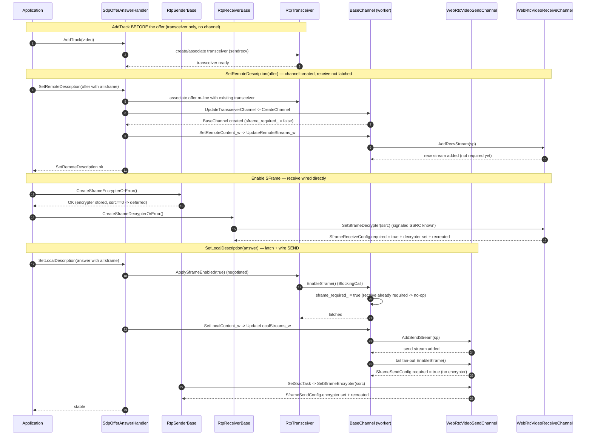
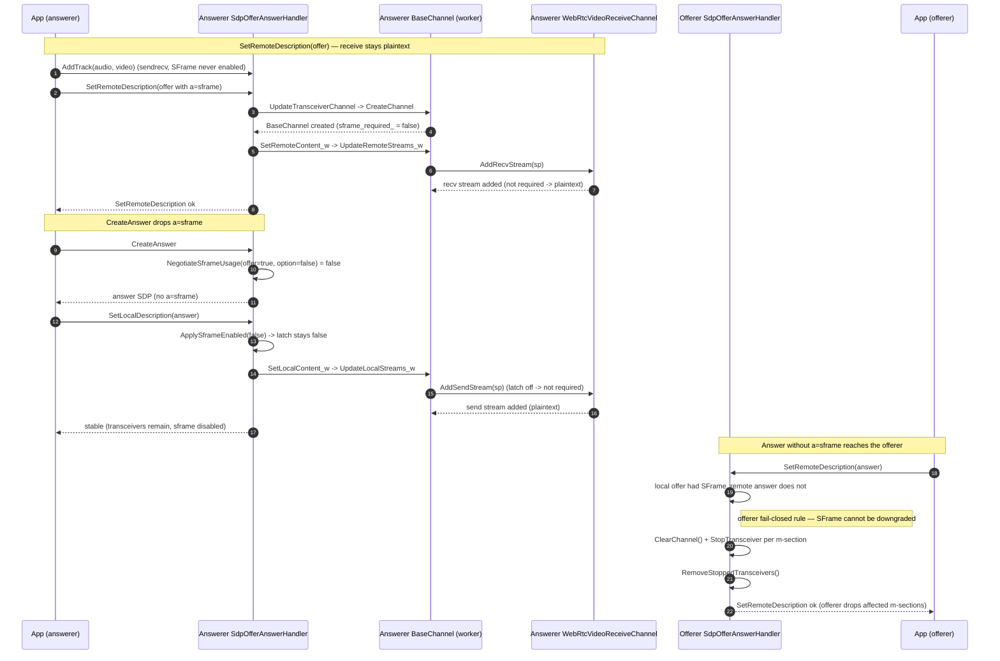

# SFrame Requirement Propagation

This document describes how the SFrame requirement moves from application intent
to media-stream enforcement, and specifies the propagation behavior for every
offer/answer scenario.

The design goal is to keep a single SFrame-required decision at the media
channel level. SFrame is negotiated for an SDP media section, and a media
section maps to one transceiver and one media channel. Once SFrame is required
for that channel, the media-channel implementation propagates the requirement
to every stream it owns.

## Design Goal

SFrame has two pieces of state that arrive at different times:

| State | Source | Scope |
|---|---|---|
| SFrame is required | SDP negotiation for the media section | Whole media channel |
| Media crypto is available | Application-created encrypter or decrypter | One sender or receiver stream |

The architecture separates these two decisions. The channel first records that
SFrame is mandatory for the media section. Individual streams then receive a
per-stream configuration that enforces the requirement and later receives the
actual encrypter or decrypter.

This makes the system **fail closed**. During the gap between "SFrame is
required" and "the media crypto object is attached", the stream drops media
rather than sending or delivering media without the expected SFrame protection.

## Ownership Model

| Layer | Responsibility |
|---|---|
| Application | Opts in to SFrame and receives key-management handles. |
| Transceiver | Records local SFrame intent and drives `a=sframe` negotiation. |
| Media channel | Holds the channel-level "SFrame required" policy after negotiation. |
| Media channel implementation | Propagates the channel policy to active and future streams. |
| Stream config | Tracks the SFrame requirement and optional media crypto for one stream. |
| RTP pipeline | Encrypts, decrypts, or drops based on the stream config. |

The important boundary is between the transceiver and the media channel. The
transceiver participates in signaling. The media channel owns the runtime media
policy for the negotiated media section. Crucially, the value the channel
latches comes from the **local** description (offer = local intent, answer = the
negotiated result), so the latch reflects the *agreed* media-section mode — not
the remote peer's wish. This is what keeps an answerer who declines SFrame on
the plaintext path.

## Where "SFrame Required" Lives

The single logical decision is represented differently at each layer:

| Layer | "SFrame required" representation |
|---|---|
| `RtpTransceiver` | `sframe_enabled_` (`std::optional<bool>`) |
| `MediaContentDescription` (m= section) | `sframe_enabled()` (`bool`) |
| `BaseChannel` | `sframe_required_` (`bool` latch, set by `EnableSframe()`) |
| `WebRtcVideoSendStream` / `WebRtcVideoReceiveStream` | `SframeSendConfig::required` / `SframeReceiveConfig::required` |

## Proposed Solution

The chosen design is a **channel latch with per-stream fan-out into a plain
configuration object.**

### Channel latch

When the negotiated value for a media section becomes known,
`RtpTransceiver::ApplySframeEnabled(true)` latches it onto the section's
`BaseChannel` via `BaseChannel::EnableSframe()`. The channel records
`sframe_required_ = true` and fans the requirement out to the underlying
send/receive media channels, which mark each owned stream's configuration as
required. The latch is the channel's single source of truth for the media
section.

### Per-stream configuration

Each stream carries a small, explicit configuration object instead of a
behavior-bearing adapter. Two structs model the two directions:

```cpp
struct SframeSendConfig {
  bool required = false;
  scoped_refptr<SframeMediaEncrypterInterface> encrypter;
};

struct SframeReceiveConfig {
  bool required = false;
  scoped_refptr<SframeMediaDecrypterInterface> decrypter;
};
```

The configuration is consumed **by value** down the media/send pipeline; the
`scoped_refptr` keeps the encrypter/decrypter alive for as long as the sender or
receiver holds its copy. The object has exactly three meaningful forms:

| Config form | Meaning | Send behavior | Receive behavior |
|---|---|---|---|
| `required == false` | SFrame is not required for the stream. | Normal RTP send path. | Normal RTP receive path. |
| `required == true`, crypto `== nullptr` | SFrame is mandatory but no crypto is attached yet. | Drop outgoing frames. | Drop incoming SFrame ciphertext. |
| `required == true`, crypto `!= nullptr` | SFrame is mandatory and the RTP path can process media. | Encrypt per the sender's SFrame mode. | Decrypt per the packet descriptor T bit. |

This keeps SFrame policy out of the RTP stack: the RTP path only reads
`required` and dereferences the crypto when present. Because `required` is
explicit (rather than inferred from "an object exists"), the two active states
are unambiguous, which is what enables the fail-closed behavior in the middle
row.

### Two fan-out points

The fan-out happens at two complementary points, which together cover every
ordering of "stream added" versus "SFrame latched":

- **`BaseChannel::EnableSframe()`** (triggered by `ApplySframeEnabled`) — sets
  the `sframe_required_` latch and marks any streams that *already* exist.
- **the tail of `UpdateLocalStreams_w` / `UpdateRemoteStreams_w`** — re-runs the
  fan-out after `AddSendStream` / `AddRecvStream`, so streams added *after* the
  latch flipped also become required.

Stream-level `EnableSframe()` is idempotent: it early-returns when the stream is
already `required`, so a re-fan-out never clears a crypto object that has already
been attached.

### Rejected alternative: `StreamParams` stamping

An earlier approach stamped `StreamParams::sframe_required` during stream
creation (in `pc/media_session.cc` and `api/webrtc_sdp.cc`) and installed the
per-stream object from those flags in `AddSendStream` / `AddRecvStream`. It was
rejected because the receive-side flag was derived from the **remote** SDP: an
answerer who declined SFrame still received a fail-closed receive stream stamped
from the offerer's intent (see flow 4). The channel-latch design uses the
**local/negotiated** value instead, so a declining peer stays on the plaintext
path. The stamping code is retained, commented out, for reference.

## Top-to-Bottom Class Responsibilities

This maps the design to the classes that carry it from signaling down to RTP
media processing.

| Layer | Classes | Responsibility |
|---|---|---|
| Public API | `RtpSenderInterface`, `RtpReceiverInterface` | Expose the application opt-in points and return key-management handles. |
| Sender/receiver implementation | `RtpSenderBase`, `RtpReceiverBase` | Notify the owning transceiver that SFrame is desired, create the media encrypter/decrypter, and attach it to the channel once the SSRC is known. |
| Transceiver | `RtpTransceiver` | Own the local SFrame intent for the media section and translate the negotiated value into a channel-level requirement via `ApplySframeEnabled`. |
| Offer/answer | `SdpOfferAnswerHandler`, media-session and SDP serialization | Carry the transceiver decision into `a=sframe`, negotiate it in answers, and apply the negotiated result back to the transceiver. |
| Channel boundary | `ChannelInterface`, `MediaChannelInterface` | Provide the boundary where SFrame stops being signaling state and becomes media policy (`EnableSframe`). |
| Video media channels | `WebRtcVideoSendChannel`, `WebRtcVideoReceiveChannel` | Latch SFrame as required for the channel and fan that requirement out to all owned streams. |
| Video stream wrappers | `WebRtcVideoSendStream`, `WebRtcVideoReceiveStream` | Hold the per-stream config and recreate the underlying RTP stream when the config changes. |
| Per-stream config | `SframeSendConfig`, `SframeReceiveConfig` | Represent the three stream forms: not required, required without crypto, required with crypto. |
| RTP send path | `RTPSenderVideo` | Drop frames while SFrame is required but no encrypter is attached; encrypt frames or packets once the encrypter is available. |
| RTP receive path | `RtpVideoStreamReceiver2` | Route SFrame packets through descriptor parsing, buffering, and decryption; drop while the decrypter is missing. |
| RTP SFrame helpers | SFrame packetizer, depacketizer, and packet buffer | Encode/decode the SFrame RTP descriptor and preserve the T=0/T=1 processing split. |

The config object is intentionally narrower than a "controller". It does not own
negotiation or channel policy. It is the stream-local representation of a policy
already decided at the media channel level.

## Propagation Lifecycle

| Step | What happens |
|---|---|
| 1. Application opts in | The application asks a sender or receiver for an SFrame key-management handle (`CreateSframeEncrypterOrError` / `CreateSframeDecrypterOrError`). |
| 2. Transceiver records intent | `RtpTransceiver::TryToEnableSframe` marks SFrame as desired for the media section and requests renegotiation. |
| 3. SDP confirms SFrame | Offer/answer completes with `a=sframe` for the media section. |
| 4. Channel latches requirement | `ApplySframeEnabled(true)` runs `BaseChannel::EnableSframe()`, setting `sframe_required_`. |
| 5. Streams become required | The fan-out marks `SframeSendConfig`/`SframeReceiveConfig` `required` for each owned send/receive stream. |
| 6. Media crypto is attached | When the encrypter/decrypter is available for an SSRC, `SetSframeEncrypter`/`SetSframeDecrypter` fills in the config's crypto field and recreates the stream. |
| 7. RTP path enforces policy | The RTP path encrypts/decrypts when crypto is present, and drops media while only the requirement is present. |

The same channel-level requirement applies to streams created after
negotiation: a newly created stream is marked required immediately if its owning
channel already requires SFrame (fan-out point two).

## Flows

The four scenarios below cover the offerer, the passive answerer, and the two
`AddTrack` answerer cases (accepting and declining SFrame). They are
reconstructed from the `webex:sframe_loopback` apps and focus on the video path
(`mid=1`); audio takes the same route. For the fully annotated trace-level
version of these diagrams see
[`../../sframe-video-flow.md`](../../sframe-video-flow.md).

### Flow 1 — Offerer

The offerer enables SFrame before offering. At `SetLocalDescription(offer)` the
channel latch is set and the **send** stream becomes required; the **receive**
stream becomes required when the answer is applied (the latch is already on, so
`UpdateRemoteStreams_w` marks the new receive stream).



### Flow 2 — Passive answerer (recvonly)

The answerer adds no local track and does not create an encrypter/decrypter.
WebRTC creates a recvonly transceiver on demand while applying the offer and
calls `ApplySframeEnabled(true)` there — **before that transceiver's
`BaseChannel` exists**, so only `sframe_enabled_` is recorded. The latch is set
later, at `SetLocalDescription(answer)`, where `EnableSframe()` marks the
**already-existing** receive stream required. This is the one flow where
`BaseChannel::EnableSframe()`'s fan-out over existing streams is load-bearing.

```mermaid
sequenceDiagram
    autonumber
    participant App as Application
    participant SOA as SdpOfferAnswerHandler
    participant Tx as RtpTransceiver
    participant Ch as BaseChannel (worker)
    participant VRC as WebRtcVideoReceiveChannel

    Note over App,Tx: SetRemoteDescription(offer) — no pre-created transceiver
    App->>SOA: SetRemoteDescription(offer with a=sframe)
    SOA->>Tx: AssociateTransceiver -> create recvonly transceiver
    Tx-->>SOA: transceiver (channel_ == nullptr)
    SOA->>Tx: ApplySframeEnabled(true)
    Tx-->>SOA: records sframe_enabled_ only (no channel -> latch NOT set)
    SOA->>Ch: UpdateTransceiverChannel -> create BaseChannel
    Ch-->>SOA: channel ready (sframe_required_ = false)
    SOA->>Ch: SetRemoteContent_w -> UpdateRemoteStreams_w
    Ch->>VRC: AddRecvStream(sp)
    VRC-->>Ch: recv stream added (not required yet)
    SOA-->>App: SetRemoteDescription ok

    Note over App,VRC: CreateAnswer keeps a=sframe (recvonly, no send streams)
    App->>SOA: SetLocalDescription(answer)
    SOA->>Tx: ApplySframeEnabled(true) (negotiated; channel exists now)
    Tx->>Ch: EnableSframe() (BlockingCall)
    Ch->>Ch: sframe_required_ = true, fan-out over EXISTING receive_streams_
    Ch->>VRC: EnableSframe()
    VRC-->>Ch: SframeReceiveConfig.required = true + stream recreated
    Ch-->>Tx: latched
    Note right of VRC: fail-closed; decrypter attaches only if the app creates one
    SOA-->>App: stable
```

### Flow 3 — `AddTrack` answerer, SFrame enabled

The answerer calls `AddTrack` before applying the offer, so its transceivers
exist sendrecv. It also enables SFrame, so the receive stream is wired
**directly** via `SetSframeDecrypter` (the receive SSRC is already known from the
offer), while the send stream becomes required at `SetLocalDescription(answer)`
via the latch flip plus tail fan-out.



Because the stream-level `EnableSframe()` is idempotent, the answer-time
send-side fan-out never clobbers the decrypter installed directly during enable.

### Flow 4 — `AddTrack` answerer, SFrame declined (downgrade rejected)

The answerer adds tracks before the offer but **never** enables SFrame, while the
offerer offered `a=sframe`. This exercises asymmetric negotiation and is the
case the channel-latch design fixes.

- **Answerer:** `NegotiateSframeUsage(offer=true, option=false) == false`, so the
  answer **drops `a=sframe`** and `ApplySframeEnabled(false)` leaves the latch
  off. No receive stream is marked required — the receive side stays plaintext,
  matching the local decision. (The rejected stamping approach would have marked
  the receive stream required from the offerer's intent.)
- **Offerer:** receives an answer without `a=sframe`. The offerer-side
  fail-closed rule in `SdpOfferAnswerHandler` stops each affected transceiver —
  SFrame cannot be silently downgraded to plaintext — and
  `RemoveStoppedTransceivers()` clears them.



## Send-Side Behavior

On the send side, `SframeSendConfig` carries both the requirement and the media
encrypter. If `required` is set but `encrypter` is still null, `RTPSenderVideo`
drops the frame before packet allocation or packetization.

When the encrypter is attached, the send path applies the sender-selected SFrame
mode:

| Mode | Send behavior |
|---|---|
| Per-frame | Encrypt the whole encoded payload first, then packetize the ciphertext as opaque data. |
| Per-packet | Packetize the encoded payload first, then encrypt each packet payload while preserving the SFrame descriptor. |

SFrame takes precedence over the legacy `FrameEncryptorInterface` when the
config is `required`.

## Receive-Side Behavior

On the receive side, `SframeReceiveConfig` carries both the requirement and the
media decrypter. If `required` is set but `decrypter` is still null, incoming
SFrame media is dropped instead of being forwarded to the decoder pipeline.

When the decrypter is attached, the receive path derives the processing mode
from the SFrame RTP descriptor:

| Descriptor | Receive behavior |
|---|---|
| T=1, per-packet | Decrypt each packet payload first, then hand the cleartext packet to the normal codec depacketizer. |
| T=0, per-frame | Preserve opaque ciphertext packets through frame assembly, then decrypt the assembled frame. |

See [video-receive-pipeline.md](video-receive-pipeline.md) for the detailed
receive-side packet flow.

## Ordering Guarantees

- **The latch uses the negotiated value.** `ApplySframeEnabled` is driven by the
  *local* description: the raw local option on the offer, and
  `NegotiateSframeUsage(offer, option)` on the answer. The latch flips on only
  when both sides agreed.
- **Two fan-out points cover every ordering.** `BaseChannel::EnableSframe()`
  marks streams that already exist; the tail of `UpdateLocal/RemoteStreams_w`
  re-fans out after each `AddSendStream`/`AddRecvStream`. Flow 2 relies on the
  first; the send paths in flows 1 and 3 rely on the second.
- **Stream-level `EnableSframe()` is idempotent.** It early-returns when the
  stream is already `required`, so a re-fan-out never clears an attached crypto
  object.
- **Receive crypto is order-independent.** A receive SSRC is already known from
  the remote offer, so the decrypter may be installed before the latch flips.
  `SetSframeDecrypter` sets `required = true` and stores the decrypter
  unconditionally; a later fan-out is then a no-op. Either ordering converges on
  `required == true` with the decrypter attached.
- **Send never races.** The sender's SSRC is `0` until negotiation, so its
  encrypter push is deferred to `RtpSenderBase::SetSsrcTask`, which runs after
  `AddSendStream` and the tail fan-out have marked the stream required.

## Source Map

| Step | Function | File |
|---|---|---|
| Sender creates encrypter, latches transceiver | `RtpSenderBase::CreateSframeEncrypterOrError` | `pc/rtp_sender.cc` |
| Receiver creates decrypter, latches transceiver | `RtpReceiverBase::CreateSframeDecrypterOrError` | `pc/rtp_receiver.cc` |
| Transceiver latch + renegotiation | `RtpTransceiver::TryToEnableSframe` | `pc/rtp_transceiver.cc` |
| Carry SFrame into m= options | `media_description_options.sframe_enabled` | `pc/sdp_offer_answer.cc` |
| Set content mode + negotiate (answer) | `AddStreamParams` / `NegotiateSframeUsage` | `pc/media_session.cc` |
| Parse `a=sframe` into content mode | `ParseContent` | `api/webrtc_sdp.cc` |
| Apply negotiated result, latch channel | `RtpTransceiver::ApplySframeEnabled` -> `channel_->EnableSframe()` | `pc/rtp_transceiver.cc` |
| Channel latch + fan-out | `BaseChannel::EnableSframe`, `UpdateLocal/RemoteStreams_w` | `pc/channel.cc` |
| Send stream config (required + encrypter) | `WebRtcVideoSendStream::EnableSframe` / `SetSframeEncrypter` | `media/engine/webrtc_video_engine.cc` |
| Receive stream config (required + decrypter) | `WebRtcVideoReceiveStream::EnableSframe` / `SetSframeDecrypter` | `media/engine/webrtc_video_engine.cc` |
| Per-stream config structs | `SframeSendConfig`, `SframeReceiveConfig` | `modules/sframe/sframe_send_config.h`, `modules/sframe/sframe_receive_config.h` |
| RTP send enforcement | `RTPSenderVideo::SendVideo` | `modules/rtp_rtcp/source/rtp_sender_video.cc` |
| RTP receive enforcement | `RtpVideoStreamReceiver2` | `video/rtp_video_stream_receiver2.cc` |
