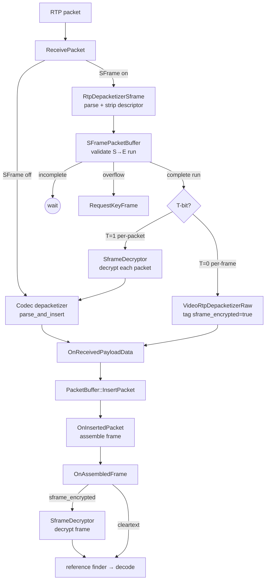

# Video Receive Pipeline - SFrame Integration

## Table of Contents

- [Overview](#overview)
- [Components at a Glance](#components-at-a-glance)
- [SFrame Intercept in `ReceivePacket`](#sframe-intercept-in-receivepacket)
- [T=0 Decryption Signal](#t0-decryption-signal)
- [Component Details](#component-details)
  - [`SFrameDescriptor`](#sframedescriptor)
  - [`SframeRtpPacketReceived`](#sframertppacketreceived)
  - [`RtpDepacketizerSframe`](#rtpdepacketizersframe)
  - [`SFramePacketBuffer`](#sframepacketbuffer)
  - [`SframeDecryptor`](#sframedecryptor)

## Overview

This document describes the SFrame receive pipeline implemented in
`RtpVideoStreamReceiver2`, handling both T=0 (per-frame) and T=1
(per-packet) modes.

The core idea is a small intercept in front of the existing receive path:
an SFrame-aware depacketizer parses the 1-byte payload descriptor, a
dedicated packet buffer reassembles `S→E` runs, and decryption is then
dispatched per-packet (T=1) or per-frame (T=0).  Everything downstream of
that intercept is unchanged.

Three lanes meet at `OnReceivedPayloadData` and again at
`OnAssembledFrame`: the existing non-SFrame path, the T=1 per-packet
path (decrypt then rejoin the codec depacketizer), and the T=0 per-frame
path (raw depacketize, tag the header, decrypt after assembly).



---

## Components at a Glance

| Component | Purpose |
|---|---|
| `SFrameDescriptor` | S/E/T bit struct (header-only) |
| `SframeRtpPacketReceived` | `RtpPacketReceived` + parsed descriptor |
| `SFramePacketBuffer` | Circular buffer, validates S→E runs |
| `RtpDepacketizerSframe` | Depacketizer: parses + strips 1-byte descriptor from RTP payload |
| SFrame decryptor | Actual SFrame decryption (per-packet for T=1, per-frame for T=0) |

---

## SFrame Intercept in `ReceivePacket`

When SFrame is enabled, `ReceivePacket` intercepts the packet **before**
the normal codec depacketizer path:

```
ReceivePacket
  │
  ├─ [SFrame NOT enabled] → parse_and_insert(packet)  (unchanged)
  │
  └─ [SFrame enabled]
       │
       │  1. RtpDepacketizerSframe::Parse(packet)
       │       → SframeRtpPacketReceived(packet, {S, E, T})
       │
       │  2. sframe_packet_buffer_.InsertPacket(sframe_pkt)
       │     → std::variant<AssembledFrame, InsertResult>
       │     if (kBufferCleared) RequestKeyFrame();
       │     if (kNoFrame)        return;            // incomplete frame
       │
       │  3. Branch on assembled.encryption_level (from T-bit)
       │
       ├─ kPacket (T=1, per-packet): decrypt each packet → parse_and_insert()
       │    (normal codec depacketizer → PacketBuffer → OnInsertedPacket)
       │
       └─ kFrame  (T=0, per-frame):  raw depacketizer → OnReceivedPayloadData
            (PacketBuffer → OnInsertedPacket → OnAssembledFrame → decrypt)
```

### Step-by-step

1. **Parse the SFrame descriptor** — read the 1-byte SFrame payload
   descriptor (S/E/T bits) and strip it from the RTP payload.  The result
   is an `SframeRtpPacketReceived` that pairs the original packet with its
   parsed descriptor.

2. **Insert into `SFramePacketBuffer`** — the buffer collects packets and
   validates complete S→E runs (contiguous sequence of packets from
   start-of-frame to end-of-frame).  `InsertPacket` returns a
   `std::variant<AssembledFrame, InsertResult>`: an `AssembledFrame`
   carries the validated run and its `encryption_level`; otherwise the
   `InsertResult` enum is `kNoFrame` (still buffering) or
   `kBufferCleared` (overflow — caller requests a keyframe).

3. **Branch on `encryption_level`** — once a complete S→E run is
   available the buffer reports `kPacket` (T=1) or `kFrame` (T=0):
   - **`kPacket` (T=1, per-packet):** each packet's payload is
     individually encrypted.  Decrypt each packet first, then feed the
     cleartext through the normal codec depacketizer path.  From this
     point on, the pipeline is identical to the non-SFrame flow.
   - **`kFrame` (T=0, per-frame):** the entire frame is encrypted as one
     unit, split across packets.  The individual packet payloads are
     opaque ciphertext that the codec depacketizer cannot parse.
     Instead, use a raw depacketizer to pass them through
     `OnReceivedPayloadData` → `PacketBuffer` → `OnInsertedPacket`,
     where they are reassembled into a single bitstream.  Frame-level
     decryption happens at `OnAssembledFrame` after assembly (see [T=0
     Decryption Signal](#t0-decryption-signal) below for how the signal
     reaches that point).

`SframeRtpPacketReceived` is scoped to the intercept block: it carries
the parsed S/E/T descriptor into `SFramePacketBuffer` and is unwrapped
back to `RtpPacketReceived` before flowing downstream.

---

## T=0 Decryption Signal

The T=1 path needs no signal — it decrypts before the codec depacketizer
and from there is identical to the non-SFrame flow.  The T=0 path is the
problem: by the time the bitstream reaches `OnAssembledFrame` it looks
like a normal reassembled frame, and we need a way to tell that method
“this one is ciphertext, decrypt it before releasing it downstream.”

We piggyback on `RTPVideoHeader`: add a `bool sframe_encrypted = false`
field that travels with the packet through `OnReceivedPayloadData` →
`PacketBuffer` → `OnInsertedPacket` → `OnAssembledFrame`.  The T=0 path
sets the flag when stamping the parsed header; the decryption decision
is made at `OnAssembledFrame` by checking
`frame->GetRtpVideoHeader().sframe_encrypted`.  No method signatures
change — the tag rides along inside the `RTPVideoHeader` already passed
through the pipeline.

### New field

```cpp
// modules/rtp_rtcp/source/rtp_video_header.h
struct RTPVideoHeader {
  // ... existing fields ...

  // True when the payload is SFrame ciphertext (T=0 per-frame mode).
  // Tells OnAssembledFrame to route through SFrame decryption.
  bool sframe_encrypted = false;
};
```

### Step-by-step (T=0)

1. **Raw depacketize** — for each packet in the completed S→E run, use
   `VideoRtpDepacketizerRaw` to pass the opaque ciphertext payload through
   without codec parsing.
2. **Tag `video_header.sframe_encrypted = true`** — stamp the parsed
   `RTPVideoHeader` before it enters the pipeline.  No extra parameters.
3. **`OnReceivedPayloadData` → `PacketBuffer::InsertPacket`** — the
   `RTPVideoHeader` (with the tag) is stored alongside the packet in
   `PacketBuffer`.
4. **`OnInsertedPacket` → `OnAssembledFrame`** — once `PacketBuffer`
   assembles a complete frame, `RtpFrameObject` carries the tagged
   `RTPVideoHeader`.
5. **`OnAssembledFrame`** — check
   `frame->GetRtpVideoHeader().sframe_encrypted`: if `true`, decrypt
   the frame via the SFrame decryptor.  After decryption
   the cleartext frame continues through the remaining pipeline
   (`frame_transformer_delegate_` → `OnCompleteFrames`).

## Component Details

### `SFrameDescriptor`

Header-only struct holding the three bits from the 1-byte SFrame payload
descriptor: S (start-of-frame), E (end-of-frame), T (per-packet vs
per-frame).

**Location:** `modules/rtp_rtcp/source/sframe_descriptor.h`

### `SframeRtpPacketReceived`

Pairs an `RtpPacketReceived` with its parsed `SFrameDescriptor`.  Used at
the `SFramePacketBuffer` boundary so the buffer can inspect S/E/T bits
without re-parsing.  Does not propagate past the SFrame intercept block.

**Location:** `modules/rtp_rtcp/source/sframe_rtp_packet_received.h`

### `RtpDepacketizerSframe`

Codec-agnostic depacketizer for the SFrame payload descriptor.  Exposes
a single static `Parse(RtpPacketReceived)` that:
1. Reads byte 0 of the RTP payload → `SFrameDescriptor{S, E, T}`
2. Strips byte 0 from the payload (the rest is encrypted data)
3. Returns `std::unique_ptr<SframeRtpPacketReceived>` (or `nullptr` on
   an empty payload)

It does not implement `VideoRtpDepacketizer` — the descriptor format is
independent of the wrapped media, so the same class is reused for any
encrypted RTP payload.

**Location:** `modules/rtp_rtcp/source/rtp_format_sframe.{h,cc}`

### `SFramePacketBuffer`

A circular buffer that sits **before** `PacketBuffer` and **before** SFrame
decryption.  It collects incoming SFrame RTP packets and validates complete
S→E runs per draft-ietf-avtcore-rtp-sframe section 5.2.

**Location:** `modules/video_coding/sframe_packet_buffer.{h,cc}`

#### Internal design

**Storage.** Fixed-size circular buffer of `unique_ptr<SframeRtpPacketReceived>`
indexed by `seq_num % buffer_size` (default `2048`), same pattern as the
existing `PacketBuffer`.

**`InsertPacket` flow** — returns
`std::variant<AssembledFrame, InsertResult>`:

1. `UpdateWindowStart(seq_num)` — reject packets older than the window
   (returns `InsertResult::kNoFrame`).
2. `ResolveSlot(seq_num)` — find a buffer slot.  Returns one of:
   - `kOk` — empty slot found; store the packet there.
   - `kDuplicate` — packet already buffered; return
     `InsertResult::kNoFrame`.
   - `kFull` — buffer at capacity; `Clear()` and return
     `InsertResult::kBufferCleared` so the caller can request a
     keyframe.
3. `FindFrame(seq_num)` — check if insertion completes a frame:
   `FindFrameStart` walks backward looking for `S=1`, `FindFrameEnd`
   walks forward looking for `E=1`, and `AssembleFrame` validates the
   run (see below) and moves packets out of the buffer into an
   `AssembledFrame{encryption_level, packets}`.  If no end is found yet,
   return `InsertResult::kNoFrame`; on validation failure the frame is
   dropped, the slots are cleared, and `InsertResult::kNoFrame` is
   returned.

#### Validation rules (in `AssembleFrame`)

All packets in an `S→E` run must share the same:

- **T-bit** — mixed per-packet/per-frame is invalid.
- **Payload type** — all packets belong to the same codec.
- **RTP timestamp** — all packets belong to the same frame.

If any mismatch is found, the entire run is dropped and the slots are
cleared.

#### Window management

`UpdateWindowStart` tracks the lowest seq num.  Reordered packets that
still fit in the buffer extend the window backward.  `ClearTo(seq_num)`
discards all packets up to and including `seq_num` and locks the window
start at that point — late packets before the cleared point are
rejected.

### `SframeDecryptor`

Handles SFrame decryption for both modes:
- **T=1 (per-packet):** decrypts individual packet payloads before they
  enter the codec depacketizer.
- **T=0 (per-frame):** decrypts the reassembled bitstream at
  `OnAssembledFrame` after `PacketBuffer` assembly.

**Location:** `modules/sframe` media decryptor adapter
