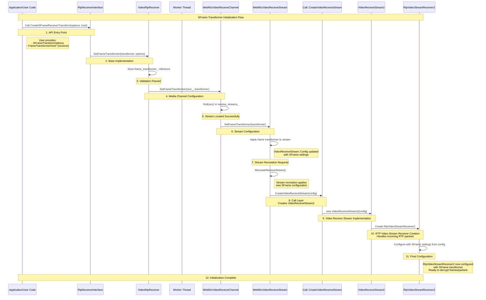
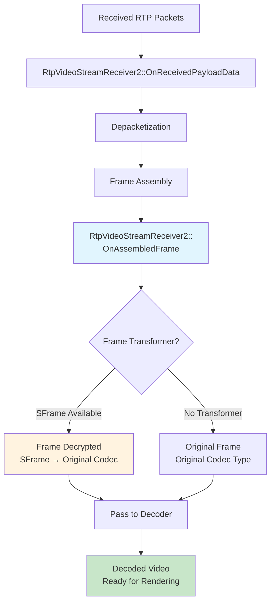

# Video Receiver SFrame Integration

## Overview

This document describes how to integrate SFrame (Secure Frame) decryption into the WebRTC video receiver pipeline. The goal is to add secure end-to-end video reception capabilities using specialized receiver transforms.

SFrame decryption works at the frame level, transforming complete video frames after RTP depacketization.

## SFrame Transformer Initialization Flow

The following diagram illustrates how SFrame transformer initialization flows from the API level down to the RtpVideoStreamReceiver2 component. This shows the "sunny day" scenario where all components are ready and the initialization completes successfully.



### Key Flow Steps:

1. **API Entry Point**: User calls `SetFrameTransformer()` with SFrame transformer
2. **Base Implementation**: `VideoRtpReceiver` stores the transformer and validates readiness
3. **Media Channel**: `WebRtcVideoReceiveChannel` locates the correct stream by SSRC
4. **Stream Configuration**: `WebRtcVideoReceiveStream` updates configuration parameters in place
5. **Stream Recreation**: Existing streams are recreated to apply new SFrame settings
6. **Creation Pipeline**: Settings flow through Call → VideoReceiveStream2 → RtpVideoStreamReceiver2
7. **Ready for Decryption**: RtpVideoStreamReceiver2 is now ready to decrypt frames

Once initialization is complete, the RtpVideoStreamReceiver2 component can perform frame-level decryption based on the configured `SFrameOptions`.

## C++ API Proposal

### Basic API Structure

The integration uses the FrameTransformerHost interface implemented by RtpReceiverInterface.
This existing interface will be used to pass down to the `RtpVideoStreamReceiver2` the `SFrame` transformer.

```cpp
class RtpReceiverInterface : public RefCountInterface,
                             public FrameTransformerHost {
 public:
  // Sets frame-level transformer
  void SetFrameTransformer(
      scoped_refptr<FrameTransformerInterface> frame_transformer) override;
};
```

Skipping passthrough steps here as it's not relevant for the architecture.


### RtpVideoStreamReceiver2 Configuration

The `RtpVideoStreamReceiver2::Config` structure is extended with additional fields to support SFrame decryption capabilities.
[SFrameOptions]() will be fed into `RtpVideoStreamReceiver2` during the creation steps

```cpp
class RtpVideoStreamReceiver2 : public RtpPacketSinkInterface {
 public:
  struct Config {
    /* Other configuration fields */

    scoped_refptr<FrameTransformerInterface> frame_transformer;
    SFrameOptions sframe_options;
  };

 private:
  scoped_refptr<FrameTransformerInterface> frame_transformer_delegate_;
  SFrameOptions sframe_options_;
};
```

### RtpVideoStreamReceiver2 Construction

The `RtpVideoStreamReceiver2` constructor stores the SFrame configuration directly:

```cpp
RtpVideoStreamReceiver2::RtpVideoStreamReceiver2(const Config& config)
    : frame_transformer_delegate_(/* params */),
      sframe_options_(config.sframe_options) {}
```

### SFrame Transformation Flow in RtpVideoStreamReceiver2

The following diagram shows how assembled video frames flow through RtpVideoStreamReceiver2 and where SFrame decryption is applied:



### RtpVideoStreamReceiver2 Overview

The `RtpVideoStreamReceiver2` class is where the actual video processing happens. It receives RTP packets, performs depacketization, and assembles them into complete frames.

### Depacketization Format Selection

Depacketizers map will be filled with SFrame depacketizers based on the `use_sframe` flag.

`modules/video_coding/rtp_video_stream_receiver2.cc`
```cpp
void RtpVideoStreamReceiver2::AddReceiveCodec(
    uint8_t payload_type,
    VideoCodecType video_codec,
    const CodecParameterMap& codec_params,
    bool raw_payload) {
  RTC_DCHECK_RUN_ON(&packet_sequence_checker_);
  if (codec_params.count(kH264FmtpSpsPpsIdrInKeyframe) > 0 ||
      env_.field_trials().IsEnabled("WebRTC-SpsPpsIdrIsH264Keyframe")) {
    packet_buffer_.ForceSpsPpsIdrIsH264Keyframe();
    sps_pps_idr_is_h264_keyframe_ = true;
  }

  if (config_.sframe_options.use_sframe) {
    payload_type_map_.emplace(
        payload_type, std::make_unique<VideoRtpDepacketizerSFrame>());
  } else {
    payload_type_map_.emplace(
      payload_type, raw_payload ? std::make_unique<VideoRtpDepacketizerRaw>()
                                : CreateVideoRtpDepacketizer(video_codec));
  }

  pt_codec_params_.emplace(payload_type, codec_params);
  pt_codec_.emplace(payload_type, video_codec);
}
```

### SFrame Depacketizer

SFrame decryption requires specialized depacketization to handle the encrypted payload format. The `VideoRtpDepacketizerSFrame` class provides this functionality by extending the standard RTP depacketization interface.

`modules/rtp_rtcp/source/video_rtp_depacketizer_sframe.h`
```cpp
class VideoRtpDepacketizerSFrame : public VideoRtpDepacketizer {
 public:
  VideoRtpDepacketizerSFrame() = default;
  VideoRtpDepacketizerSFrame(const VideoRtpDepacketizerSFrame&) = delete;
  VideoRtpDepacketizerSFrame& operator=(const VideoRtpDepacketizerSFrame&) = delete;

  ~VideoRtpDepacketizerSFrame() override = default;

  std::optional<ParsedRtpPayload> Parse(
      const CopyOnWriteBuffer& rtp_payload) override;
}; 
```

The depacketizer handles SFrame-specific RTP payload format, extracting the SFrame ciphertext from the RTP payload and preparing it for frame-level decryption. Once depacketized, the encrypted frame data flows through the frame transformer pipeline for decryption before being passed to the decoder.

### Processing Assembled Frames

When `RtpVideoStreamReceiver2` has assembled a complete frame, it can either process it through the frame transformer pipeline or handle it directly.
In `SFrame` enabled scenario, we need to make sure that if `SFrame` is required, we must have transformer. Otherwise, we must drop frame.

`modules/video_coding/rtp_video_stream_receiver2.cc`
```cpp
void RtpVideoStreamReceiver2::OnAssembledFrame(
    std::unique_ptr<RtpFrameObject> frame) {
  // ... frame validation and codec management ...
  
  // If there's a frame transformer, use it (this handles SFrame decryption)
  if (frame_transformer_delegate_) {
    frame_transformer_delegate_->TransformFrame(std::move(frame));
  } else if (config_.sframe_options.use_sframe) {
    // If we require sframe, we must have frame transformer - drop frame
    return;
  } else {
    // Continue with standard frame processing
    OnCompleteFrames(reference_finder_->ManageFrame(std::move(frame)));
  }
}
```