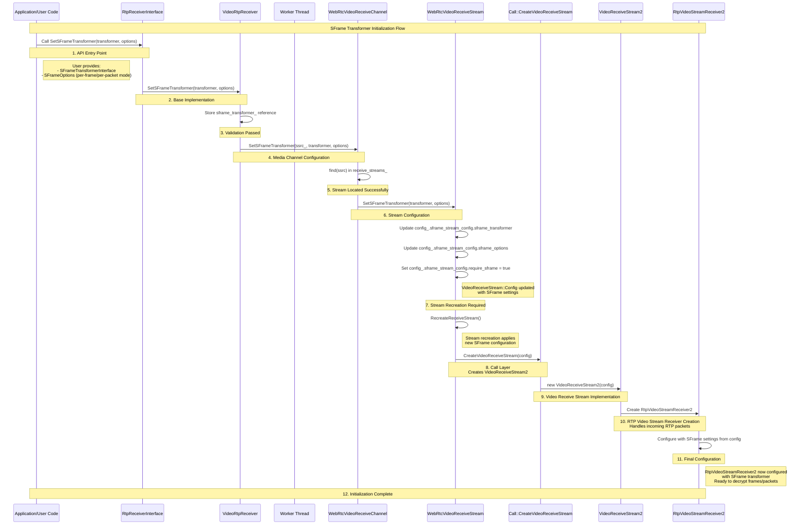
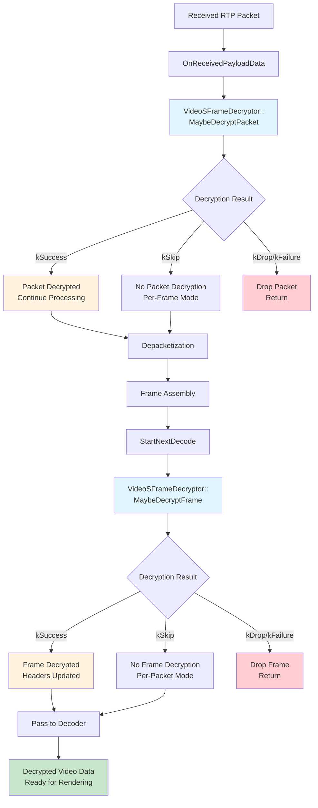

# Video Receiver SFrame Integration

## Overview

This document describes how to integrate SFrame (Secure Frame) decryption into the WebRTC video receiver pipeline. The goal is to add secure end-to-end video reception capabilities while working with the existing RTP receiver infrastructure.

SFrame decryption can work at two levels:

- **Per-frame**: Decrypts complete video frames after assembling them from RTP packets
- **Per-packet**: Decrypts individual RTP packets before frame assembly

## SFrame Transformer Initialization Flow

The following diagram illustrates how SFrame transformer initialization flows from the API level down to the RtpVideoStreamReceiver2 component. This shows the "sunny day" scenario where all components are ready and the initialization completes successfully.



### Key Flow Steps:

1. **API Entry Point**: User calls `SetSFrameTransformer()` with transformer and options
2. **Base Implementation**: `VideoRtpReceiver` stores the transformer and validates readiness
3. **Media Channel**: `WebRtcVideoReceiveChannel` locates the correct stream by SSRC
4. **Stream Configuration**: `WebRtcVideoReceiveStream` updates configuration parameters in place
5. **Stream Recreation**: Existing streams are recreated to apply new SFrame settings
6. **Creation Pipeline**: Settings flow through Call → VideoReceiveStream2 → RtpVideoStreamReceiver2
7. **Ready for Decryption**: RtpVideoStreamReceiver2 is now ready to decrypt frames/packets

Once initialization is complete, the RtpVideoStreamReceiver2 component can perform decryption at two levels based on the configured `SFrameOptions`.

## C++ API Proposal

### Basic API Structure

The integration starts with extending `RtpReceiverInterface` to support SFrame transformers. This gives applications a clean way to inject decryption at the receiver level.

```cpp
class RtpReceiverInterface : public SFrameTransformerHost {
 public:
  /**
   * Sets up SFrame decryption for this RTP receiver.
   * @param sframe_transformer The decryption implementation
   * @param options Configuration for how SFrame should operate
   */
  virtual void SetSFrameTransformer(
      scoped_refptr<SFrameTransformerInterface> sframe_transformer,
      SFrameOptions options) = 0;

  virtual scoped_refptr<SFrameTransformerInterface> GetSFrameTransformer() = 0;
};
```

## Implementation Architecture

### VideoRtpReceiver

`VideoRtpReceiver` is the main implementation that inherits from `RtpReceiverInternal`. Here's how it handles SFrame configuration:

```cpp
class VideoRtpReceiver: public RtpReceiverInternal {
 public:
  /**
   * Sets up the SFrame transformer and passes the configuration
   * down to the media channel layer.
   */
  void SetSFrameTransformer(
      scoped_refptr<SFrameTransformerInterface> sframe_transformer,
      SFrameOptions options) override;

  scoped_refptr<SFrameTransformerInterface> GetSFrameTransformer() override;

 private:
  // Keeps a reference to the configured SFrame transformer
  scoped_refptr<SFrameTransformerInterface> sframe_transformer_;
};
```

The implementation makes sure SFrame configuration is safely passed to the media channel:

```cpp
void VideoRtpReceiver::SetSFrameTransformer(
    scoped_refptr<SFrameTransformerInterface> sframe_transformer,
    SFrameOptions options) {
  sframe_transformer_ = sframe_transformer;

  // Pass configuration to media channel if everything is ready
  if (media_channel_ && ssrc_) {
    worker_thread_->BlockingCall([&] {
      media_channel_->SetSFrameTransformer(ssrc_, sframe_transformer, options);
    });
  }
}

scoped_refptr<SFrameTransformerInterface> VideoRtpReceiver::GetSFrameTransformer()  {
  return sframe_transformer_;
}
```

## SFrameStreamConfig

The `SFrameStreamConfig` structure consolidates all SFrame-related configuration parameters for media streams. This configuration structure is utilized by both media senders and receivers, with each maintaining its own instance to ensure proper encapsulation of SFrame settings.

The structure contains three primary components: `SFrameOptions` and `SFrameTransformerInterface` are populated through the `SetSFrameTransformer` API call, while the `require_sframe` property is configured separately during SDP negotiation. This separation is necessary to accommodate scenarios where SFrame may be enabled through sender-side configuration without necessarily having a transformer available on the receiver side.

```cpp
struct SFrameStreamConfig {
  // SDP negotiated if we should require SFrame
  bool require_sframe;

  // Options provided with `SetSFrameTransformer`
  // Should it be optional ? Or simply keep defaults?
  SFrameOptions options;

  // Transformer
  scoped_refptr<SFrameTransformerInterface> sframe_transformer;
};
```

## Media Channel Layer

### Extending VideoMediaReceiveChannelInterface

To support SFrame at the media channel level, we need to extend the interface with a new method:

```cpp
class VideoMediaReceiveChannelInterface {
 public:
  /**
   * Configures SFrame decryption for a specific stream.
   * @param ssrc The stream identifier
   * @param sframe_transformer The decryption implementation
   * @param options How SFrame should operate (per-frame vs per-packet)
   */
  virtual void SetSFrameTransformer(
      uint32_t ssrc,
      scoped_refptr<SFrameTransformerInterface> sframe_transformer,
      SFrameOptions options) = 0;
};
```

### WebRtcVideoReceiveChannel Implementation

This is where SFrame configuration gets applied to actual video streams:

```cpp
class WebRtcVideoReceiveChannel : public VideoMediaReceiveChannelInterface {
 public:
  /**
   * Finds the right video stream and applies SFrame configuration to it.
   */
  void SetSFrameTransformer(
      uint32_t ssrc,
      scoped_refptr<SFrameTransformerInterface> sframe_transformer,
      SFrameOptions options) override;
};
```

The implementation looks up the correct stream and handles errors gracefully:

```cpp
void WebRtcVideoReceiveChannel::SetSFrameTransformer(
    uint32_t ssrc,
    scoped_refptr<SFrameTransformerInterface> sframe_transformer,
    SFrameOptions options) {
  RTC_DCHECK_RUN_ON(&thread_checker_);

  auto matching_stream = receive_streams_.find(ssrc);
  if (matching_stream != receive_streams_.end()) {
    matching_stream->second->SetSFrameTransformer(sframe_transformer, options);
  } else {
    RTC_LOG(LS_ERROR) << "Could not find receive stream with SSRC " << ssrc
                      << " to configure SFrame decryption";
  }
}
```

### Individual Stream Configuration

Each video stream is represented by a `WebRtcVideoReceiveStream` object. When SFrame configuration is applied, the stream must be recreated to properly integrate the new decryption settings. The configuration parameters are stored within the `SFrameStreamConfig` structure, which is embedded in the stream's configuration hierarchy for centralized management.

```cpp
struct VideoReceiveStreamParameters {
  /* Other fields */
  VideoReceiveStreamInterface::Config config;
};

struct VideoReceiveStreamInterface::Config {
  /* Other fields */
  SFrameStreamConfig sframe_stream_config;
};
```

```cpp
class WebRtcVideoReceiveStream {
 public:
  /**
   * Applies SFrame configuration to this video stream.
   * This triggers recreation of the underlying WebRTC stream.
   */
  void SetSFrameTransformer(
      scoped_refptr<SFrameTransformerInterface> sframe_transformer,
      SFrameOptions options);

  // Holds configuration of the stream
  VideoReceiveStreamInterface::Config config_;
};
```

Here's how stream recreation works:

```cpp
void WebRtcVideoReceiveChannel::WebRtcVideoReceiveStream::SetSFrameTransformer(
    scoped_refptr<SFrameTransformerInterface> sframe_transformer,
    SFrameOptions options) {
  RTC_DCHECK_RUN_ON(&thread_checker_);

  // Update the stream configuration
  config_.sframe_stream_config.sframe_transformer = sframe_transformer;
  config_.sframe_stream_config.sframe_options = options;
  // NOTE: require_sframe is not automatically set - this is a current gap

  // Recreate the stream with new SFrame settings
  if (stream_) {
    RTC_LOG(LS_INFO)
        << "Setting SFrameTransformer (recv) because of SetSFrameTransformer, "
           "remote_ssrc="
        << config_.rtp.remote_ssrc;
    stream_->SetSFrameTransformer(sframe_transformer, options);
  }
}
```

### MediaReceiveStreamInterface

Extend `MediaReceiveStreamInterface` with new method which will allow passing by provided `SFrameTransformer`.

```cpp
class MediaReceiveStreamInterface : public ReceiveStreamInterface {
 public:

  virtual void SetSFrameTransformer(
      scoped_refptr<SFrameTransformerInterface> sframe_transformer,
      SFrameOptions options) = 0;
};
```

It will be inherited by `VideoReceiveStreamInterface`.

### VideoReceiveStream2

`VideoReceiveStream2` inherits from `MediaReceiveStreamInterface` and implements `SetSFrameTransformer` method to pass created `SFrameTransformer` into `RtpVideoStreamReceiver2` object which performs actual media actions.

```cpp
void VideoReceiveStream2::SetSFrameTransformer(
    scoped_refptr<SFrameTransformerInterface> sframe_transformer,
    SFrameOptions sframe_options) {
  rtp_video_stream_receiver_.SetSFrameTransformer(std::move(sframe_transformer),
                                                  sframe_options);
}
```

### RtpVideoStreamReceiver2

```cpp
void RtpVideoStreamReceiver2::SetSFrameTransformer(
    scoped_refptr<SFrameTransformerInterface> sframe_transformer,
    SFrameOptions sframe_options) {
  RTC_DCHECK_RUN_ON(&packet_sequence_checker_);
  if (sframe_transformer) {
    sframe_decryptor_ = std::make_unique<VideoSFrameDecryptor>(
        std::move(sframe_transformer), sframe_options);
  } else {
    sframe_decryptor_.reset();
  }
}
```

## RTP Video Stream Receiver - Where Decryption Happens

### VideoSFrameDecryptor

The `VideoSFrameDecryptor` class provides a clean abstraction layer that encapsulates all SFrame-related decryption operations for video streams. This design promotes better code organization and maintainability by consolidating decryption logic within a dedicated component.

```cpp
class VideoSFrameDecryptor {
 public:
  enum class DecryptionResult {
    kSuccess,
    kFailure,
    kDrop,
    kSkip,
  };

  VideoSFrameDecryptor(scoped_refptr<SFrameTransformerInterface> sframe_transformer, SFrameOptions options_);

  ~VideoSFrameDecryptor();

  DecryptionResult MaybeDecryptFrame(CopyOnWriteBuffer& payload);

  DecryptionResult MaybeDecryptPacket(CopyOnWriteBuffer& payload);

 private:
  scoped_refptr<SFrameTransformerInterface> sframe_transformer_;

  SFrameOptions options_;
};
```

The implementation handles all operations required to perform SFrame decryption, providing a standardized interface for both per-frame and per-packet decryption modes.

Example code:
```cpp
VideoSFrameDecryptor::DecryptionResult VideoSFrameDecryptor::MaybeDecryptFrame(
    CopyOnWriteBuffer& payload) {
  if (sframe_options_.mode == SFrameMode::kPerPacket) {
    return DecryptionResult::kSkip;
  }

  if (!sframe_transformer_) {
    return DecryptionResult::kDrop;
  }

  sframe_transformer_->Transform(payload);

  return DecryptionResult::kSuccess;
}
```

**Summary**: Manages per-frame SFrame decryption by validating the decryption mode, verifying transformer availability, applying SFrame decryption to the complete frame payload in-place.

```cpp
VideoSFrameDecryptor::DecryptionResult
VideoSFrameDecryptor::MaybeDecryptPacket(CopyOnWriteBuffer& payload) {
  if (sframe_options_.mode == SFrameMode::kPerFrame) {
    return DecryptionResult::kSkip;
  }

  if (!sframe_transformer_) {
    return DecryptionResult::kDrop;
  }

  sframe_transformer_->Transform(payload);

  return DecryptionResult::kSuccess;
}
```

**Summary**: Manages per-packet SFrame decryption by validating the decryption mode, verifying transformer availability, applying SFrame decryption to the packet payload directly, and modifying the payload in-place with decrypted data.

### RtpVideoStreamReceiver2 Configuration

The `RtpVideoStreamReceiver2` is configured during construction based on the SFrame settings in the `VideoReceiveStreamInterface::Config` or with `SetSFrameTransformer` as shown above.

```cpp
class RtpVideoStreamReceiver2 : public RtpPacketSinkInterface {
 public:
  RtpVideoStreamReceiver2(
      const Environment& env,
      TaskQueueBase* current_queue,
      Transport* transport,
      RtcpRttStats* rtt_stats,
      PacketRouter* packet_router,
      const VideoReceiveStreamInterface::Config* config,
      /* ... other parameters ... */);

 private:
  std::unique_ptr<VideoSFrameDecryptor> sframe_decryptor_;
};
```

### RtpVideoStreamReceiver2 Construction

The `RtpVideoStreamReceiver2` constructor conditionally instantiates the `VideoSFrameDecryptor` based on the SFrame requirement configuration, ensuring optimal resource utilization.

```cpp
RtpVideoStreamReceiver2::RtpVideoStreamReceiver2(
    const VideoReceiveStreamInterface::Config* config)
    : /* ... other initializations ... */ {
  
  // Initialize SFrame decryptor if require_frame_encryption is enabled and
  // SFrame transformer is provided in config
  if (config->sframe_stream_config.require_sframe) {
    sframe_decryptor_ = std::make_unique<VideoSFrameDecryptor>(
        config->sframe_stream_config.sframe_transformer,
        config->sframe_stream_config.sframe_options);
  }
}
```

### SFrame Transformation Flow in RtpVideoStreamReceiver2

The following diagram shows how received RTP packets and assembled frames flow through RtpVideoStreamReceiver2 and where SFrame decryption is applied:



### RtpVideoStreamReceiver2 Overview

The `RtpVideoStreamReceiver2` class is where the actual video processing happens. It receives RTP packets and assembles them into complete frames.

### Processing Received Packets

When `RtpVideoStreamReceiver2` receives an RTP packet, it can apply SFrame decryption at the appropriate point in the pipeline:

```cpp
void RtpVideoStreamReceiver2::OnReceivedPayloadData(
    ArrayView<const uint8_t> payload,
    const RtpPacketReceived& rtp_packet,
    const RTPVideoHeader& video) {
  
  // Apply per-packet SFrame decryption before depacketization
  if (sframe_decryptor_) {
    CopyOnWriteBuffer payload_buffer = rtp_packet.PayloadBuffer();
    
    switch (sframe_decryptor_->MaybeDecryptPacket(payload_buffer)) {
      case VideoSFrameDecryptor::DecryptionResult::kDrop:
        // Drop packet if decryption fails or transformer not available
        return;
      case VideoSFrameDecryptor::DecryptionResult::kSuccess:
        // Packet decrypted successfully
        break;
      case VideoSFrameDecryptor::DecryptionResult::kFailure:
        // Decryption failed, drop packet
        return;
      case VideoSFrameDecryptor::DecryptionResult::kSkip:
        // Per-frame mode configured, continue with normal processing
        break;
    }
  }

  // Continue with standard depacketization and frame assembly
  // ...
}
```

### SFrame Decryption Integration in Frame Processing

SFrame frame-level decryption is performed in the `StartNextDecode()` method after frame assembly. This happens before the frame is passed to the reference finder or decoder pipeline:

```cpp
void RtpVideoStreamReceiver2::StartNextDecode() {
  // ... frame selection logic ...
  
  // Attempt SFrame frame-level decryption if decryptor is available
  if (sframe_decryptor_) {
    auto decryption_result = sframe_decryptor_->MaybeDecryptFrame(frame->GetEncodedData());
    switch (decryption_result) {
      case VideoSFrameDecryptor::DecryptionResult::kDrop:
        // Drop frame if decryption fails
        return;
      case VideoSFrameDecryptor::DecryptionResult::kFailure:
        // Continue processing even if decryption failed
        return;
      case VideoSFrameDecryptor::DecryptionResult::kSuccess:
        // Frame has been decrypted, update frame data
        break;
      case VideoSFrameDecryptor::DecryptionResult::kSkip:
        // SFrame decryption not applicable, continue with normal processing
        break;
    }
  }

  // Pass to frame transformer or reference finder
  if (buffered_frame_decryptor_ != nullptr) {
    buffered_frame_decryptor_->ManageEncryptedFrame(std::move(frame));
  } else if (frame_transformer_delegate_) {
    frame_transformer_delegate_->TransformFrame(std::move(frame));
  } else {
    // Frame continues to reference finder and eventually to decoder
    reference_finder_->ManageFrame(std::move(frame));
  }
}
```

The method processes the decrypted frame through the normal WebRTC pipeline, either through frame transformers or directly to the reference finder for eventual delivery to the decoder.

## SFrame Depacketizer

SFrame decryption requires specialized depacketization to handle the encrypted payload format. The `VideoRtpDepacketizerSFrame` class provides this functionality by extending the standard RTP depacketization interface.

```cpp
class VideoRtpDepacketizerSFrame : public VideoRtpDepacketizer {
 public:
  ~VideoRtpDepacketizerSFrame() override = default;

  std::optional<ParsedRtpPayload> Parse(CopyOnWriteBuffer rtp_payload) override;

 private:
  // SFrame RTP header size is always 1 byte
  static constexpr size_t kSFrameRtpHeaderSize = 1;
};
```

The depacketizer handles SFrame-specific RTP payload format, extracting the SFrame ciphertext from the RTP payload and preparing it for decryption. The depacketizer processes the SFrame RTP header to determine packet boundaries and reassembly information.

```
 0                   1                   2                   3
 0 1 2 3 4 5 6 7 8 9 0 1 2 3 4 5 6 7 8 9 0 1 2 3 4 5 6 7 8 9 0 1
+-+-+-+-+-+-+-+-+-+-+-+-+-+-+-+-+-+-+-+-+-+-+-+-+-+-+-+-+-+-+-+-+
|V=2|P|X|  CC   |M|     PT      |       sequence number         |
+-+-+-+-+-+-+-+-+-+-+-+-+-+-+-+-+-+-+-+-+-+-+-+-+-+-+-+-+-+-+-+-+
|                           timestamp                           |
+-+-+-+-+-+-+-+-+-+-+-+-+-+-+-+-+-+-+-+-+-+-+-+-+-+-+-+-+-+-+-+-+
|           synchronization source (SSRC) identifier            |
+=+=+=+=+=+=+=+=+=+=+=+=+=+=+=+=+=+=+=+=+=+=+=+=+=+=+=+=+=+=+=+=+
|            contributing source (CSRC) identifiers             |
|                             ....                              |
+=+=+=+=+=+=+=+=+=+=+=+=+=+=+=+=+=+=+=+=+=+=+=+=+=+=+=+=+=+=+=+=+
|S E x x x x x x|                                               |
|                                                               |
:                       SFrame payload                          :
|                                                               |
|                               +-+-+-+-+-+-+-+-+-+-+-+-+-+-+-+-+
|                               :    OPTIONAL RTP padding       |
+-+-+-+-+-+-+-+-+-+-+-+-+-+-+-+-+-+-+-+-+-+-+-+-+-+-+-+-+-+-+-+-+
```
