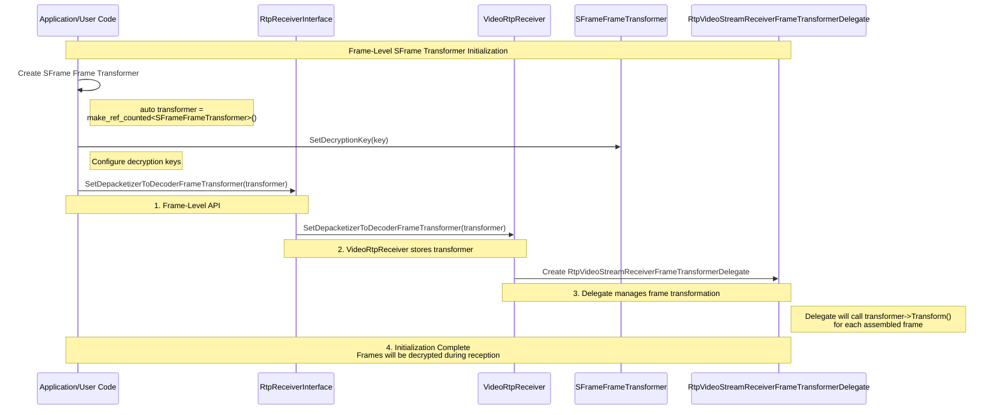
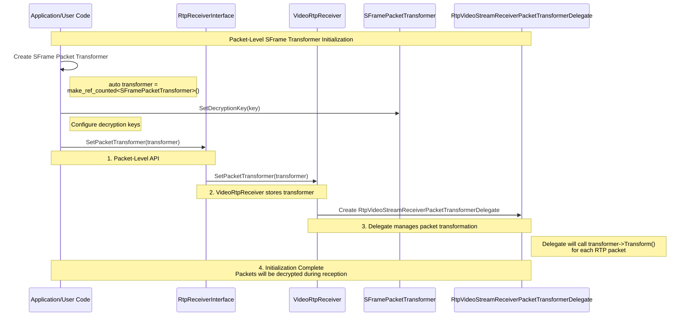
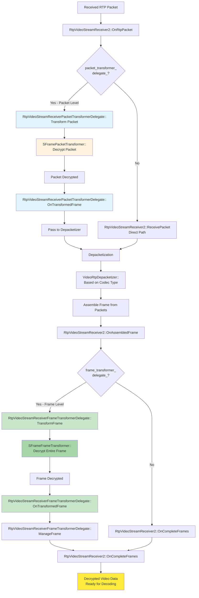

# Video Receiver SFrame Integration

## Overview

This document describes how to integrate SFrame (Secure Frame) decryption into the WebRTC video receiver pipeline using both **frame-level** and **packet-level** transformation. The goal is to add secure end-to-end video reception capabilities while working with the existing RTP receiver infrastructure.

**Coverage**:
- **Frame-Level Transformation**: Decrypts complete video frames after depacketization using `SetDepacketizerToDecoderFrameTransformer()` with `SFrameFrameTransformer`
- **Packet-Level Transformation**: Decrypts individual RTP packets before depacketization using `SetPacketTransformer()` with `SFramePacketTransformer`

Both approaches follow the same configuration and negotiation architecture but differ in transformation timing and granularity.Both approaches follow the same configuration and negotiation architecture but differ in transformation timing and granularity.

## Frame-Level SFrame Transformer Initialization Flow

The following diagram illustrates how SFrame frame transformers are configured in the WebRTC video receiver pipeline using `SetDepacketizerToDecoderFrameTransformer()`.



1. **Transformer Creation**: User creates `SFrameFrameTransformer` for frame-level decryption
2. **Key Configuration**: User configures decryption keys via `SetDecryptionKey()`
3. **API Call**: User calls `SetDepacketizerToDecoderFrameTransformer()` to attach the transformer
4. **Observer Registration**: `VideoRtpReceiver` registers itself as a negotiation observer with the transformer
5. **SDP Negotiation**: Transformer immediately requests SFrame SDP attribute, triggering renegotiation
6. **Delegate Creation**: `RtpVideoStreamReceiverFrameTransformerDelegate` is created to handle transformation callbacks
7. **Decryption Active**: Assembled frames are now decrypted via the transformer after depacketization

## Packet-Level SFrame Transformer Initialization Flow

The following diagram illustrates how SFrame packet transformers are configured in the WebRTC video receiver pipeline using `SetPacketTransformer()`.



1. **Transformer Creation**: User creates `SFramePacketTransformer` for packet-level decryption
2. **Key Configuration**: User configures decryption keys via `SetDecryptionKey()`
3. **API Call**: User calls `SetPacketTransformer()` to attach the transformer
4. **Observer Registration**: `VideoRtpReceiver` registers itself as a negotiation observer with the transformer
5. **SDP Negotiation**: Transformer immediately requests SFrame SDP attribute, triggering renegotiation
6. **Delegate Creation**: `RtpVideoStreamReceiverPacketTransformerDelegate` is created to handle transformation callbacks
7. **Decryption Active**: RTP packets are now decrypted via the transformer before depacketization

## Implementation Architecture

### VideoRtpReceiver

`VideoRtpReceiver` implements the `RtpReceiverInternal` interface and the `FrameTransformerNegotiationObserver` interface to support both frame-level and packet-level transformers.

```cpp
class VideoRtpReceiver : public RtpReceiverInternal {
 public:
  void SetFrameTransformer(
      scoped_refptr<FrameTransformerInterface> frame_transformer) override;

  void SetPacketTransformer(
      scoped_refptr<FrameTransformerInterface> packet_transformer) override;

 private:
  // Stored transformer references
  scoped_refptr<FrameTransformerInterface> frame_transformer_
      RTC_GUARDED_BY(worker_thread_);
  scoped_refptr<FrameTransformerInterface> packet_transformer_
      RTC_GUARDED_BY(worker_thread_);
};
```

The implementation manages transformer lifecycle and propagates configuration to the media channel:

```cpp
void VideoRtpReceiver::SetFrameTransformer(
    scoped_refptr<FrameTransformerInterface> frame_transformer) {
  RTC_DCHECK_RUN_ON(worker_thread_);
  
  frame_transformer_ = std::move(frame_transformer);

  if (media_channel_) {
    media_channel_->SetDepacketizerToDecoderFrameTransformer(
        signaled_ssrc_.value_or(0), frame_transformer_);
  }
}

void VideoRtpReceiver::SetPacketTransformer(
    scoped_refptr<FrameTransformerInterface> packet_transformer) {
  RTC_DCHECK_RUN_ON(worker_thread_);
  
  packet_transformer_ = std::move(packet_transformer);

  if (media_channel_) {
    media_channel_->SetPacketTransformer(signaled_ssrc_.value_or(0),
                                         packet_transformer_);
  }
}
```

## Media Channel Layer

### WebRtcVideoReceiveChannel

The `WebRtcVideoReceiveChannel` class implements the video receive channel interface and manages multiple video receive streams. It provides methods to configure transformers on a per-SSRC basis.

```cpp
class WebRtcVideoReceiveChannel : public MediaChannelUtil,
                                  public VideoMediaReceiveChannelInterface {
 public:
  void SetDepacketizerToDecoderFrameTransformer(
      uint32_t ssrc,
      scoped_refptr<FrameTransformerInterface> frame_transformer) override;

  void SetPacketTransformer(
      uint32_t ssrc,
      scoped_refptr<FrameTransformerInterface> packet_transformer) override;

 private:
  std::map<uint32_t, WebRtcVideoReceiveStream*> receive_streams_;
  scoped_refptr<FrameTransformerInterface> unsignaled_frame_transformer_
      RTC_GUARDED_BY(thread_checker_);
  scoped_refptr<FrameTransformerInterface> unsignaled_packet_transformer_
      RTC_GUARDED_BY(thread_checker_);
};
```

The implementation looks up the correct stream and delegates the transformer configuration:

```cpp
void WebRtcVideoReceiveChannel::SetDepacketizerToDecoderFrameTransformer(
    uint32_t ssrc,
    scoped_refptr<FrameTransformerInterface> frame_transformer) {
  RTC_DCHECK_RUN_ON(&thread_checker_);
  
  if (ssrc == 0) {
    // Unsignaled stream - store transformer for later
    unsignaled_frame_transformer_ = std::move(frame_transformer);
    return;
  }

  auto matching_stream = receive_streams_.find(ssrc);
  if (matching_stream != receive_streams_.end()) {
    matching_stream->second->SetDepacketizerToDecoderFrameTransformer(
        std::move(frame_transformer));
  }
}

void WebRtcVideoReceiveChannel::SetPacketTransformer(
    uint32_t ssrc,
    scoped_refptr<FrameTransformerInterface> packet_transformer) {
  RTC_DCHECK_RUN_ON(&thread_checker_);
  
  if (ssrc == 0) {
    // Unsignaled stream - store transformer for later
    unsignaled_packet_transformer_ = std::move(packet_transformer);
    return;
  }

  auto matching_stream = receive_streams_.find(ssrc);
  if (matching_stream != receive_streams_.end()) {
    matching_stream->second->SetPacketTransformer(packet_transformer);
  } else {
    RTC_LOG(LS_ERROR) << "No stream found to attach packet transformer";
  }
}
```

### WebRtcVideoReceiveStream

Each video stream is represented by a `WebRtcVideoReceiveStream` object which wraps the internal `VideoReceiveStream2`. Transformer configuration is stored in `VideoReceiveStreamInterface::Config` and triggers stream recreation.

```cpp
class WebRtcVideoReceiveStream {
 public:
  void SetDepacketizerToDecoderFrameTransformer(
      scoped_refptr<FrameTransformerInterface> frame_transformer);

  void SetPacketTransformer(
      scoped_refptr<FrameTransformerInterface> packet_transformer);

 private:
  void RecreateReceiveStream();
  
  VideoReceiveStreamInterface::Config config_;
  VideoReceiveStreamInterface* stream_;
};
```

When a frame transformer is set, the stream configuration is updated and propagated to the stream:

```cpp
void WebRtcVideoReceiveChannel::WebRtcVideoReceiveStream::
    SetDepacketizerToDecoderFrameTransformer(
        scoped_refptr<FrameTransformerInterface> frame_transformer) {
  config_.frame_transformer = frame_transformer;
  if (stream_)
    stream_->SetDepacketizerToDecoderFrameTransformer(frame_transformer);
}
```

When a packet transformer is set, the stream configuration is updated and the stream is recreated:

```cpp
void WebRtcVideoReceiveChannel::WebRtcVideoReceiveStream::SetPacketTransformer(
    scoped_refptr<FrameTransformerInterface> packet_transformer) {
  config_.packet_transformer = packet_transformer;
  RecreateReceiveStream();
}
```

### VideoReceiveStreamInterface::Config

Both frame and packet transformers are stored directly in the `VideoReceiveStreamInterface::Config` structure:

```cpp
struct VideoReceiveStreamInterface::Config {  
  // Optional frame transformer (depacketizer to decoder transformation)
  scoped_refptr<FrameTransformerInterface> frame_transformer;

  // Optional packet transformer (per-packet transformation)
  scoped_refptr<FrameTransformerInterface> packet_transformer;

  // ... other fields
};
```

### VideoReceiveStream2

The `VideoReceiveStream2` is created by the `Call` interface and manages the video decoding and receiving pipeline. It creates the `RtpVideoStreamReceiver2` with transformers from the configuration.

```cpp
class VideoReceiveStream2 : public VideoReceiveStreamInterface,
                            public VideoStreamBufferControllerInterface {
 public:
  VideoReceiveStream2(
      const Environment& env,
      Call* call,
      int num_cpu_cores,
      PacketRouter* packet_router,
      VideoReceiveStreamInterface::Config config,
      CallStats* call_stats,
      clock::Clock* clock,
      VCMTiming* timing,
      NackPeriodicProcessor* nack_periodic_processor,
      DecodeSynchronizer* decode_sync);

  void SetDepacketizerToDecoderFrameTransformer(
      scoped_refptr<FrameTransformerInterface> frame_transformer) override;

  void SetPacketTransformer(
      scoped_refptr<FrameTransformerInterface> packet_transformer);
};
```

### RtpVideoStreamReceiver2

The `RtpVideoStreamReceiver2` is created with both frame and packet transformers and manages RTP packet reception, depacketization, and frame assembly.

```cpp
class RtpVideoStreamReceiver2 : public LossNotificationSender,
                                public RecoveredPacketReceiver,
                                public RtpPacketSinkInterface,
                                public KeyFrameRequestSender,
                                public NackSender,
                                public OnDecryptedFrameCallback,
                                public OnDecryptionStatusChangeCallback,
                                public RtpVideoFrameReceiver {
 public:
  RtpVideoStreamReceiver2(
      const Environment& env,
      TaskQueueBase* current_queue,
      Transport* transport,
      RtcpRttStats* rtt_stats,
      PacketRouter* packet_router,
      const VideoReceiveStreamInterface::Config* config,
      ReceiveStatistics* rtp_receive_statistics,
      RtcpPacketTypeCounterObserver* rtcp_packet_type_counter_observer,
      RtcpCnameCallback* rtcp_cname_callback,
      NackPeriodicProcessor* nack_periodic_processor,
      OnCompleteFrameCallback* complete_frame_callback,
      scoped_refptr<FrameDecryptorInterface> frame_decryptor,
      scoped_refptr<FrameTransformerInterface> frame_transformer,
      scoped_refptr<FrameTransformerInterface> packet_transformer);
  
  void SetDepacketizerToDecoderFrameTransformer(
      scoped_refptr<FrameTransformerInterface> frame_transformer);

  void SetPacketTransformer(
      scoped_refptr<FrameTransformerInterface> packet_transformer);

 private:
  scoped_refptr<RtpVideoStreamReceiverFrameTransformerDelegate>
      frame_transformer_delegate_;
  scoped_refptr<RtpVideoStreamReceiverPacketTransformerDelegate>
      packet_transformer_delegate_;
};
```

The constructor creates transformer delegates with the configuration, passing transformers to manage the decryption workflow.

## RtpVideoStreamReceiver2 Configuration

### Frame Transformer Delegate

When a frame transformer is configured, `RtpVideoStreamReceiver2` creates an `RtpVideoStreamReceiverFrameTransformerDelegate` to handle the transformation workflow:

```cpp
class RtpVideoStreamReceiverFrameTransformerDelegate 
    : public TransformedFrameCallback {
 public:
  RtpVideoStreamReceiverFrameTransformerDelegate(
      RtpVideoFrameReceiver* receiver,
      Clock* clock,
      scoped_refptr<FrameTransformerInterface> frame_transformer,
      Thread* network_thread,
      uint32_t ssrc);

  void Init();

  // Transforms assembled frames before decoding
  void TransformFrame(std::unique_ptr<RtpFrameObject> frame);

  // Callback when transformation completes
  void OnTransformedFrame(
      std::unique_ptr<TransformableFrameInterface> frame) override;

  // Delivers transformed frame back to receiver
  void ManageFrame(std::unique_ptr<RtpFrameObject> frame);
};
```

The delegate workflow:
1. **TransformFrame**: Receives assembled frames from the receiver, wraps them in `TransformableFrameInterface`, and passes to the transformer
2. **Transform**: The `SFrameFrameTransformer` decrypts the frame data
3. **OnTransformedFrame**: Receives decrypted frame from transformer
4. **ManageFrame**: Delivers decrypted frame back to `RtpVideoStreamReceiver2` for decoding

### Packet Transformer Delegate

When a packet transformer is configured, `RtpVideoStreamReceiver2` creates an `RtpVideoStreamReceiverPacketTransformerDelegate` to handle packet-level transformation. This operates **before** depacketization, transforming individual RTP packets.

```cpp
class RtpVideoStreamReceiverPacketTransformerDelegate 
    : public TransformedFrameCallback {
 public:
  RtpVideoStreamReceiverPacketTransformerDelegate(
      Clock* clock,
      scoped_refptr<FrameTransformerInterface> packet_transformer,
      Thread* network_thread,
      uint32_t ssrc);

  void Init();
  void Reset();

  // Callback when transformation completes
  void OnTransformedFrame(
      std::unique_ptr<TransformableFrameInterface> packet) override;

  void StartShortCircuiting() override;

 private:
  scoped_refptr<FrameTransformerInterface> packet_transformer_
      RTC_GUARDED_BY(network_sequence_checker_);
  TaskQueueBase* const network_thread_;
  const uint32_t ssrc_;
  Clock* const clock_;
  bool short_circuit_ RTC_GUARDED_BY(network_sequence_checker_) = false;
};
```

The packet delegate workflow:
1. **Packet Reception**: Receives RTP packets before depacketization, wraps each packet in `TransformableFrameInterface`
2. **Transform**: The `SFramePacketTransformer` decrypts each packet's payload individually
3. **OnTransformedFrame**: Receives decrypted packets from transformer
4. **Packet Delivery**: Delivers transformed packets back to the receiver pipeline for depacketization

### Transformation Flow in RtpVideoStreamReceiver2

The following diagram shows how received RTP packets flow through RtpVideoStreamReceiver2 with both packet-level and frame-level transformation paths:



**Flow Explanation**:

1. **Packet Reception**: `OnRtpPacket` receives RTP packet from network
2. **Packet-Level Path** (if configured):
   - Packet transformer delegate intercepts the RTP packet
   - Each packet is decrypted before depacketization
   - Decrypted packet continues to depacketization
3. **Depacketization**: RTP packets (possibly decrypted) are depacketized into encoded frames
4. **Frame Assembly**: Multiple packets are assembled into complete frames
5. **Frame-Level Path** (if configured):
   - Frame transformer delegate intercepts the assembled frame
   - Entire frame is decrypted after depacketization
   - Decrypted frame is passed to the decoder
6. **Decoding**: Final frames are sent to the video decoder

### RtpVideoStreamReceiver2 Processing Flow

When `RtpVideoStreamReceiver2` receives an RTP packet, it checks if a packet transformer delegate exists and routes accordingly:

```cpp
void RtpVideoStreamReceiver2::OnRtpPacket(const RtpPacketReceived& packet) {
  RTC_DCHECK_RUN_ON(&packet_sequence_checker_);

  if (!receiving_)
    return;

  // If there's a packet transformer delegate, packets are transformed
  // before entering the normal receive pipeline
  // (Implementation would transform packet here)

  ReceivePacket(packet);

  // Update receive statistics after ReceivePacket
  if (!packet.recovered()) {
    rtp_receive_statistics_->OnRtpPacket(packet);
  }

  if (packet_sink_) {
    packet_sink_->OnRtpPacket(packet);
  }
}
```

The `OnAssembledFrame` method handles frame-level transformation after depacketization:

```cpp
void RtpVideoStreamReceiver2::OnAssembledFrame(
    std::unique_ptr<RtpFrameObject> frame) {
  RTC_DCHECK_RUN_ON(&packet_sequence_checker_);
  RTC_DCHECK(frame);

  // Handle loss notification and keyframe requests
  // ...

  // Route to appropriate transformation path
  if (buffered_frame_decryptor_ != nullptr) {
    buffered_frame_decryptor_->ManageEncryptedFrame(std::move(frame));
  } else if (frame_transformer_delegate_) {
    // Frame-level transformation: decrypt complete frame
    frame_transformer_delegate_->TransformFrame(std::move(frame));
  } else {
    // No transformation: pass directly to reference finder
    OnCompleteFrames(reference_finder_->ManageFrame(std::move(frame)));
  }
}
```
