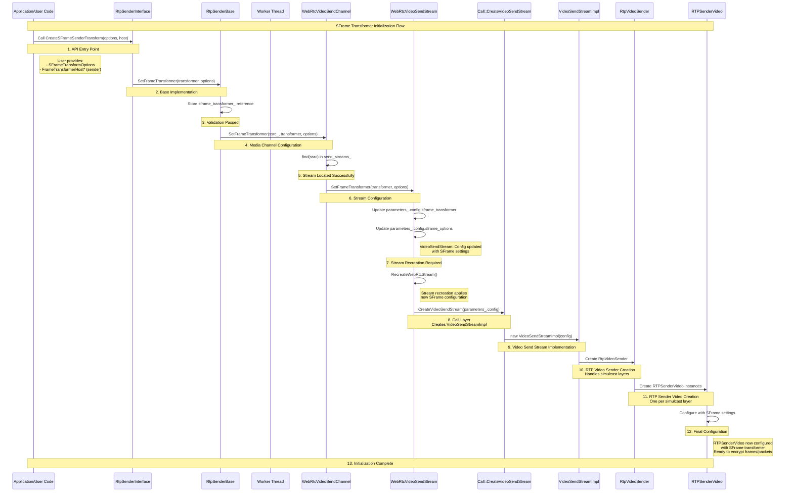
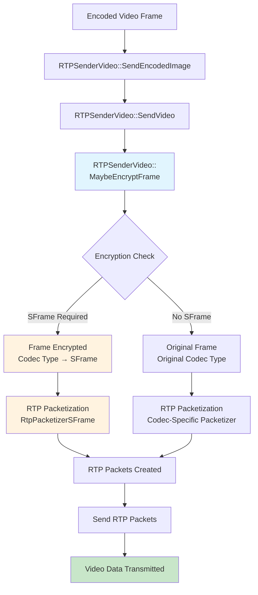

# Video Sender SFrame Integration

## Overview

This document describes how to integrate SFrame (Secure Frame) encryption into the WebRTC video sender pipeline. The goal is to add secure end-to-end video transmission capabilities using specialized sender transforms.

SFrame encryption works at the frame level, transforming complete video frames before RTP packetization.

## SFrame Transformer Initialization Flow

The following diagram illustrates how SFrame transformer initialization flows from the API level down to the RTPSenderVideo component. This shows the "sunny day" scenario where all components are ready and the initialization completes successfully.



### Key Flow Steps:

1. **API Entry Point**: User calls `SetFrameTransformer()` with transformer and options
2. **Base Implementation**: `RtpSenderBase` stores the transformer and validates readiness
3. **Media Channel**: `WebRtcVideoSendChannel` locates the correct stream by SSRC
4. **Stream Configuration**: `WebRtcVideoSendStream` updates configuration parameters in place
5. **Stream Recreation**: Existing streams are recreated to apply new SFrame settings
6. **Creation Pipeline**: Settings flow through Call → VideoSendStreamImpl → RtpVideoSender → RTPSenderVideo
7. **Ready for Encryption**: RTPSenderVideo is now ready to encrypt frames/packets

Once initialization is complete, the RTPSenderVideo component can perform encryption at two levels based on the configured `SFrameOptions`.

## C++ API Proposal

### Basic API Structure

The integration uses the FrameTransformerHost interface implemented by RtpSenderInterface:

```cpp
class RtpSenderInterface : public RefCountInterface,
                           public FrameTransformerHost {
 public:
  // Sets frame-level transformer
  void SetFrameTransformer(
      scoped_refptr<FrameTransformerInterface> frame_transformer) override;
};
```

### RTPSenderVideo Configuration

The `RTPSenderVideo::Config` structure is extended with additional fields to support SFrame encryption capabilities.

```cpp
class RTPSenderVideo : public RTPVideoFrameSenderInterface {
 public:
  struct Config {
    /* Other configuration fields */

    scoped_refptr<FrameTransformerInterface> frame_transformer;
    SFrameOptions sframe_options;
  };

 private:
  scoped_refptr<FrameTransformerInterface> frame_transformer_delegate_;
  SFrameOptions sframe_options_;
};
```

### RTPSenderVideo Construction

The `RTPSenderVideo` constructor stores the SFrame configuration directly:

```cpp
RTPSenderVideo::RTPSenderVideo(const Config& config)
    : frame_transformer_delegate_(/* params */),
      sframe_options_(config.sframe_options) {}
```

### SFrame Transformation Flow in RTPSenderVideo

The following diagram shows how encoded video frames flow through RTPSenderVideo and where SFrame encryption is applied:



### RTPSenderVideo Overview

The `RTPSenderVideo` class is where the actual video processing happens. It receives encoded video frames and splits them into RTP packets. This is a good place to add SFrame encryption because:

- **Frame encryption** works well here since we have access to complete frames before packetization

### Processing Encoded Frames

When `RTPSenderVideo` receives an encoded frame, it can either process it through the frame transformer pipeline or handle it directly.
I `SFrame` enabled scenario, we need to make sure that if `SFrame` is there, we must have transformer. Otherwise, we must drop frame.

`modules/rtp_rtcp/source/rtp_sender_video.cc`
```cpp
bool RTPSenderVideo::SendEncodedImage(int payload_type,
                                      std::optional<VideoCodecType> codec_type,
                                      uint32_t rtp_timestamp,
                                      const EncodedImage& encoded_image,
                                      RTPVideoHeader video_header,
                                      TimeDelta expected_retransmission_time,
                                      const std::vector<uint32_t>& csrcs) {
  // If there's a frame transformer, use it (this handles existing transform logic)
  if (frame_transformer_delegate_) {
    return frame_transformer_delegate_->TransformFrame(
        payload_type, codec_type, rtp_timestamp, encoded_image, video_header,
        expected_retransmission_time, csrcs);
  } else if (sframe_options_.use_sframe) {
    // If we require sframe, we must have frame transformer
    return false;
  }

  // Otherwise, process the frame directly
  return SendVideo(payload_type, codec_type, rtp_timestamp,
                   encoded_image.CaptureTime(), encoded_image,
                   encoded_image.size(), video_header,
                   expected_retransmission_time, csrcs);
}
```

### SFrame Encryption Integration

The `SendVideo` method integrates SFrame encryption by checking if SFrame is required and applying the transformer directly:

`modules/rtp_rtcp/source/rtp_sender_video.cc`
```cpp
bool RTPSenderVideo::SendVideo(int payload_type,
                               std::optional<VideoCodecType> codec_type,
                               uint32_t rtp_timestamp,
                               Timestamp capture_time,
                               ArrayView<const uint8_t> payload,
                               size_t encoder_output_size,
                               RTPVideoHeader video_header,
                               TimeDelta expected_retransmission_time,
                               std::vector<uint32_t> csrcs) {

  /* Existing implementation */

  // RTP packetization uses RtpPacketizerSFrame when codec_type is SFrame
  std::unique_ptr<RtpPacketizer> packetizer = RtpPacketizer::Create(
      GetPacketizationFormat(codec_type, raw_packetization_, sframe_options_.use_sframe), payload, limits,
      video_header);

  std::vector<std::unique_ptr<RtpPacketToSend>> rtp_packets;

  // Send the packets out
}
```

### Packetization Format Selection

The `GetPacketizationFormat` function determines the appropriate packetization strategy based on the codec type and configuration flags:

`modules/rtp_rtcp/source/rtp_sender_video.cc`
```cpp
PacketizationFormat GetPacketizationFormat(const VideoCodecType codec_type,
                                           bool raw_packetization,
                                           bool sframe_packetization) {
  if (raw_packetization) {
    return PacketizationFormat::kRaw;
  }

  if (sframe_packetization) {
    return PacketizationFormat::kSFrame;
  }

  switch (codec_type) {
    case kVideoCodecH264:
      return PacketizationFormat::kH264;
    case kVideoCodecVP8:
      return PacketizationFormat::kVP8;
    case kVideoCodecVP9:
      return PacketizationFormat::kVP9;
    case kVideoCodecAV1:
      return PacketizationFormat::kAV1;
    case kVideoCodecH265:
      return PacketizationFormat::kH265;
    case kVideoCodecGeneric:
      return PacketizationFormat::kGeneric;
  }
}
```

### SFrame Packetizer

SFrame encryption requires specialized packetization to accommodate the encrypted payload format. The `RtpPacketizerSFrame` class provides this functionality by extending the standard RTP packetization interface.

`modules/rtp_rtcp/source/rtp_packetizer_sframe.h`
```cpp
class RtpPacketizerSFrame : public RtpPacketizer {
 public:
  RtpPacketizerSFrame(ArrayView<const uint8_t> payload,
                      PayloadSizeLimits limits);

  RtpPacketizerSFrame(const RtpPacketizerSFrame&) = delete;
  RtpPacketizerSFrame& operator=(const RtpPacketizerSFrame&) = delete;

  ~RtpPacketizerSFrame() override;

  size_t NumPackets() const override;

  bool NextPacket(RtpPacketToSend* rtp_packet) override;
}; 
```
