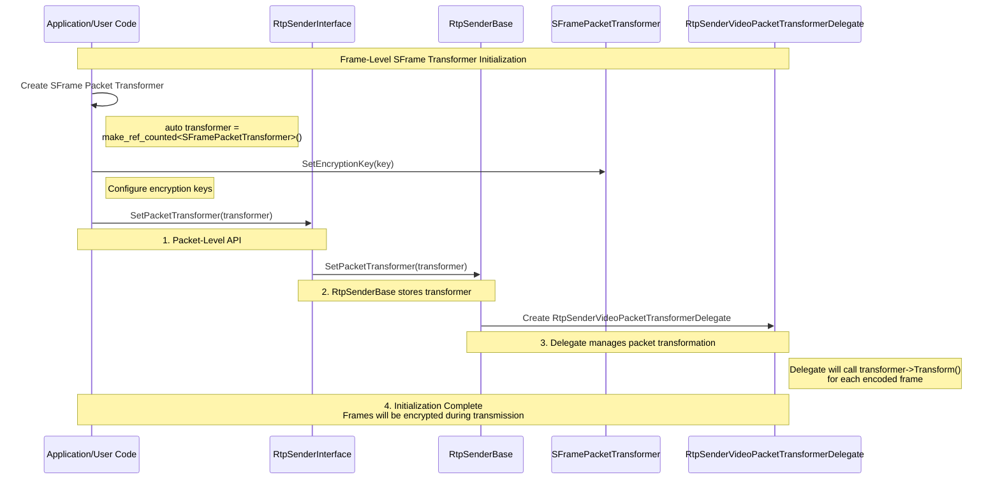
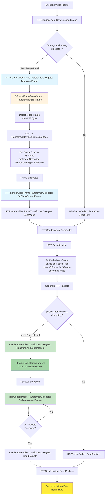

# Video Sender SFrame Integration

## Overview

This document describes how to integrate SFrame (Secure Frame) encryption into the WebRTC video sender pipeline using both **frame-level** and **packet-level** transformation. The goal is to add secure end-to-end video transmission capabilities while working with the existing RTP sender infrastructure.

**Coverage**:
- **Frame-Level Transformation**: Encrypts complete encoded frames before packetization using `SetFrameTransformer()` with `SFrameFrameTransformer`
- **Packet-Level Transformation**: Encrypts individual RTP packets after packetization using `SetPacketTransformer()` with `SFramePacketTransformer`

Both approaches follow the same configuration and negotiation architecture but differ in transformation timing and granularity.

## Frame-Level SFrame Transformer Initialization Flow

The following diagram illustrates how SFrame frame transformers are configured in the WebRTC video sender pipeline using `SetFrameTransformer()`.


1. **Transformer Creation**: User creates `SFrameFrameTransformer` for frame-level encryption
2. **Key Configuration**: User configures encryption keys via `SetEncryptionKey()`
3. **API Call**: User calls `SetFrameTransformer()` to attach the transformer
4. **Observer Registration**: `RtpSenderBase` registers itself as a negotiation observer with the transformer
5. **SDP Negotiation**: Transformer immediately requests SFrame SDP attribute, triggering renegotiation
6. **Delegate Creation**: `RtpSenderVideoFrameTransformerDelegate` is created to handle transformation callbacks
7. **Encryption Active**: Encoded frames are now encrypted via the transformer before packetization

## Packet-Level SFrame Transformer Initialization Flow

The following diagram illustrates how SFrame frame transformers are configured in the WebRTC video sender pipeline using `SetFrameTransformer()`.



1. **Transformer Creation**: User creates `SFramePacketTransformer` for packet-level encryption
2. **Key Configuration**: User configures encryption keys via `SetEncryptionKey()`
3. **API Call**: User calls `SetFrameTransformer()` to attach the transformer
4. **Observer Registration**: `RtpSenderBase` registers itself as a negotiation observer with the transformer
5. **SDP Negotiation**: Transformer immediately requests SFrame SDP attribute, triggering renegotiation
6. **Delegate Creation**: `RtpSenderVideoFrameTransformerDelegate` is created to handle transformation callbacks
7. **Encryption Active**: Encoded frames are now encrypted via the transformer before packetization

## Implementation Architecture

### RtpSenderBase

`RtpSenderBase` is the main implementation that both `VideoRtpSender` and `AudioRtpSender` inherit from. It implements the `FrameTransformerHost` interface to support both frame-level and packet-level transformers.

```cpp
class RtpSenderBase : public RtpSenderInternal,
                      public FrameTransformerHost {
 public:
  // FrameTransformerHost implementation
  void SetFrameTransformer(
      scoped_refptr<FrameTransformerInterface> frame_transformer) override;

  void SetPacketTransformer(
      scoped_refptr<FrameTransformerInterface> packet_transformer) override;

 private:
  // Stored transformer references
  scoped_refptr<FrameTransformerInterface> frame_transformer_;
  scoped_refptr<FrameTransformerInterface> packet_transformer_;
};
```

The implementation manages transformer lifecycle:

```cpp
void RtpSenderBase::SetFrameTransformer(
    scoped_refptr<FrameTransformerInterface> frame_transformer) {
  frame_transformer_ = std::move(frame_transformer);

  if (media_channel_ && ssrc_ && !stopped_) {
    worker_thread_->BlockingCall([&] {
      media_channel_->SetEncoderToPacketizerFrameTransformer(
          ssrc_, frame_transformer_);
    });
  }
}

void RtpSenderBase::SetPacketTransformer(
    scoped_refptr<FrameTransformerInterface> packet_transformer) {
  packet_transformer_ = std::move(packet_transformer);

  if (media_channel_ && ssrc_ != 0) {
    worker_thread_->BlockingCall([&] {
      media_channel_->SetPacketTransformer(ssrc_, packet_transformer_);
    });
  }
}
```

## Media Channel Layer

### WebRtcVideoSendChannel

The `WebRtcVideoSendChannel` class implements the video send channel interface and manages multiple video send streams. It provides methods to configure frame transformers on a per-SSRC basis.

```cpp
class WebRtcVideoSendChannel : public MediaChannelUtil,
                               public VideoMediaSendChannelInterface {
 public:
  void SetEncoderToPacketizerFrameTransformer(
      uint32_t ssrc,
      scoped_refptr<FrameTransformerInterface> frame_transformer) override;

  void SetPacketTransformer(
      uint32_t ssrc,
      scoped_refptr<FrameTransformerInterface> packet_transformer) override;

 private:
  std::map<uint32_t, WebRtcVideoSendStream*> send_streams_;
};
```

The implementation looks up the correct stream and delegates the transformer configuration:

```cpp
void WebRtcVideoSendChannel::SetEncoderToPacketizerFrameTransformer(
    uint32_t ssrc,
    scoped_refptr<FrameTransformerInterface> frame_transformer) {
  RTC_DCHECK_RUN_ON(&thread_checker_);
  auto matching_stream = send_streams_.find(ssrc);
  if (matching_stream != send_streams_.end()) {
    matching_stream->second->SetEncoderToPacketizerFrameTransformer(
        std::move(frame_transformer));
  }
}

void WebRtcVideoSendChannel::SetPacketTransformer(
    uint32_t ssrc,
    scoped_refptr<FrameTransformerInterface> packet_transformer) {
  RTC_DCHECK_RUN_ON(&thread_checker_);
  auto matching_stream = send_streams_.find(ssrc);
  if (matching_stream != send_streams_.end()) {
    matching_stream->second->SetPacketTransformer(packet_transformer);
  } else {
    RTC_LOG(LS_ERROR) << "No stream found to attach packet transformer";
  }
}
```

### WebRtcVideoSendStream

Each video stream is represented by a `WebRtcVideoSendStream` object which wraps the internal `VideoSendStream`. Frame transformer configuration is stored in `VideoSendStream::Config` and triggers stream recreation.

```cpp
class WebRtcVideoSendStream {
 public:
  void SetEncoderToPacketizerFrameTransformer(
      scoped_refptr<FrameTransformerInterface> frame_transformer);

  void SetPacketTransformer(
      scoped_refptr<FrameTransformerInterface> packet_transformer);

 private:
  void RecreateWebRtcStream();
  
  VideoSendStreamParameters parameters_;
  VideoSendStream* stream_;
};
```

When a frame transformer is set, the stream configuration is updated and the stream is recreated:

```cpp
void WebRtcVideoSendChannel::WebRtcVideoSendStream::
    SetEncoderToPacketizerFrameTransformer(
        scoped_refptr<FrameTransformerInterface> frame_transformer) {
  RTC_DCHECK_RUN_ON(&thread_checker_);
  parameters_.config.frame_transformer = std::move(frame_transformer);
  if (stream_)
    RecreateWebRtcStream();
}
```

When a packet transformer is set, the stream configuration is updated and the stream is recreated:

```cpp
void WebRtcVideoSendChannel::WebRtcVideoSendStream::SetPacketTransformer(
    scoped_refptr<FrameTransformerInterface> packet_transformer) {
  RTC_DCHECK_RUN_ON(&thread_checker_);
  parameters_.config.packet_transformer = packet_transformer;
  if (stream_) {
    RTC_LOG(LS_INFO)
        << "RecreateWebRtcStream (send) because of SetPacketTransformer, ssrc="
        << parameters_.config.rtp.ssrcs[0];
    RecreateWebRtcStream();
  }
}
```

### VideoSendStream::Config

The frame transformer is stored directly in the `VideoSendStream::Config` structure:

```cpp
struct VideoSendStream::Config {  
  // Optional frame transformer (encoder to packetizer transformation)
  scoped_refptr<FrameTransformerInterface> frame_transformer;

  // Optional packet transformer (per-packet transformation)
  scoped_refptr<FrameTransformerInterface> packet_transformer;

  // ... other fields
};
```

### VideoSendStreamImpl

The `VideoSendStreamImpl` is created by the `Call` interface and manages the video encoding and sending pipeline. It creates the `RtpVideoSender` with the frame transformer from the configuration.

```cpp
class VideoSendStreamImpl : public VideoSendStream,
                            public BitrateAllocatorObserver,
                            public VideoStreamEncoderInterface::EncoderSink {
 public:
  VideoSendStreamImpl(
      const Environment& env,
      int num_cpu_cores,
      RtcpRttStats* call_stats,
      RtpTransportControllerSendInterface* transport,
      Metronome* metronome,
      BitrateAllocatorInterface* bitrate_allocator,
      SendDelayStats* send_delay_stats,
      VideoSendStream::Config config,
      VideoEncoderConfig encoder_config,
      const RtpStateMap& suspended_ssrcs,
      const RtpPayloadStateMap& suspended_payload_states,
      std::unique_ptr<FecController> fec_controller,
      std::unique_ptr<VideoStreamEncoderInterface> video_stream_encoder);
};
```

### RtpVideoSender

The `RtpVideoSender` is created with both frame and packet transformers and manages multiple `RTPSenderVideo` instances for simulcast layers.

```cpp
class RtpVideoSender : public RtpVideoSenderInterface,
                       public VCMProtectionCallback,
                       public StreamFeedbackObserver {
 public:
  RtpVideoSender(
      const Environment& env,
      TaskQueueBase* transport_queue,
      const std::map<uint32_t, RtpState>& suspended_ssrcs,
      const std::map<uint32_t, RtpPayloadState>& states,
      const RtpConfig& rtp_config,
      int rtcp_report_interval_ms,
      Transport* send_transport,
      const RtpSenderObservers& observers,
      RtpTransportControllerSendInterface* transport,
      RateLimiter* retransmission_limiter,
      std::unique_ptr<FecController> fec_controller,
      FrameEncryptorInterface* frame_encryptor,
      const CryptoOptions& crypto_options,
      scoped_refptr<FrameTransformerInterface> frame_transformer,
      scoped_refptr<FrameTransformerInterface> packet_transformer);
  
 private:
  std::vector<std::unique_ptr<RTPSenderVideo>> rtp_streams_;
};
```

The constructor creates RTP stream senders with the transformer configuration, passing transformers down to the individual `RTPSenderVideo` instances.

## RTPSenderVideo

### RTPSenderVideo Configuration

The `RTPSenderVideo::Config` structure contains frame and packet transformer references that are used to create transformer delegates.

```cpp
class RTPSenderVideo : public RTPVideoFrameSenderInterface,
                       public RTPVideoPacketSenderInterface {
 public:
  struct Config {
    // Optional transformers
    scoped_refptr<FrameTransformerInterface> frame_transformer;
    scoped_refptr<FrameTransformerInterface> packet_transformer;
    
    // ... other fields
  };

  explicit RTPSenderVideo(const Config& config);
  virtual ~RTPSenderVideo();
};
```

### Frame Transformer Delegate

When a frame transformer is configured, `RTPSenderVideo` creates an `RTPSenderVideoFrameTransformerDelegate` to handle the transformation workflow:

```cpp
class RTPSenderVideoFrameTransformerDelegate : public TransformedFrameCallback {
 public:
  RTPSenderVideoFrameTransformerDelegate(
      RTPVideoFrameSenderInterface* sender,
      scoped_refptr<FrameTransformerInterface> frame_transformer,
      uint32_t ssrc,
      std::string rid,
      TaskQueueFactory* send_transport_queue);

  void Init();

  // Transforms encoded frames before packetization
  bool TransformFrame(int payload_type,
                      VideoCodecType codec_type,
                      uint32_t rtp_timestamp,
                      const EncodedImage& encoded_image,
                      RTPVideoHeader video_header,
                      TimeDelta expected_retransmission_time,
                      const std::vector<uint32_t>& csrcs = {});

  // Callback when transformation completes
  void OnTransformedFrame(
      std::unique_ptr<TransformableFrameInterface> frame) override;

  // Sends transformed frame via RTPSenderVideo
  void SendVideo(std::unique_ptr<TransformableFrameInterface> frame) const;
};
```

The delegate workflow:
1. **TransformFrame**: Receives encoded frames from the encoder, wraps them in `TransformableFrameInterface`, and passes to the transformer
2. **Transform**: The `SFrameFrameTransformer` encrypts the frame data
3. **OnTransformedFrame**: Receives encrypted frame from transformer
4. **SendVideo**: Sends encrypted frame to `RTPSenderVideo::SendVideo` for packetization

### Packet Transformer Delegate

When a packet transformer is configured, `RTPSenderVideo` creates an `RTPSenderPacketTransformerDelegate` to handle packet-level transformation. This operates **after** packetization, transforming individual RTP packets.

```cpp
class RTPSenderPacketTransformerDelegate : public TransformedFrameCallback {
 public:
  RTPSenderPacketTransformerDelegate(
      RTPVideoPacketSenderInterface* sender,
      scoped_refptr<FrameTransformerInterface> packet_transformer,
      uint32_t ssrc);

  void Init();

  // Transforms packets after packetization
  bool TransformAndSendPackets(
      std::vector<std::unique_ptr<RtpPacketToSend>> packets,
      const RTPVideoHeader& video_header,
      size_t encoder_output_size);

  // Callback when transformation completes
  void OnTransformedFrame(
      std::unique_ptr<TransformableFrameInterface> packet) override;

 private:
  // Tracks packet groups being transformed together
  struct PacketGroup {
    size_t total_packets;
    size_t received_packets = 0;
    std::vector<std::unique_ptr<RtpPacketToSend>> packets;
    RTPVideoHeader video_header;
    size_t encoder_output_size;
  };

  RTPVideoPacketSenderInterface* sender_;
  scoped_refptr<FrameTransformerInterface> packet_transformer_;
  uint32_t ssrc_;
  std::map<uint64_t, PacketGroup> packet_groups_;
};
```

The packet delegate workflow:
1. **TransformAndSendPackets**: Receives RTP packets after packetization, wraps each packet in `TransformableFrameInterface`
2. **Transform**: The `SFramePacketTransformer` encrypts each packet's payload individually
3. **OnTransformedFrame**: Receives encrypted packets from transformer
4. **Packet Group Reassembly**: Collects all transformed packets belonging to the same frame (tracked by RTP timestamp)
5. **SendPackets**: Once all packets for a frame are transformed, sends them via `RTPVideoPacketSenderInterface`

### Transformation Flow in RTPSenderVideo

The following diagram shows how encoded video frames flow through RTPSenderVideo with both frame-level and packet-level transformation paths:



**Flow Explanation**:

1. **Frame Reception**: `SendEncodedImage` receives encoded frame from encoder
2. **Frame-Level Path** (if configured):
   - Frame transformer delegate intercepts the encoded frame
   - **SFrame Encryption Process**:
     - SFrameFrameTransformer detects video frames via MIME type check (`mime_type.find("video")`)
     - Casts to `TransformableVideoFrameInterface` for video-specific operations
     - **Modifies codec type**: Sets `metadata.SetCodec(VideoCodecType::kSFrame)`
     - This codec change signals RTP packetizer to use SFrame packetization format
   - Entire frame is encrypted before packetization
   - Encrypted frame is then packetized normally
3. **Packetization**: Encoded (possibly encrypted) frame is split into RTP packets
   - **RtpPacketizer::Create** uses the codec type (now `kSFrame` for SFrame-encrypted video) to select the appropriate packetizer
   - This ensures SFrame-specific RTP payload formatting
4. **Packet-Level Path** (if configured):
   - Packet transformer delegate intercepts RTP packets after packetization
   - Each packet is encrypted individually
   - Delegate tracks packet groups and reassembles them after transformation
5. **Transmission**: Final RTP packets are sent to the network

### RTPSenderVideo Processing Flow

When `RTPSenderVideo` receives an encoded frame, it checks if a frame transformer delegate exists and routes accordingly:

```cpp
bool RTPSenderVideo::SendEncodedImage(
    int payload_type,
    VideoCodecType codec_type,
    uint32_t rtp_timestamp,
    const EncodedImage& encoded_image,
    RTPVideoHeader video_header,
    TimeDelta expected_retransmission_time,
    const std::vector<uint32_t>& csrcs) {
  
  // If there's a frame transformer delegate, use frame-level transformation
  if (frame_transformer_delegate_) {
    return frame_transformer_delegate_->TransformFrame(
        payload_type, codec_type, rtp_timestamp, encoded_image, video_header,
        expected_retransmission_time, csrcs);
  }

  // Otherwise, process the frame directly without frame-level transformation
  return SendVideo(payload_type, codec_type, rtp_timestamp,
                   encoded_image.CaptureTime(), encoded_image,
                   encoded_image.size(), video_header,
                   expected_retransmission_time, csrcs);
}
```

The `SendVideo` method handles packetization and packet-level transformation:

```cpp
bool RTPSenderVideo::SendVideo(
    int payload_type,
    VideoCodecType codec_type,
    uint32_t rtp_timestamp,
    Timestamp capture_time,
    ArrayView<const uint8_t> payload,
    size_t encoder_output_size,
    RTPVideoHeader video_header,
    TimeDelta expected_retransmission_time,
    std::vector<uint32_t> csrcs) {

  // Create appropriate packetizer based on codec type
  std::unique_ptr<RtpPacketizer> packetizer = RtpPacketizer::Create(
      GetPacketizationFormat(codec_type, raw_packetization_), 
      payload, 
      limits,
      video_header);

  // Generate RTP packets from the encoded frame
  std::vector<std::unique_ptr<RtpPacketToSend>> rtp_packets;
  while (std::unique_ptr<RtpPacketToSend> packet = packetizer->NextPacket()) {
    rtp_packets.push_back(std::move(packet));
  }

  // If there's a packet transformer delegate, use packet-level transformation
  if (packet_transformer_delegate_) {
    packet_transformer_delegate_->TransformAndSendPackets(
        std::move(rtp_packets), video_header, encoder_output_size);
  } else {
    // Otherwise, send packets directly without packet-level transformation
    SendPackets(std::move(rtp_packets), video_header, encoder_output_size);
  }
  
  return true;
}
```
