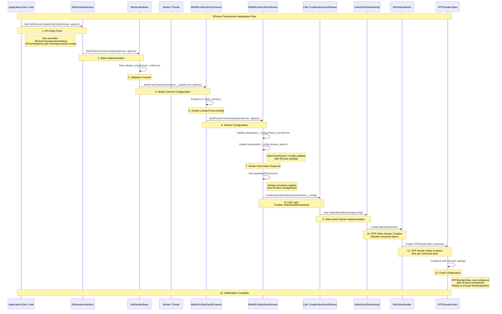
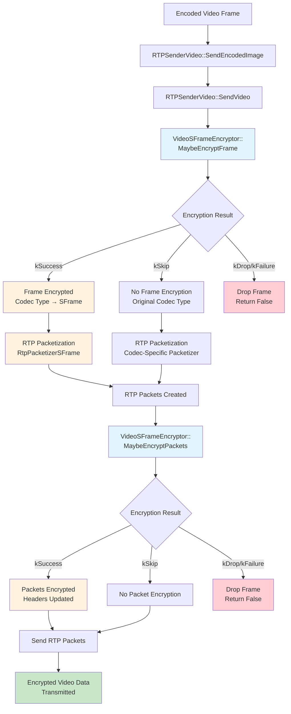

# Video Sender SFrame Integration

## Overview

This document describes how to integrate SFrame (Secure Frame) encryption into the WebRTC video sender pipeline. The goal is to add secure end-to-end video transmission capabilities while working with the existing RTP sender infrastructure.

SFrame encryption can work at two levels:

- **Per-frame**: Encrypts complete video frames before they're split into RTP packets
- **Per-packet**: Encrypts individual RTP packets after packetization

## SFrame Transformer Initialization Flow

The following diagram illustrates how SFrame transformer initialization flows from the API level down to the RTPSenderVideo component. This shows the "sunny day" scenario where all components are ready and the initialization completes successfully.



### Key Flow Steps:

1. **API Entry Point**: User calls `SetSFrameTransformer()` with transformer and options
2. **Base Implementation**: `RtpSenderBase` stores the transformer and validates readiness
3. **Media Channel**: `WebRtcVideoSendChannel` locates the correct stream by SSRC
4. **Stream Configuration**: `WebRtcVideoSendStream` updates configuration parameters in place
5. **Stream Recreation**: Existing streams are recreated to apply new SFrame settings
6. **Creation Pipeline**: Settings flow through Call → VideoSendStreamImpl → RtpVideoSender → RTPSenderVideo
7. **Ready for Encryption**: RTPSenderVideo is now ready to encrypt frames/packets

Once initialization is complete, the RTPSenderVideo component can perform encryption at two levels based on the configured `SFrameOptions`.

## C++ API Proposal

### Basic API Structure

The integration starts with extending `RtpSenderInterface` to support SFrame transformers.

```cpp
class RtpSenderInterface : public SFrameTransformerHost {
 public:
  /**
   * Sets up SFrame encryption for this RTP sender.
   * @param sframe_transformer The encryption implementation
   * @param options Configuration for how SFrame should operate
   */
  virtual void SetSFrameTransformer(
      scoped_refptr<SFrameTransformerInterface> sframe_transformer,
      SFrameOptions options) = 0;

  virtual scoped_refptr<SFrameTransformerInterface> GetSFrameTransformer() = 0;
};
```

## Implementation Architecture

### RtpSenderBase

`RtpSenderBase` is the main implementation that both `VideoRtpSender` and `AudioRtpSender` inherit from. Here's how it handles SFrame configuration:

```cpp
class RtpSenderBase: public RtpSenderInterface {
 public:
  /**
   * Sets up the SFrame transformer and passes the configuration
   * down to the media channel layer.
   */
  void SetSFrameTransformer(
      scoped_refptr<SFrameTransformerInterface> sframe_transformer,
      SFrameOptions options) override;

  scoped_refptr<SFrameTransformerInterface> GetSFrameTransformer() override;

 private:
  // Keeps a reference to the configured SFrame transformer
  scoped_refptr<SFrameTransformerInterface> sframe_transformer_;
};
```

The implementation makes sure SFrame configuration is safely passed to the media channel:

```cpp
void RtpSenderBase::SetSFrameTransformer(
    scoped_refptr<SFrameTransformerInterface> sframe_transformer,
    SFrameOptions options) {
  sframe_transformer_ = sframe_transformer;

  // Pass configuration to media channel if everything is ready
  if (media_channel_ && ssrc_ && !stopped_) {
    worker_thread_->BlockingCall([&] {
      media_channel_->SetSFrameTransformer(ssrc_, sframe_transformer, options);
    });
  }
}

scoped_refptr<SFrameTransformerInterface> RtpSenderBase::GetSFrameTransformer() {
  return sframe_transformer_;
}
```

## SFrameStreamConfig

The `SFrameStreamConfig` structure consolidates all SFrame-related configuration parameters for media streams. This configuration structure is utilized by both media senders and receivers, with each maintaining its own instance to ensure proper encapsulation of SFrame settings.

The structure contains three primary components: `SFrameOptions` and `SFrameTransformerInterface` are populated through the `SetSFrameTransformer` API call, while the `require_sframe` property is configured separately during SDP negotiation. This separation is necessary to accommodate scenarios where SFrame may be enabled through receiver-side configuration (via SFrameTransform creation) without necessarily having a transformer available on the sender side.

```cpp
struct SFrameStreamConfig {
  // SDP negotiated if we should require SFrame
  bool require_sframe;

  // Options provided with `SetSFrameTransformer`
  // Should it be optional ? Or simply keep defaults?
  SFrameOptions options;

  // Transformer
  scoped_refptr<SFrameTransformerInterface> sframe_transformer;
};
```

## Media Channel Layer

### Extending MediaSendChannelInterface

To support SFrame at the media channel level, we need to extend the interface with a new method:

```cpp
class MediaSendChannelInterface {
 public:
  /**
   * Configures SFrame encryption for a specific stream.
   * @param ssrc The stream identifier
   * @param sframe_transformer The encryption implementation
   * @param options How SFrame should operate (per-frame vs per-packet)
   */
  virtual void SetSFrameTransformer(
      uint32_t ssrc,
      scoped_refptr<SFrameTransformerInterface> sframe_transformer,
      SFrameOptions options) = 0;
};
```

### WebRtcVideoSendChannel Implementation

This is where SFrame configuration gets applied to actual video streams:

```cpp
class WebRtcVideoSendChannel : public VideoMediaSendChannelInterface {
 public:
  /**
   * Finds the right video stream and applies SFrame configuration to it.
   */
  void SetSFrameTransformer(
      uint32_t ssrc,
      scoped_refptr<SFrameTransformerInterface> sframe_transformer,
      SFrameOptions options) override;
};
```

The implementation looks up the correct stream and handles errors gracefully:

```cpp
void WebRtcVideoSendChannel::SetSFrameTransformer(
    uint32_t ssrc,
    scoped_refptr<SFrameTransformerInterface> sframe_transformer,
    SFrameOptions options) {
  RTC_DCHECK_RUN_ON(&thread_checker_);

  auto matching_stream = send_streams_.find(ssrc);
  if (matching_stream != send_streams_.end()) {
    matching_stream->second->SetSFrameTransformer(sframe_transformer, options);
  } else {
    RTC_LOG(LS_ERROR) << "Could not find stream with SSRC " << ssrc
                      << " to configure SFrame encryption";
  }
}
```

### Individual Stream Configuration

Each video stream is represented by a `WebRtcVideoSendStream` object. When SFrame configuration is applied, the stream must be recreated to properly integrate the new encryption settings. The configuration parameters are stored within the `SFrameStreamConfig` structure, which is embedded in the stream's configuration hierarchy for centralized management.

```cpp
struct VideoSendStreamParameters {
  /* Other fields */
  VideoSendStream::Config config;
};

struct VideoSendStream::Config {
  /* Other fields */
  SFrameStreamConfig sframe_stream_config;
};
```

```cpp
class WebRtcVideoSendStream {
 public:
  /**
   * Applies SFrame configuration to this video stream.
   * This triggers recreation of the underlying WebRTC stream.
   */
  void SetSFrameTransformer(
      scoped_refptr<SFrameTransformerInterface> sframe_transformer,
      SFrameOptions options);

  // Holds configuration of the stream
  VideoSendStreamParameters parameters_;
};
```

Here's how stream recreation works:

```cpp
void WebRtcVideoSendChannel::WebRtcVideoSendStream::SetSFrameTransformer(
    scoped_refptr<SFrameTransformerInterface> sframe_transformer,
    SFrameOptions options) {
  RTC_DCHECK_RUN_ON(&thread_checker_);

  // Update the stream configuration
  parameters_.config.sframe_stream_config.sframe_transformer = sframe_transformer;
  parameters_.config.sframe_stream_config.sframe_options = options;

  // Recreate the stream with new SFrame settings
  if (stream_) {
    RTC_LOG(LS_INFO) << "Recreating video stream to apply SFrame encryption, "
                     << "SSRC=" << parameters_.config.rtp.ssrcs[0];
    RecreateWebRtcStream();
  }
}
```

`RecreateWebRtcStream()` initiates the creation of a new VideoSendStream instance through the `Call` interface, utilizing the configuration parameters contained within `VideoSendStream::Config`.

### Call::CreateVideoSendStream

Creates a new `VideoSendStreamImpl` instance with the provided configuration from the `WebRtcVideoEngine`.

### VideoSendStreamImpl

`VideoSendStreamImpl` utilizes the `RtpTransportControllerSendInterface` to instantiate a `RtpVideoSender`.

### RtpVideoSender

`RtpVideoSender` creates a collection of `RTPSenderVideo` objects to handle individual simulcast layer streams. `RTPSenderVideo` serves as the final integration point where SFrame encryption operations are performed.

## RTP Sender Video - Where Encryption Happens

### VideoSFrameEncryptor

The `VideoSFrameEncryptor` class provides a clean abstraction layer that encapsulates all SFrame-related encryption operations for video streams. This design promotes better code organization and maintainability by consolidating encryption logic within a dedicated component.

```cpp
class VideoSFrameEncryptor {
 public:
  enum class EncryptionResult {
    kSuccess,
    kFailure,
    kDrop,
    kSkip,
  };

  VideoSFrameEncryptor(scoped_refptr<SFrameTransformerInterface> sframe_transformer, SFrameOptions options_);

  ~VideoSFrameEncryptor();

  EncryptionResult MaybeEncryptFrame(VideoCodecType& codec_type,
                                     ArrayView<const uint8_t> payload);

  EncryptionResult MaybeEncryptPackets(std::vector<std::unique_ptr<RtpPacketToSend>>& packets);

 private:
  scoped_refptr<SFrameTransformerInterface> sframe_transformer_;

  SFrameOptions options_;
};
```

The implementation handles all operations required to perform SFrame encryption, providing a standardized interface for both per-frame and per-packet encryption modes.

Example code:
```cpp
VideoSFrameEncryptor::EncryptionResult VideoSFrameEncryptor::MaybeEncryptFrame(
    VideoCodecType& codec_type,
    ArrayView<const uint8_t> payload) {
  if (sframe_options_.mode == SFrameMode::kPerPacket) {
    return EncryptionResult::kSkip;
  }

  if (!sframe_transformer_) {
    return EncryptionResult::kDrop;
  }

  sframe_transformer_->Transform(CopyOnWriteBuffer(payload));

  // Make sure to trigger default packetization for SFrame.
  codec_type = kVideoCodecSFrame;

  return EncryptionResult::kSuccess;
}
```

**Summary**: Manages per-frame SFrame encryption by validating the encryption mode, verifying transformer availability, applying SFrame encryption to the complete frame payload, and updating the codec type to ensure proper SFrame-aware packetization.

```cpp
VideoSFrameEncryptor::EncryptionResult
VideoSFrameEncryptor::MaybeEncryptPackets(
    std::vector<std::unique_ptr<RtpPacketToSend>>& packets) {
  if (sframe_options_.mode == SFrameMode::kPerFrame) {
    return EncryptionResult::kSkip;
  }

  if (!sframe_transformer_) {
    return EncryptionResult::kDrop;
  }

  for (const auto& packet : packets) {
    auto buffer = packet->PayloadBuffer();

    sframe_transformer_->Transform(buffer);

    packet->SetPayload(buffer);
  }

  // Add SFrame header to the payload

  return EncryptionResult::kSuccess;
}
```

**Summary**: Manages per-packet SFrame encryption by validating the encryption mode, verifying transformer availability, iterating through each RTP packet to encrypt payloads individually, updating packet contents with encrypted data, and incorporating necessary SFrame protocol headers.

### RTPSenderVideo Configuration

The `RTPSenderVideo::Config` structure is extended with additional fields to support SFrame encryption capabilities.

```cpp
class RTPSenderVideo : public RTPVideoFrameSenderInterface {
 public:
  struct Config {
    /* Other configuration fields */
    bool require_sframe;

    // SFrame encryption interface
    scoped_refptr<webrtc::SFrameTransformerInterface> sframe_transformer;

    SFrameOptions sframe_options;
  };

 private:
  std::unique_ptr<VideoSFrameEncryptor> sframe_encryptor;
};
```


### RTPSenderVideo Construction

The `RTPSenderVideo` constructor conditionally instantiates the `VideoSFrameEncryptor` based on the SFrame requirement configuration, ensuring optimal resource utilization.


```cpp
RTPSenderVideo::RTPSenderVideo(const Config& config)
    : sframe_encryptor(config.require_sframe
                        ? std::make_unique<VideoSFrameEncryptor>(
                              config.sframe_transformer,
                              config.sframe_options)
                        : nullptr) {} 
```

### SFrame Transformation Flow in RTPSenderVideo

The following diagram shows how encoded video frames flow through RTPSenderVideo and where SFrame encryption is applied:



### RTPSenderVideo Overview

The `RTPSenderVideo` class is where the actual video processing happens. It receives encoded video frames and splits them into RTP packets. This is a good place to add SFrame encryption because:

- **Per-frame encryption** works well here since we have access to complete frames before packetization
- **Per-packet encryption** can be done after packetization, though this has some architectural trade-offs (more on this later)

### Processing Encoded Frames

When `RTPSenderVideo` receives an encoded frame, it can either process it through the frame transformer pipeline or handle it directly:

```cpp
bool RTPSenderVideo::SendEncodedImage(int payload_type,
                                      std::optional<VideoCodecType> codec_type,
                                      uint32_t rtp_timestamp,
                                      const EncodedImage& encoded_image,
                                      RTPVideoHeader video_header,
                                      TimeDelta expected_retransmission_time,
                                      const std::vector<uint32_t>& csrcs) {
  // If there's a frame transformer, use it (this handles existing transform logic)
  if (frame_transformer_delegate_) {
    return frame_transformer_delegate_->TransformFrame(
        payload_type, codec_type, rtp_timestamp, encoded_image, video_header,
        expected_retransmission_time, csrcs);
  }

  // Otherwise, process the frame directly
  return SendVideo(payload_type, codec_type, rtp_timestamp,
                   encoded_image.CaptureTime(), encoded_image,
                   encoded_image.size(), video_header,
                   expected_retransmission_time, csrcs);
}
```

### SFrame Encryption Integration

The `SendVideo` method integrates SFrame encryption capabilities by leveraging the `VideoSFrameEncryptor` component. The implementation supports both per-frame and per-packet encryption modes through a structured approach that maintains compatibility with existing packetization workflows:

```cpp
bool RTPSenderVideo::SendVideo(int payload_type,
                               std::optional<VideoCodecType> codec_type,
                               uint32_t rtp_timestamp,
                               Timestamp capture_time,
                               ArrayView<const uint8_t> payload,
                               size_t encoder_output_size,
                               RTPVideoHeader video_header,
                               TimeDelta expected_retransmission_time,
                               std::vector<uint32_t> csrcs) {

  // Per-frame encryption: encrypt the complete frame before packetization
 switch (sframe_encryptor->MaybeEncryptFrame(codec_type, payload)) {
    case RtpSenderSFrameVideo::EncryptionResult::kDrop:
      // Drop can happen if we do not have keys to encrypt the frame.
      // Transformer is not set, even though SFrame is configured.
      return false;
    case RtpSenderSFrameVideo::EncryptionResult::kSuccess:
      // Frame has been encrypted, pass to packetizer.
      break;
    case RtpSenderSFrameVideo::EncryptionResult::kFailure:
      // Failure while encrypting, drop frame
      return false;
    case RtpSenderSFrameVideo::EncryptionResult::kSkip:
      // SFrame encryption not attempted (probably per-packet requested), continue with normal packetization.
      break;
  } 

  /*
   * RTP packetization selection based on encryption results:
   * - Per-frame SFrame: Uses RtpPacketizerSFrame when codec_type is modified to SFrame
   * - Per-packet SFrame: Uses codec-specific packetizer for original codec type
   * - Non-encrypted: Uses standard codec-specific packetization
   */
  std::unique_ptr<RtpPacketizer> packetizer = RtpPacketizer::Create(
      GetPacketizationFormat(codec_type, raw_packetization_), payload, limits,
      video_header);

  std::vector<std::unique_ptr<RtpPacketToSend>> rtp_packets;

  // Per-packet encryption: encrypt each packet individually
  switch (sframe_encryptor->MaybeEncryptPackets(rtp_packets)) {
    case RtpSenderSFrameVideo::EncryptionResult::kDrop:
      // Drop the whole frame if any packet fails to encrypt (probably missing transformer).
      return false;
    case RtpSenderSFrameVideo::EncryptionResult::kSuccess:
      // Packet has been encrypted.
      break;
    case RtpSenderSFrameVideo::EncryptionResult::kFailure:
      // Packet was not encrypted, return.
      break;
    case RtpSenderSFrameVideo::EncryptionResult::kSkip:
      // SFrame encryption not attempted (probably per-frame), continue.
      break;
  } 

  // Send the packets out
}
```

### SFrame Packetizer

SFrame encryption requires specialized packetization to accommodate the encrypted payload format. The `RtpPacketizerSFrame` class provides this functionality by extending the standard RTP packetization interface.

```
class RtpPacketizerSFrame : public RtpPacketizer {
 public:
  // Initialize with SFrame ciphertext payload.
  // The payload should contain a complete SFrame ciphertext (header + encrypted data + auth tag).
  RtpPacketizerSFrame(ArrayView<const uint8_t> payload,
                      PayloadSizeLimits limits);

  RtpPacketizerSFrame(const RtpPacketizerSFrame&) = delete;
  RtpPacketizerSFrame& operator=(const RtpPacketizerSFrame&) = delete;

  ~RtpPacketizerSFrame() override;

  size_t NumPackets() const override;

  bool NextPacket(RtpPacketToSend* rtp_packet) override;

 private:
  // SFrame RTP header size is always 1 byte
  static constexpr size_t kSFrameRtpHeaderSize = 1;
  
  // The remaining SFrame payload to be packetized
  ArrayView<const uint8_t> remaining_payload_;
  
  // Sizes of payload data for each packet (excluding SFrame RTP header)
  std::vector<int> payload_sizes_;
  
  // Iterator pointing to the current packet size
  std::vector<int>::const_iterator current_packet_;
  
  // SFrame RTP header (1 byte with S/E flags)
  uint8_t sframe_header_;
}; 
```

The packetizer operates similarly to `GenericRtpPacketizer` since SFrame utilizes generic packetization principles. The primary distinction is the addition of an SFrame-specific header at the beginning of each RTP payload, providing the necessary protocol information for proper decryption at the receiver.

```
 0                   1                   2                   3
 0 1 2 3 4 5 6 7 8 9 0 1 2 3 4 5 6 7 8 9 0 1 2 3 4 5 6 7 8 9 0 1
+-+-+-+-+-+-+-+-+-+-+-+-+-+-+-+-+-+-+-+-+-+-+-+-+-+-+-+-+-+-+-+-+
|V=2|P|X|  CC   |M|     PT      |       sequence number         |
+-+-+-+-+-+-+-+-+-+-+-+-+-+-+-+-+-+-+-+-+-+-+-+-+-+-+-+-+-+-+-+-+
|                           timestamp                           |
+-+-+-+-+-+-+-+-+-+-+-+-+-+-+-+-+-+-+-+-+-+-+-+-+-+-+-+-+-+-+-+-+
|           synchronization source (SSRC) identifier            |
+=+=+=+=+=+=+=+=+=+=+=+=+=+=+=+=+=+=+=+=+=+=+=+=+=+=+=+=+=+=+=+=+
|            contributing source (CSRC) identifiers             |
|                             ....                              |
+=+=+=+=+=+=+=+=+=+=+=+=+=+=+=+=+=+=+=+=+=+=+=+=+=+=+=+=+=+=+=+=+
|S E x x x x x x|                                               |
|                                                               |
:                       SFrame payload                          :
|                                                               |
|                               +-+-+-+-+-+-+-+-+-+-+-+-+-+-+-+-+
|                               :    OPTIONAL RTP padding       |
+-+-+-+-+-+-+-+-+-+-+-+-+-+-+-+-+-+-+-+-+-+-+-+-+-+-+-+-+-+-+-+-+
```